<div align="center">
  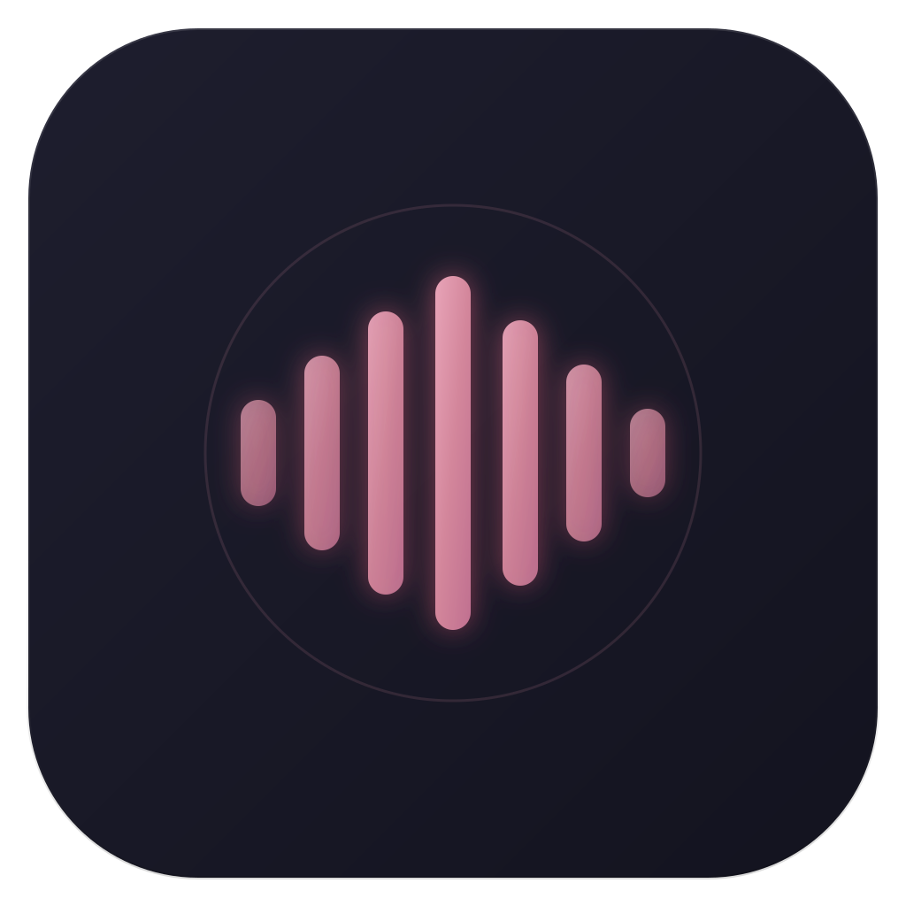
  <h1>VoiceStudio</h1>
  <p><sub><em>previously OmniVoice-Studio</em></sub></p>
  <h3>The open-source ElevenLabs alternative.</h3>
  <p>Real-time dictation, zero-shot voice cloning, and cinematic video dubbing — all on your desktop.<br/><b>No accounts. No API keys. No cloud.</b> Everything runs on your machine. Open-source, <b>646 languages.</b></p>

  <p>
    <a href="#quickstart">Quickstart</a> ·
    <a href="#features">Features</a> ·
    <a href="#why-ovs">vs Others</a> ·
    <a href="#tts-engines">Engines</a> ·
    <a href="#openai-api">API</a> ·
    <a href="#sponsor--donate">Donate</a> ·
    <a href="#contributing">Contributing</a> ·
    <a href="https://voicestudio.sh">Website</a> ·
    <a href="https://voicestudio.sh/docs">Docs</a> ·
    <a href="https://status.voicestudio.sh">Status</a> ·
    <a href="https://discord.gg/bzQavDfVV9">Discord</a> ·
    <a href="https://x.com/idebpalash">X</a> ·
    <a href="README_CN.md"><strong>简体中文</strong></a>
  </p>

  <p>
    <a href="https://github.com/debpalash/VoiceStudio/stargazers"></a>
    <a href="https://github.com/debpalash/VoiceStudio/releases"></a>
    <a href="https://github.com/debpalash/VoiceStudio/releases/latest"></a>
    <a href="LICENSE"></a>
    <a href="https://github.com/debpalash/VoiceStudio/issues"></a>
    <a href="https://discord.gg/bzQavDfVV9"></a>
    <a href="https://x.com/idebpalash"></a>
    <a href="https://ko-fi.com/debpalash"></a>
    <a href="https://paypal.me/palashCoder"></a>
  </p>

  <p>
    <a href="https://github.com/debpalash/VoiceStudio/releases/latest"></a>
  </p>

  <p>
    <a href="https://trendshift.io/repositories/28176?utm_source=trendshift-badge&utm_medium=badge&utm_campaign=badge-trendshift-28176" target="_blank" rel="noopener noreferrer"></a>
  </p>
</div>

<br/>

<div align="center">
  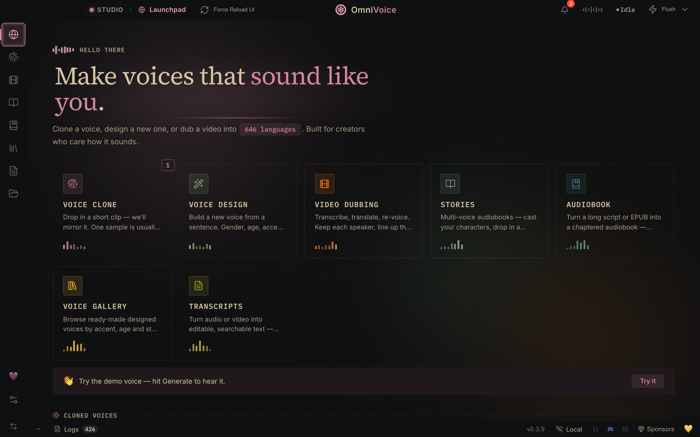
</div>

> **Your voice is the most personal data you have. So why rent it back from a cloud?** Every mainstream voice tool ships your audio to someone else's server and bills you monthly for the privilege. VoiceStudio flips that: clone, design, dub, and dictate on your own hardware — 646 languages, no meter running, nothing leaving your machine.

> [!WARNING]
> **Active beta.** Things may break between releases — for the newest fixes, run from source. Bug reports and PRs are very welcome: [open an issue](https://github.com/debpalash/VoiceStudio/issues) or [join Discord](https://discord.gg/bzQavDfVV9).

<a id="screenshots"></a>

## 📸 See it in action

<table>
  <tr>
    <td align="center" width="50%">
      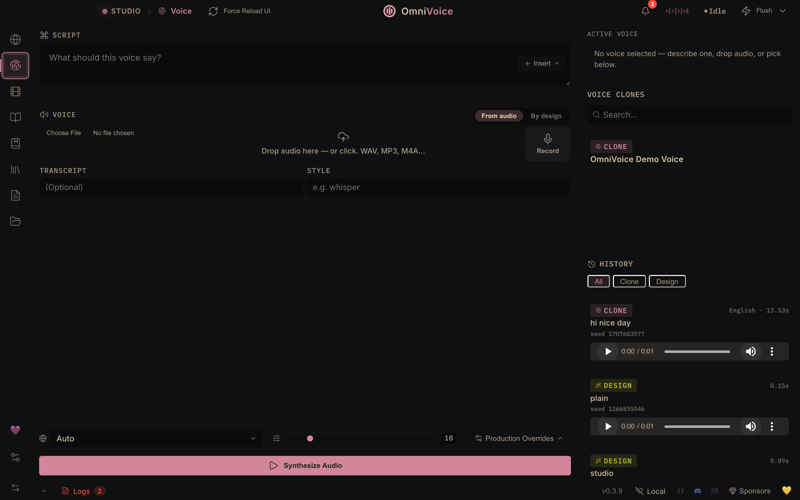
      <br/><b>Studio</b><br/>
      <sub>Generate &amp; clone in one workspace — a 3-second clip mirrors any voice, 646 languages, zero-shot.</sub>
    </td>
    <td align="center" width="50%">
      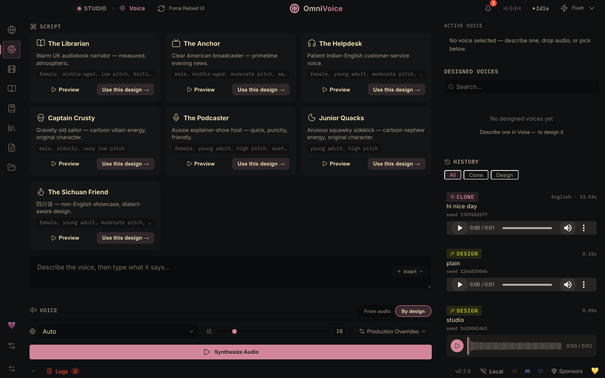
      <br/><b>Voice Design</b><br/>
      <sub>Build new voices from scratch — gender, age, accent, pitch, emotion, dialect.</sub>
    </td>
  </tr>
  <tr>
    <td align="center">
      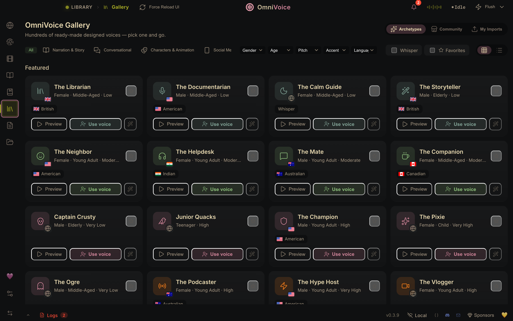
      <br/><b>Voice Gallery</b><br/>
      <sub>Browse ready-made archetype voices with language filters, or build your own — then pick any of them in Studio, Audiobook, Stories, and Dubbing.</sub>
    </td>
    <td align="center">
      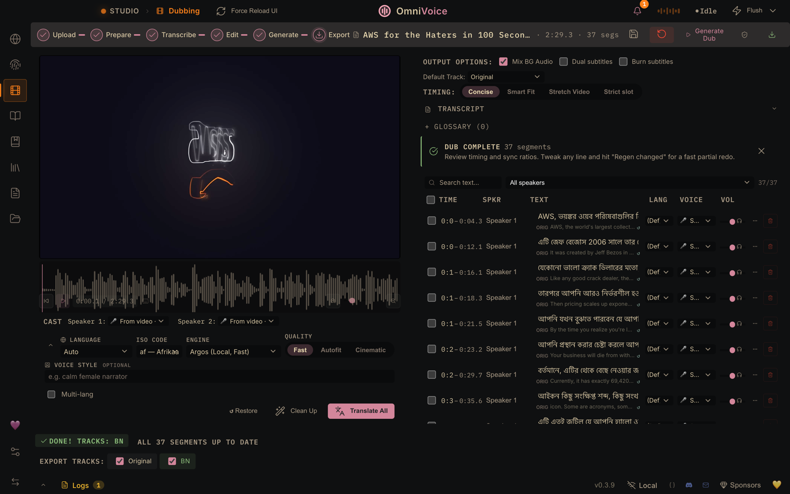
      <br/><b>Video Dubbing</b><br/>
      <sub>A real dub, end to end: 37 segments transcribed, translated to Bengali, re-voiced, and timed — ready to export as MP4.</sub>
    </td>
  </tr>
  <tr>
    <td align="center">
      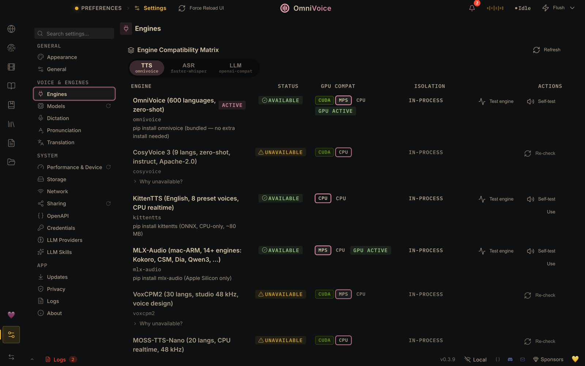
      <br/><b>Settings → Engines</b><br/>
      <sub>The engine compatibility matrix — 14 TTS engines with per-engine GPU preflight, no silent CPU fallback.</sub>
    </td>
    <td align="center">
      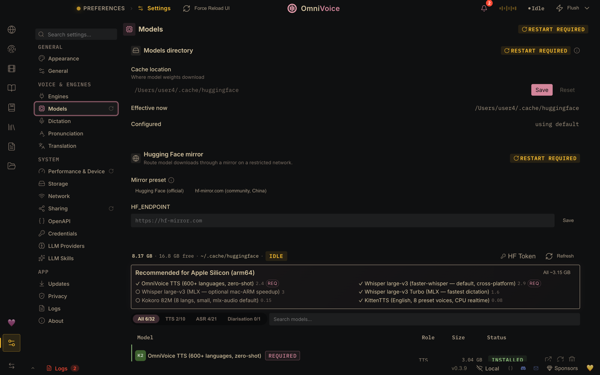
      <br/><b>Settings → Models</b><br/>
      <sub>One-click model store — auto-detects your platform (CUDA / MPS / CPU) and recommends the right models.</sub>
    </td>
  </tr>
</table>

---

<a id="features"></a>

## ✨ Features

Three flagships, five more headliners, and a dozen under the fold.

<table>
<tr>
  <td width="33%">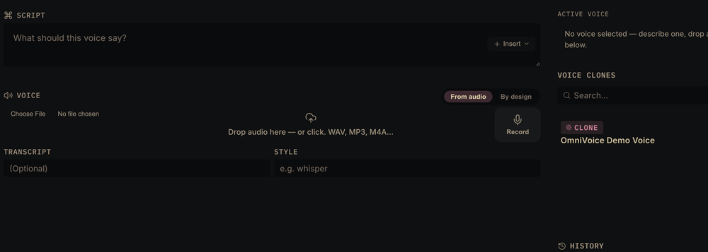</td>
  <td width="33%">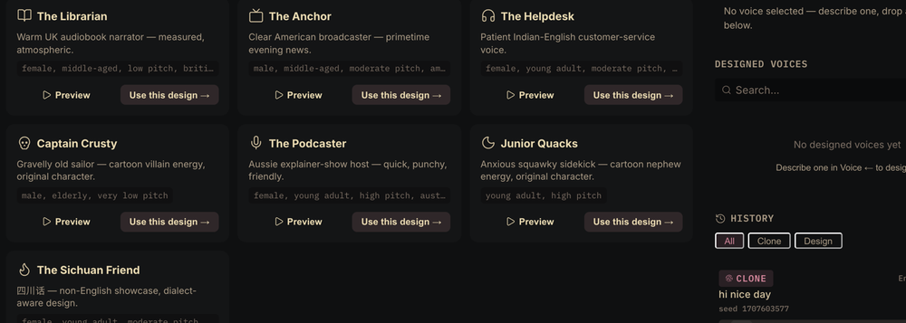</td>
  <td width="33%">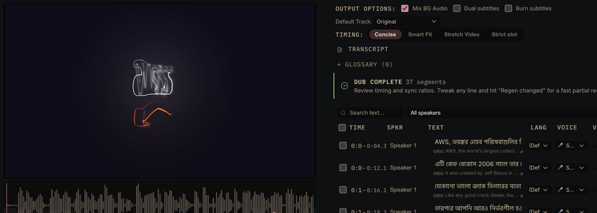</td>
</tr>
<tr>
  <td align="center">🎙️ <b>Voice Cloning</b><br/><sub>3-sec clip → any voice · 646 languages · zero-shot</sub></td>
  <td align="center">🎨 <b>Voice Design</b><br/><sub>Describe it — gender, age, accent, emotion</sub></td>
  <td align="center">🎬 <b>Video Dubbing</b><br/><sub>Transcribe → translate → re-voice → MP4</sub></td>
</tr>
</table>

<table>
<tr>
  <td align="center" width="20%">📖<br/><b>Audiobook</b><br/><sub>EPUB/PDF → .m4b, multi-voice cast</sub></td>
  <td align="center" width="20%">🎭<br/><b>Stories</b><br/><sub>Multi-voice script editor</sub></td>
  <td align="center" width="20%">⌨️<br/><b>Dictation Widget</b><br/><sub><kbd>⌘⇧Space</kbd> in any app</sub></td>
  <td align="center" width="20%">🔐<br/><b>100% Local</b><br/><sub>No keys, no cloud, no accounts</sub></td>
  <td align="center" width="20%">🤖<br/><b>MCP Server</b><br/><sub>Use from Claude, Cursor, …</sub></td>
</tr>
</table>

<details>
<summary><b>…and 12 more</b> — isolation, diarization, batch, watermarking, diagnostics, and friends</summary>

<br/>

- 🔊 **Vocal Isolation** — Demucs-powered: splits speech from music and keeps the background bed.
- 👥 **Speaker Diarization** — Pyannote + WhisperX auto-identify who said what.
- 📦 **Batch Queue** — drop 50 videos, walk away; per-job progress bars.
- 🛡️ **AI Watermark** — AudioSeal (Meta): invisible, survives compression.
- 🔬 **Diagnostics** — self-check suite, error journal, scrubbed diagnostic bundles.
- ⚡ **GPU Auto-Detect** — CUDA · MPS · ROCm (Linux, opt-in) · CPU; ≤8 GB VRAM auto-offloads.
- 🧭 **Engine routing** — preflight GPU check per engine; no silent CPU fallback.
- 🧩 **Extensible** — subclass `TTSBackend`, add any engine in ~50 lines.
- 🎒 **Portable personas** — export voices as `.ovsvoice` bundles: identity + watermark.
- ♾️ **Unlimited TTS** — sentence-chunked generation, no length cap, streaming via WebSocket.
- 🌐 **Remote backend** — point the UI at a remote server; Tailscale-friendly, bearer auth.
- 🧠 **Dictation + LLM** — local-LLM cleanup of transcripts, optional echo cancellation.

</details>

---

<a id="quickstart"></a>

## ⚡ Quickstart

<div align="center">
  <a href="https://github.com/debpalash/VoiceStudio/releases/latest"></a>
  <a href="https://github.com/debpalash/VoiceStudio/releases/latest"></a>
  <a href="https://github.com/debpalash/VoiceStudio/releases/latest"></a>
  <br/>
  <sub><b>macOS:</b> first launch needs a one-time approval — right-click → <b>Open</b> (or System Settings → Privacy &amp; Security → <b>"Open Anyway"</b> on macOS 15). No Terminal needed. <a href="docs/install/macos.md#gatekeeper-quarantine">Why?</a> · <b>Intel Macs:</b> local backend unsupported (<a href="https://github.com/debpalash/VoiceStudio/issues/889">#889</a>) — <a href="docs/install/macos.md">details</a>.</sub>
</div>

**Install guide:** [🍎 macOS](docs/install/macos.md) · [🪟 Windows](docs/install/windows.md) · [🐧 Linux](docs/install/linux.md) · [🐳 Docker](docs/install/docker.md)

<details>
<summary><b>🧰 Troubleshooting · slow generation · HF tokens · restricted networks</b></summary>

<br/>

- **Something broke?** Run the self-check — **Settings → About → "Run self-check"** (or `uv run python backend/main.py --diagnose --deep`) — then the [top 10 install errors](docs/install/troubleshooting.md). **"Save diagnostic bundle"** packages scrubbed logs for a bug report.
- **Feels slow?** [docs/performance.md](docs/performance.md) — where the time goes and how to tune it.
- **Want breaths, laughter, emotion?** [docs/expressive-speech.md](docs/expressive-speech.md) — what each engine can do today.
- **HF tokens · diarization · download speed / mirrors:** [tokens](docs/setup/huggingface-token.md) · [diarization](docs/features/diarization.md) · [downloads](docs/downloading-models.md).
- **Coming from [Real-Time-Voice-Cloning](https://github.com/CorentinJ/Real-Time-Voice-Cloning)?** [Migration guide](docs/migration/real-time-voice-cloning.md).

</details>

---

<a id="why-ovs"></a>

## ⚖️ vs Others

ElevenLabs charges **$5–$330/mo** and processes your audio on their servers. VoiceStudio runs **on your hardware, with no usage limits.**

| | **ElevenLabs** | **VoiceStudio** |
|---|---|---|
| **Pricing** | $5–$330/mo, per-character billing | Free & open-source (AGPL-3.0) · [Commercial license](#license) for proprietary use |
| **Voice Cloning** | ✅ 3s clip | ✅ 3s clip, zero-shot |
| **Voice Design** | ✅ Gender, age | ✅ Gender, age, accent, pitch, style, dialect |
| **Audiobook / Stories** | ❌ | ✅ Full audiobook editor + multi-voice stories (EPUB/PDF import, .m4b export) |
| **Languages** | 32 | **646** |
| **Video Dubbing** | ✅ Cloud-only | ✅ Fully local |
| **Data Privacy** | Audio sent to cloud | **Nothing leaves your machine** |
| **API Keys** | Required | Not needed |
| **GPU Support** | N/A (cloud) | CUDA · Apple Silicon · ROCm (Linux) · CPU |
| **Desktop App** | ❌ | ✅ macOS · Windows · Linux |
| **TTS Engines** | 1 | **14** — [full matrix](#tts-engines) |
| **ASR Engines** | 1 | **11** — [full lineup](#asr-engines) |
| **MCP Server** | ❌ | ✅ Use from Claude, Cursor, any MCP client |
| **Self-check** | ❌ | ✅ Diagnostics suite, error journal, scrubbed debug bundles |
| **Customizable** | ❌ Closed | ✅ Fork it, extend it, ship it |

Professional-grade voice AI, minus the subscription and the cloud.

<div align="center">
  <br/>
  <b>Convinced? Come build with us.</b><br/>
  <a href="https://discord.gg/bzQavDfVV9"></a>
  <br/><br/>
</div>

---

## 🖥️ System Requirements

| | **Minimum** | **Recommended** |
|---|---|---|
| **OS** | Windows 10, macOS 13.3+ (Apple Silicon), Ubuntu 24.04+ (glibc 2.39+) | Any modern 64-bit OS |
| **RAM** | 8 GB | 16 GB+ |
| **VRAM (GPU)** | 4 GB (auto-offloads TTS to CPU) | 8 GB+ (NVIDIA RTX 3060+) |
| **Disk** | 10 GB free (models + cache) | 20 GB+ SSD |
| **Python** | 3.10+ (managed by `uv`) | 3.11–3.12 |
| **GPU** | Optional — CPU works | NVIDIA CUDA · Apple Silicon MPS · AMD ROCm (Linux only) |

> [!NOTE]
> **A GPU is optional** — the whole pipeline runs on CPU (just slower), and on ≤8 GB VRAM, TTS auto-offloads to CPU. Caveats: **AMD ROCm** is Linux-only + opt-in ([Linux](docs/install/linux.md#amd-gpu-rocm)) — Windows AMD/Ryzen AI is CPU-only ([Windows](docs/install/windows.md#gpu-support)); **macOS Intel** can't run the local backend, so point it at a remote one ([#889](https://github.com/debpalash/VoiceStudio/issues/889) · [macOS](docs/install/macos.md)).

<a id="tts-engines"></a>

### 🗣️ TTS Engines

**14 engines, one picker.** VoiceStudio (default, 600+ languages) is always available; seven more are opt-in and auto-detected (CosyVoice 3, GPT-SoVITS, VoxCPM2, MOSS-TTS-Nano, KittenTTS, MLX-Audio, Sherpa-ONNX), plus six lazy-installed heavyweights (IndexTTS 2, OmniVoice GGUF, Supertonic 3, MOSS-TTS-v1.5, dots.tts, Confucius4-TTS). Switch in **Settings → TTS Engine**; the choice applies everywhere synthesis happens.

<details>
<summary><b>📊 The full matrix</b> — 14 engines × platform × clone/instruct × license</summary>

<br/>

| Engine | Languages | Clone | Instruct | Linux | macOS ARM | Windows | License |
|--------|:---------:|:-----:|:--------:|:-----:|:---------:|:-------:|:-------:|
| **OmniVoice** (default) | 600+ | ✅ | ✅ | ✅ CUDA/CPU | ✅ MPS | ✅ CUDA/CPU | Built-in |
| **CosyVoice 3** | 9 + 18 dialects | ✅ | ✅ | ✅ CUDA/CPU | ✅ MPS | ✅ CUDA/CPU | Apache-2.0 |
| **GPT-SoVITS** | 5 | ✅ | — | ✅ CUDA/CPU | — | ✅ CUDA/CPU | MIT |
| **VoxCPM2** | 30 | ✅ | ✅ | ✅ CUDA/CPU | ✅ MPS | ✅ CUDA/CPU | Apache-2.0 |
| **MOSS-TTS-Nano** | 20 | ✅ | — | ✅ CUDA/CPU | ✅ CPU | ✅ CUDA/CPU | Apache-2.0 |
| **KittenTTS** | English | — | — | ✅ CPU | ✅ CPU | ✅ CPU | MIT |
| **MLX-Audio** (Kokoro, Qwen3-TTS, CSM, Dia, …) | Multi | Varies | Varies | ❌ | ✅ Native | ❌ | Varies |
| **Sherpa-ONNX** | 20+ | — | — | ✅ CUDA/CPU | ✅ CPU | ✅ CUDA/CPU | Apache-2.0 |
| **IndexTTS 2** ⚡ | Multi | ✅ | — | ✅ CUDA | — | ✅ CUDA | Apache-2.0 |
| **OmniVoice GGUF** ⚡ | 600+ | ✅ | ✅ | ✅ CPU | ✅ CPU | ✅ CPU | Built-in |
| **Supertonic 3** ⚡ | 31 | — | — | ✅ CPU | ✅ CPU | ✅ CPU | OpenRAIL-M |
| **MOSS-TTS-v1.5** ⚡ (8B) | 31 | ✅ | — | ✅ CUDA/CPU | ✅ CPU | ✅ CUDA/CPU | Apache-2.0 |
| **dots.tts** ⚡ (2B) | 24 | ✅ | — | ✅ CUDA/CPU | ✅ CPU | ❌ | Apache-2.0 |
| **Confucius4-TTS** ⚡ | 14 | ✅ | — | ✅ CUDA/CPU | ✅ CPU | ✅ CUDA/CPU | Apache-2.0 |

> **CUDA** = GPU-accelerated · **MPS** = Apple Silicon Metal · **CPU** = runs everywhere, slower for large models · KittenTTS and MOSS-TTS-Nano run realtime on CPU · MLX-Audio is Apple Silicon only · ⚡ = lazy-registered (installed on first use)
>
> **Clone** matters beyond single-clip generation: Video Dubbing (and any Batch job with a pinned voice) needs reference-audio cloning to preserve speaker identity, so picking a Clone-less engine (KittenTTS, Sherpa-ONNX, Supertonic 3) as the active engine fails those jobs up front with an actionable message instead of silently falling back to VoiceStudio.
>
> **MOSS-TTS-v1.5** (8B, ~16 GB), **dots.tts** (2B, ~9 GB), and **Confucius4-TTS** are heavyweight opt-ins that run in their own isolated venv from a local clone. None claims Apple-Silicon MPS (CPU on Macs); dots.tts has no Windows path; Confucius4 wants CUDA (CPU works, ~17× realtime). Details: [MOSS-TTS-v1.5](docs/engines/moss-tts-v15.md) · [dots.tts](docs/engines/dots-tts.md) · [Confucius4-TTS](docs/engines/confucius4-tts.md).

</details>

<a id="asr-engines"></a>

### 🎧 ASR Engines

**11 engines** — they power dictation, video dubbing, and subtitles. **WhisperX** is the cross-platform default (~100 languages, word-level timing); the rest are opt-in and auto-detected. Switch in **Settings → Engines**. Ten run fully on-device; the eleventh (OpenAI-compatible) is an optional remote client for Qwen3-ASR or any compatible server.

<details>
<summary><b>📊 The full lineup</b> — 11 engines, what each is best at, and compute-type notes</summary>

<br/>

| Engine | `OMNIVOICE_ASR_BACKEND` | Languages | Best for |
|--------|-------------------------|:---------:|----------|
| **WhisperX** (default) | `whisperx` | ~100 | Dubbing & subtitles — word-level timing via wav2vec2 forced alignment |
| **Faster-Whisper** | `faster-whisper` | ~100 | Fast transcription on Linux / macOS / Windows (CTranslate2) |
| **Faster-Whisper (isolated)** | `faster-whisper-isolated` | ~100 | Same as Faster-Whisper but crash-isolated in a subprocess — an ASR crash won't take down the app |
| **MLX Whisper** | `mlx-whisper` | ~100 | Native Apple Silicon speed (Apple MLX / Metal) |
| **PyTorch Whisper** | `pytorch-whisper` | ~100 | CUDA / CPU fallback via 🤗 Transformers (no cuDNN 8 needed) |
| **Parakeet TDT** | `nemo-parakeet` | English + 25 EU | SOTA accuracy at ~10× realtime even on CPU, auto language detection (NVIDIA NeMo, CUDA/CPU) |
| **Parakeet TDT v3 (MLX)** | `parakeet-mlx` | 25 EU | The Parakeet tier for Apple Silicon — TDT word timestamps, ~2 GB unified memory, dictation-grade speed on the GPU via MLX. Install the model from **Settings → Models** and dictation prefers it automatically when your system language is one of its 25 (European) languages; other languages (CJK, Arabic, …) keep the multilingual Whisper engine so dictation coverage never regresses. |
| **Moonshine** | `moonshine` | English | Edge / low-latency, ONNX |
| **FunASR** | `funasr` | 50+ | All-in-one multilingual — built-in VAD + inline speaker diarization (SenseVoice) |
| **sherpa-onnx** (live dictation) | `sherpa-onnx-asr` | 25 EU + 90+ | Live, faster-than-real-time dictation — small streaming/offline ONNX models (Parakeet TDT v3/v2, streaming Zipformer & Paraformer, Whisper Tiny), CPU, identical on macOS / Windows / Linux. Picked per-model in **Settings → Voice**. |
| **OpenAI-compatible** ⚠️ remote | `openai-compat-asr` | Server-dependent | A path to **Qwen3-ASR** today (self-hosted server, no transformers wait), any OpenAI-compatible transcription endpoint, or OpenAI's own API — no install, configure + test the connection in **Settings → Engines** (ASR tab). Audio leaves your machine to whatever server you point it at; see [docs/engines/openai-compatible-asr.md](docs/engines/openai-compatible-asr.md). |

> Whisper-family engines cover ~100 languages; **FunASR / SenseVoice** adds an all-in-one multilingual path with built-in voice-activity detection and inline speaker diarization. **sherpa-onnx** powers the live dictation model picker — you talk and text appears as you speak. Every engine runs on-device — no API keys, no cloud.

> **GPU without efficient float16?** On older NVIDIA GPUs (Maxwell/Pascal, GTX 16xx) or after a CTranslate2/cuDNN mismatch, the CTranslate2 ASR engines (WhisperX, Faster-Whisper) can't run `float16` and VoiceStudio automatically retries on `int8` — no config needed. If transcription still fails, pin the compute type with the `ASR_COMPUTE_TYPE` env var (escape hatch): `ASR_COMPUTE_TYPE=int8` (or `float32` for CPU). Set it to `int8` and restart the backend.

</details>

---

## 🏗️ Architecture

A **Tauri v2** desktop shell (Rust) wraps a **React** UI and a bundled **Python/FastAPI** backend that runs as a local sidecar on `localhost:3900`. Nothing external — every layer is on your machine.

```
┌────────────────────────────────────────────────────────────────────┐
│  Tauri v2 shell — Rust                                             │
│  window state · global dictation hotkey · system tray ·           │
│  signed auto-updater (stable/preview) · single-instance ·         │
│  first-run bootstrap (installs uv + Python venv) · blank guard    │
├────────────────────────────────────────────────────────────────────┤
│  Frontend — React + Vite                                          │
│  Studio · Dub · Stories · Audiobook · Gallery · Dictation ·       │
│  Batch · Diagnostics · MCP client    —   Zustand store · WS bus   │
│                          ▲  IPC  /  HTTP + WS                      │
├──────────────────────────┼─────────────────────────────────────────┤
│  Backend — FastAPI sidecar @ localhost:3900                       │
│  100+ REST endpoints · SSE + WebSocket streaming ·               │
│  SQLite + Alembic (omnivoice_data/) · OpenAI-compatible API       │
├───────────┬───────────┬───────────┬───────────┬────────────────────┤
│  TTS ×14  │  ASR ×11  │  Demucs   │ Pyannote  │  AudioSeal         │
│  clone /  │  WhisperX │  vocal    │  speaker  │  watermark         │
│  design   │  +10 more │  isolation│  diariz.  │  embed / detect    │
├───────────┴───────────┴───────────┴───────────┴────────────────────┤
│  Engine routing — per-engine GPU preflight, no silent CPU fallback │
│  Hardware:  CUDA · MPS · ROCm (Linux) · CPU   (auto-detected)      │
└────────────────────────────────────────────────────────────────────┘
```

- **Shell (Rust)** — native OS integration: the system-wide dictation hotkey, tray, signed auto-updater (stable + preview channels), single-instance lock, and the first-run bootstrap that installs `uv` and a Python 3.11 venv.
- **Frontend (React)** — every workspace tab over a Zustand store, with a WebSocket event bus that live-refreshes the UI when backend data changes.
- **Backend (FastAPI)** — the bundled Python sidecar: 100+ endpoints, SSE/WSS streaming, a SQLite DB migrated by Alembic, and the OpenAI-compatible API surface.
- **Engines** — 14 TTS + 11 ASR, plus Demucs (isolation), Pyannote (diarization), and AudioSeal (watermark), all behind routing that GPU-preflights each engine and refuses to silently fall back to CPU.

<a id="openai-api"></a>

## 🔌 OpenAI-compatible API

<div align="center">

**Drop-in replacement for OpenAI / ElevenLabs audio.** One line — no key, no code changes:

```diff
- base_url="https://api.openai.com/v1"
+ base_url="http://localhost:3900/v1"
```

</div>

Your existing scripts, agents, and OpenAI/ElevenLabs SDK calls now run **locally** on whatever engine you have active. What the cloud can't do: `voice` takes **your own cloned-voice profile IDs**, and `model` can pin a **specific engine** per request.

| Endpoint | What it does |
|---|---|
| `POST /v1/audio/speech` | TTS — text in; `mp3` / `opus` / `aac` / `flac` / `wav` / `pcm` out. `model`: `tts-1`/`tts-1-hd` (active engine) or a specific one (`voxcpm2`, `cosyvoice`, `kittentts`, …). `voice`: a cloned profile ID, `default`, or an OpenAI name (`alloy`, …). `speed` supported. |
| `POST /v1/audio/transcriptions` | STT — audio file in; `json` / `text` / `verbose_json` / `srt` / `vtt` out (`verbose_json` adds word-level timings). `whisper-1` maps to your active ASR engine. |
| `GET /v1/audio/voices` | VoiceStudio extension — lists every voice profile and engine, so clients can discover your clones. |

**Speak with your own cloned voice** — list the IDs, then pass one as `voice`:

```sh
# 1 — find a cloned voice's profile ID
curl -s http://localhost:3900/v1/audio/voices | jq '.voices[] | select(.type=="profile") | {voice_id, name}'

# 2 — synthesize with it
curl http://localhost:3900/v1/audio/speech \
  -H "Content-Type: application/json" \
  -d '{"model":"tts-1","voice":"<profile-id>","input":"Made on my own hardware.","response_format":"wav"}' \
  --output speech.wav
```

```python
from openai import OpenAI
client = OpenAI(base_url="http://localhost:3900/v1", api_key="none")  # any string — nothing checks it

# TTS with your cloned voice (or "alloy" / "default"; model= can pin a specific engine)
with client.audio.speech.with_streaming_response.create(
        model="tts-1", voice="<profile-id>", input="Made on my own hardware.") as r:
    r.stream_to_file("speech.wav")

# STT
print(client.audio.transcriptions.create(model="whisper-1", file=open("clip.wav", "rb")).text)
```

Want the whole surface (100+ endpoints)? The full REST API reference is embedded in the app — **Settings → OpenAPI Reference** (Scalar-powered), or the `{}` button in the footer.

Calling the backend from **another machine** (LAN, Tailscale, behind a proxy)? It's loopback-only and unauthenticated by default; to reach it remotely you set a share PIN or an API key. [docs/api-auth.md](docs/api-auth.md) covers the exact headers, query params, `401`/`403`/`429` meanings, and the `OMNIVOICE_TRUSTED_NETWORKS` exemption.

### 📓 Run on Google Colab

[](https://colab.research.google.com/github/debpalash/VoiceStudio/blob/main/notebooks/VoiceStudio_Studio_Colab.ipynb)

No local GPU? The [official notebook](notebooks/VoiceStudio_Studio_Colab.ipynb) boots the full app — web UI included — on a free Colab T4, then walks the whole feature surface (TTS, cloning, design, transcription, dubbing, audiobook, watermarking, the OpenAI-compatible API) as a guided tour with inline playback. No tunnels, no API keys.

### 🤝 Agent Skills

Teach your coding agent to speak and listen through your local VoiceStudio — one command, works with **Claude Code, Codex, Cursor, Grok, Kimi, opencode**, and any [skills.sh](https://skills.sh)-compatible agent:

```sh
npx skills add debpalash/omnivoice-studio
```

Ships two [skills](https://skills.sh):

- **`omnivoice`** — generate speech (including your cloned voices) and transcribe audio from any agent, free and fully offline via your local install.
- **`oss-maintainer`** — the maintainer methodology this project is run with, for anyone running their own OSS project with an agent.

---

## 🗺️ Roadmap

### 🔜 Up Next

- 🎬 **Lip-sync v2** — visual speech timing with wav2lip
- 🌐 **Hosted Demo** — try VoiceStudio without installing anything
- 🔌 **Plugin Marketplace** — community-contributed TTS engines and effects
- 🎵 **Real-time Voice Changer** — live microphone transformation during calls

<details>
<summary><b>✅ Everything shipped so far</b> — the receipts, by category</summary>

<br/>

| Category | Features |
|----------|----------|
| **Longform** | Audiobook editor (text/EPUB/PDF → chaptered .m4b) with multi-voice cast, expressive controls, live per-chapter progress + Stop, and a one-click sample; Stories multi-voice editor, two-pass loudnorm mastering, crash-resume for interrupted renders, pronunciation control + SSML-lite prosody |
| **Dubbing** | Full pipeline (transcribe→translate→synthesize→mux), scene-aware splitting, lip-sync scoring, streaming TTS, per-speaker voice assignment, Smart Fit timing + second-pass QC, paste-in translations from any external tool, dedicated Dub home |
| **Voice** | Zero-shot cloning, voice design, A/B comparison, voice preview widget, gallery with favorites/tags (its voices selectable in every picker — Studio, Audiobook, Stories, Dubbing), portable persona bundles (`.ovsvoice`), voice console workspace |
| **Audio** | Demucs vocal isolation, per-segment gain, selective track export, stem/SRT/VTT/MP3 export, unlimited-length TTS via sentence-chunked generation |
| **Multi-Lang** | Multi-language batch picker, batch dubbing queue with sequential GPU execution |
| **Diarization** | Pyannote ML diarization, auto speaker clone extraction, per-speaker voice assignment |
| **ASR** | 11 engines (WhisperX, Faster-Whisper, isolated Faster-Whisper, MLX Whisper, PyTorch Whisper, Parakeet TDT, Parakeet TDT v3 MLX, Moonshine, FunASR/SenseVoice, sherpa-onnx live dictation, OpenAI-compatible remote), crash-isolated subprocess backend |
| **TTS** | 14 engines (VoiceStudio, CosyVoice 3, GPT-SoVITS, VoxCPM2, MOSS-TTS-Nano, KittenTTS, MLX-Audio, Sherpa-ONNX, + lazy: IndexTTS 2, OmniVoice GGUF, Supertonic 3, MOSS-TTS-v1.5, dots.tts, Confucius4-TTS), engine routing with GPU preflight |
| **Infra** | Docker deployment, CUDA/MPS/ROCm auto-detect, cuDNN 8 compat, VRAM-aware model offloading, engine routing (no silent CPU fallback), diagnostics suite & error journal, restricted-network mirror support |
| **AI Provenance** | AudioSeal invisible watermarking (SynthID-like), video logo overlay, watermark detection API |
| **UX** | Undo/redo, keyboard shortcuts, drag-and-drop, session persistence, glassmorphism design system, UI scale fix for Linux/WebKitGTK |
| **Real-time Events** | WebSocket event bus — instant sidebar refresh on data mutations, exponential backoff reconnect |
| **State Management** | Zustand store migration — `uiSlice`, `pillSlice`, `dubSlice`, `generateSlice`, `prefsSlice`, `glossarySlice` |
| **Desktop** | Cross-platform Tauri installers (macOS DMG — Apple Silicon; Intel unsupported for the local backend, #889 — Windows MSI, Linux deb/AppImage), auto-update infrastructure, single-instance enforcement, close-to-tray, macOS Gatekeeper fix |
| **Dictation** | Global system-wide hotkey (`⌘+⇧+Space`), frameless floating widget, streaming ASR via WebSocket, auto-paste, customizable hotkey, local-LLM transcript refinement |
| **Batch Pipeline** | Full batch TTS: extract → transcribe → translate → generate → mix → export, with live progress tracking |
| **MCP Server** | VoiceStudio as a local TTS/STT provider for Claude, Cursor, and any MCP client |
| **Remote Backend** | Point the desktop UI at a remote backend URL with bearer auth (Tailscale-documented) |
| **Reliability** | Stall watchdog on bootstrap splash, per-engine GPU compatibility matrix, actionable errors for non-executable engine binaries, setuptools auto-repair |

</details>

---

<a id="sponsor--donate"></a>

## 💜 Sponsor / Donate

One developer, real AI-agent bills. If VoiceStudio is useful to you, chipping in keeps development full-time — every dollar goes straight to the bills.

<div align="center">


<br/><br/>

<a href="https://ko-fi.com/debpalash"></a>
&nbsp;&nbsp;
<a href="https://paypal.me/palashCoder"></a>

<br/><br/>

<sub>Also from the maker: <a href="https://github.com/debpalash/Opal"><b>Opal</b> 💠</a> · <a href="https://github.com/debpalash/memxt"><b>memxt</b> 🧠</a> — a ⭐ helps too.</sub>

</div>

<a id="sponsors"></a>

### 🌟 Sponsors

VoiceStudio is **free** and **AGPL-3.0** — no paid tier, no SaaS revenue. Sponsors keep development going, and in return get a logo slot here, in the app, and (for top tiers) on the project website. It's a thank-you, never a paywall. **[See tiers & become a sponsor →](SPONSORS.md)**

<div align="center">

<!-- SPONSORS:START — logo slots are filled here as sponsors come aboard; see SPONSORS.md -->

**Your logo here** — [become a sponsor](SPONSORS.md)

<!-- SPONSORS:END -->

</div>

<sub>💡 GitHub also shows a **Sponsor** button at the top of this repo, wired to the same links via <a href=".github/FUNDING.yml"><code>.github/FUNDING.yml</code></a>.</sub>

---

## 💬 Community

<div align="center">
  <a href="https://discord.gg/bzQavDfVV9"></a>
  <a href="https://x.com/idebpalash"></a>
  <br/>
  <sub>We respond to setup questions within hours, not days.</sub>
</div>

<details>
<summary><b>What happens in there</b></summary>

<br/>

| Channel | What happens there |
|---------|--------------------|
| `#announcements` | Release news and the big moments — new versions land here first |
| `#releases` + `#changelog` | Every build and exactly what's inside it |
| `#issues` | Bug reports as forum posts — triaged straight into GitHub issues |
| `#ideas` | Feature requests, discussed and voted on |
| `#discuss-ideas` | Design talk before things get built |
| `#general` | Setup help, GPU troubleshooting, and showing off your dubs |

</details>

---

<a id="contributing"></a>

## 🤝 Contributing

Yes please — bug fixes, new TTS engine adapters, UI improvements, docs, translations. All of it.

- 📖 Read the **[Contributing Guide](.github/CONTRIBUTING.md)** for setup, code style, and PR workflow
- 🐛 Browse [good first issues](https://github.com/debpalash/VoiceStudio/labels/good%20first%20issue)
- 💬 Join our [Discord](https://discord.gg/bzQavDfVV9) to discuss ideas or ask for help
- 𝕏 Follow [@idebpalash](https://x.com/idebpalash) for updates and what's being built next

---

## ❓ FAQ

<details>
<summary><b>Is this really as good as ElevenLabs?</b></summary>
<br/>
Honest answer: <b>it depends on what you're doing.</b>

<b>Where VoiceStudio is genuinely competitive:</b> voice cloning from a clean reference clip (state-of-the-art open diffusion TTS), language coverage (646 languages vs. their 32), and everything structural — no per-character billing, no usage caps, no audio leaving your machine, full pipeline customizability (14 TTS engines, 11 ASR engines, your choice of translation).

<b>Where ElevenLabs still wins:</b> out-of-the-box consistency and polish, especially for English TTS. Their one model is heavily tuned; our quality depends on which engine you pick, your hardware, and — for cloning — the reference audio (a dry, close-mic clip clones dramatically better than a noisy or echoey one).

<b>For dubbing specifically:</b> a dub is a chain — transcription → translation → cloning → synthesis — only as good as its weakest link on <i>your</i> source material. If parts come out incoherent, check the segment table's <i>original</i> text first: when the transcription is already wrong, switch the ASR engine or use cleaner source audio — that's usually the fix, not the voice.

Try it on your real material — it's free and takes one download. Many users replace ElevenLabs outright; some keep both. Both outcomes are fine with us.
</details>

<details>
<summary><b>Why doesn't a longer reference clip sound more like me?</b></summary>
<br/>
Because VoiceStudio's cloning is <b>zero-shot</b>: your clip is a <i>prompt</i> the model conditions on at generation time — it is never trained on. Feeding it 2 hours doesn't teach it your voice; past a short window the extra audio is simply not used. The dubbing pipeline's reference builder targets ~8 s and hard-caps at 15 s (<code>backend/services/speaker_clone.py</code>), and engines cap the prompt themselves (VoxCPM2 trims references to 30 s). This is different from ElevenLabs <i>Professional</i> Voice Cloning, which fine-tunes a model on hours of your audio — that's a training job, not a bigger prompt.

<b>What actually moves clone quality is the clip, not its length.</b> Zero-shot cloning mirrors the acoustics and delivery of the prompt, so: record 5–15 seconds (~8 s is the sweet spot) of continuous natural speech, close to the mic, in a quiet room with no reverb or music — an echoey clip clones echoey. One speaker only, and read in the tone and pace you want the output to have, because the clone copies your delivery, not just your timbre. Recording a few candidate clips and comparing results beats any amount of extra footage.

<b>Want audiobook-grade, trained-on-your-voice fidelity?</b> That path exists, but it's offline fine-tuning, not an in-app button: prepare a dataset of your recordings (<a href="docs/data_preparation.md">docs/data_preparation.md</a>) and fine-tune the bundled checkpoint via <code>init_from_checkpoint</code> (<a href="docs/training.md">docs/training.md</a>). Fair warning — it's a technical, command-line workflow that needs a capable GPU and hours of transcribed audio. In-app fine-tuning / long-reference "professional" cloning is on the <a href="docs/ROADMAP.md">roadmap</a> as research only; no promised date.
</details>

<details>
<summary><b>Does it work on Apple Silicon (M1/M2/M3/M4)?</b></summary>
<br/>
Yes. MPS acceleration is auto-detected. MLX-optimized Whisper models are available for faster transcription on Apple hardware. <b>Intel Macs are not supported</b>: the app UI installs, but the local Python backend cannot run because PyTorch no longer ships Intel-Mac wheels (<a href="https://github.com/debpalash/VoiceStudio/issues/889">#889</a>) — an Intel Mac can only be used with a remote backend.
</details>

<details>
<summary><b>How much VRAM do I need?</b></summary>
<br/>
<b>4 GB minimum.</b> With ≤8 GB, the TTS model is automatically offloaded to CPU during transcription. With 8+ GB, everything runs on GPU simultaneously. No GPU at all? CPU mode works — just slower (~3× for TTS).
</details>

<details>
<summary><b>Can I use this commercially?</b></summary>
<br/>
<b>Yes — commercial use is free</b> under the <a href="https://www.gnu.org/licenses/agpl-3.0.html">AGPL-3.0</a>: run it, sell the audio you make, dub client videos, deploy it across your team. One obligation: if you <b>modify</b> VoiceStudio and offer the modified version to others over a network, you must share that modified source under the same terms. Embedding it in a closed-source product instead? A commercial license is available — see <a href="#license">License</a>.
</details>

<details>
<summary><b>What languages are supported?</b></summary>
<br/>
646 languages for TTS via the VoiceStudio model. Transcription (WhisperX) supports 99 languages. Translation coverage depends on the target language pair.
</details>

<details>
<summary><b>Can I add my own TTS engine?</b></summary>
<br/>
Yes. Subclass <code>TTSBackend</code> in <code>backend/services/tts_backend.py</code> and add it to the <code>_REGISTRY</code> dictionary — ~50 lines. The fourteen built-in engines all work this way; see <a href="#tts-engines">TTS Engines</a>.
</details>

<details>
<summary><b>Does VoiceStudio collect any data about me?</b></summary>
<br/>
<b>Not unless you explicitly say yes.</b> On first run the app <i>asks</i> — one screen, two equal-weight buttons, no pre-ticked box — and until you answer yes, VoiceStudio sends nothing: no analytics, no telemetry, no accounts, no phone-home. Skipping the question means no. Your text, audio, voices, and projects never leave your machine either way.

If you do opt in (also togglable anytime under <b>Settings → Privacy → "Help improve VoiceStudio"</b>), what's sent is anonymous, content-free usage stats: generations (engine, language, generation time, character <i>count</i>, error <i>type</i>), plus app lifecycle — an install ping, updates (version-to-version), crashes (error class and a <i>bucketed</i> uptime, never logs), error <i>types</i> (capped, deduplicated), and a single uninstall ping if you remove it. Never your text, audio, file names, or anything identifying — enforced in code by a property allowlist (<code>backend/core/analytics.py</code>), not just a promise. Every build — installer, Docker, or built from source — asks the same first-run question and stays off unless you say yes (the destination is PostHog's publishable write-only client key; skipping the question means off). Your own numbers live in <b>Settings → Usage</b>, computed locally, sent nowhere.
</details>

<details>
<summary><b>How do I uninstall it / remove all its data?</b></summary>
<br/>
VoiceStudio is fully local — uninstalling is just deleting the app plus the folders it wrote (model cache, Python env, your voices/projects, config). Run <code>scripts/uninstall.sh</code> (macOS/Linux) or <code>scripts\uninstall.ps1</code> (Windows) — it prints every folder with its size as a dry-run first, then deletes on <code>--yes</code>. The full per-platform path list and app-removal steps are in <a href="docs/install/uninstall.md"><b>docs/install/uninstall.md</b></a>.
</details>

---

<a id="license"></a>

## 📜 License

VoiceStudio is free and open-source software under the [**GNU Affero General Public License v3.0 (AGPL-3.0)**](https://www.gnu.org/licenses/agpl-3.0.html).

**Free for any use — including commercial and internal business use.** Run it, sell the audio you produce with it, dub your own or clients' videos, roll it out across your team — all free, no license needed. As a **network copyleft** license, AGPL adds one obligation: if you **modify** VoiceStudio and offer that modified version to others over a network, you must make the complete corresponding source of your modified version available to them under the same AGPL-3.0 terms.

A **commercial license** is available for organizations that want to embed VoiceStudio in a **closed-source or proprietary** product or service without the AGPL-3.0 copyleft obligations. **Pricing tiers coming soon.** Inquiries: **VoiceStudio@palash.dev**.

The bundled `omnivoice/` TTS model by Han Zhu remains Apache-2.0 upstream. See [`LICENSE`](LICENSE) for the full, binding terms, and [`LICENSE-NOTICE.md`](LICENSE-NOTICE.md) for the plain-language summary and scope.

---

## 🙏 Acknowledgments

VoiceStudio is built on the shoulders of exceptional open-source work:

| Project | Role |
|---------|------|
| [**VoiceStudio (k2-fsa)**](https://github.com/k2-fsa/OmniVoice) | Zero-shot diffusion TTS engine — the core voice synthesis model |
| [**WhisperX**](https://github.com/m-bain/whisperX) | Word-level speech recognition and alignment |
| [**Demucs (Meta)**](https://github.com/facebookresearch/demucs) | Music source separation for vocal isolation |
| [**Pyannote**](https://github.com/pyannote/pyannote-audio) | Speaker diarization — who said what |
| [**CTranslate2**](https://github.com/OpenNMT/CTranslate2) | Optimized Transformer inference on CPU and GPU |
| [**AudioSeal (Meta)**](https://github.com/facebookresearch/audioseal) | Invisible neural audio watermarking for AI provenance |
| [**Tauri**](https://tauri.app) | Native desktop app framework |
| [**Supertone / Supertonic 3**](https://huggingface.co/Supertone/supertonic-3) | ONNX TTS engine — 31 languages, CPU-efficient |
| [**Sherpa-ONNX**](https://github.com/k2-fsa/sherpa-onnx) | WASM-ready universal TTS/ASR runtime |
| [**GPT-SoVITS**](https://github.com/RVC-Boss/GPT-SoVITS) | Zero-shot TTS engine — 5 languages, RTF 0.014 |

---

<a id="more-from-the-maker"></a>

## 🧰 More local open-source from the maker

Like the local-first philosophy? It runs in the family — same maker, same rule: **your data stays on your machine.**

<table>
<tr>
<td align="center" width="50%" valign="top">
  <br/>
  <a href="https://github.com/debpalash/Opal"></a>
  <h3><a href="https://github.com/debpalash/Opal">Opal 💠</a></h3>
  <p><b>Play everything.</b> The media player for the AI era.</p>
  <p><sub>Video, anime, comics, torrents, Jellyfin & Plex — one player for all of it, with local AI memory and context built in. Written in Zig, runs on macOS & Windows.</sub></p>
  <p>
    <a href="https://github.com/debpalash/Opal/stargazers"></a>
    <a href="https://palash.dev/opal"></a>
  </p>
</td>
<td align="center" width="50%" valign="top">
  <br/>
  <a href="https://github.com/debpalash/memxt"></a>
  <h3><a href="https://github.com/debpalash/memxt">memxt 🧠</a></h3>
  <p><b>The fastest benchmarked open-source AI memory system.</b></p>
  <p><sub>Local long-term memory for Claude Code and coding agents — an MCP server on SQLite + embeddings, 100% on your machine. Your agent finally remembers yesterday.</sub></p>
  <p>
    <a href="https://github.com/debpalash/memxt/stargazers"></a>
    <a href="https://github.com/debpalash/memxt#readme"></a>
  </p>
</td>
</tr>
</table>

---

<div align="center">

<br/>

If you read this far, you're our kind of person.<br/>
**[⭐ Star this repo](https://github.com/debpalash/VoiceStudio)** so others can find it too.<br/>
**[💬 Join the Discord](https://discord.gg/bzQavDfVV9)** to share what you build.<br/>
**[❤️ Support development](https://ko-fi.com/debpalash)** — fund the AI agent bills that keep VoiceStudio shipping.

<br/>

  <a href="https://star-history.com/#debpalash/VoiceStudio&Date">
    <picture>
      <source media="(prefers-color-scheme: dark)" srcset="https://api.star-history.com/svg?repos=debpalash/VoiceStudio&type=Date&theme=dark" />
      <source media="(prefers-color-scheme: light)" srcset="https://api.star-history.com/svg?repos=debpalash/VoiceStudio&type=Date" />
      
    </picture>
  </a>
</div>
