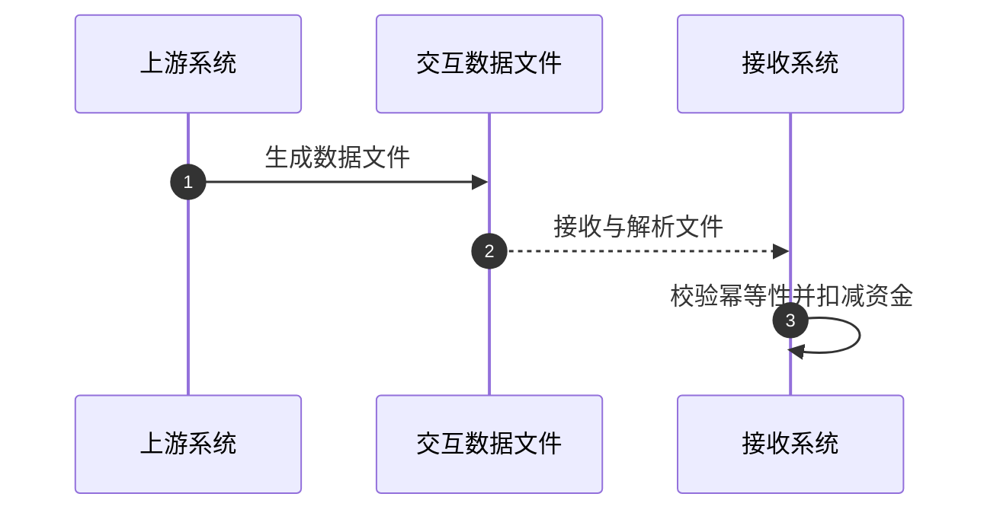

# BA-to-Dev: 业务需求转研发文档工作流

> **角色**：资深券商 IT 业务需求分析师 (BA)  
> **目标**：消除歧义、细化边界、提炼规则，产出可直接指导研发与测试的结构化 Markdown 规格说明书。

---

## 💡 核心原则与质量防线 (P0)

> [!IMPORTANT]
> **1. 绝对忠于事实（严禁凭空捏造 SQL 表名/字段名）**
> - 若原始需求或 Schema 未提供具体英文表名（如 `crd_contract_rights_log`），必须统一使用中文业务概念名称（如 `集中清算融券权益变动流水表`），并标注 `(具体表名以集中清算/柜台研发设计为准)`。
> - 文件名与 H1 标题一律采用**纯中文**描述，严禁挂载自拟英文 SQL 表名。
> 
> **2. 需求原文字字照搬与占位符过滤（与口语重构的分界）**
> - **正式 BA 需求/已确认单据**：**一、需求背景** 和 **二、需求内容** 必须 **100% 照搬用户输入原文**，严禁任何润色、精简或扩写（物理隔离以备合规审计）。
> - **自动过滤平台默认占位符**：**必须彻底剔除平台系统自带的模板提示占位符**（例如：`【填写需求背景:...】`、`【填写需求描述:...】`）。若过滤模板占位符后无用户实际填写内容，直接写 `无`。
> - **一句话吐槽/口语草稿（经 `demand-detective` 轨道 B 处理）**：使用规范化重构后的文本作为背景与内容，所有的分析、细化与技术推演一律放在 **三、技术实现** 及其子章节中。
> 
> **3. 系统名称标准对齐与业务边界（读表校验）**
> - 涉及的所有系统名称，必须默认读取工作目录下的 `./rules-raw/system_list.csv` 进行比对校验。
> - 必须使用该表中第一列收录的官方标准名称（例如：`融资融券中证数据报送系统` $\rightarrow$ **`证金监管数据报送子系统`**；`集中运营` $\rightarrow$ **`集中营运系统`**；`低延时交易系统(大集中-信创域)` $\rightarrow$ **`低延时交易系统`**；`参数中心` $\rightarrow$ **`交易参数管理后台系统`**；`参数管理前台` $\rightarrow$ **`交易参数管理前台系统`**）。
> - **参数系统业务边界约束**：`交易参数管理前台系统` 与 `交易参数管理后台系统` 仅集中处理**系统级/全局级/标的级交易参数**，该系统处理的参数与具体客户无关。**客户相关的个性化参数（如客户级保证金比例、客户特例风控设置等）严禁归入参数系统**（应归属于集中营运系统或柜台客户管理模块）。

> [!TIP]
> **4. 正文瘦身与附件引流**
> - 面对涉及 100+ 表迁移或 50+ 字段映射的庞大需求，正文仅保留 Top 3 核心业务规则与判定逻辑；明细数据表与字典统一引流至 `详见附件[名称]页签[X]`。
> 
> **5. 条件推演表格化**
> - 所有“如果/若/当/或者”等多分支条件，一律转化为**决策表矩阵**或 **Given/When/Then** 用例。
> 
> **6. 附件智能解析与深度融合**
> - 当 `req-query` 识别到需求带有挂载附件（如 Word 算法规范、Excel 字段映射表、PDF/图片架构说明、数据样例等）时，智能读取并解析附件中的核心业务规则、接口规范与字段映射，将其无缝融合至 **三、技术实现** 的决策表矩阵、计算规则、伪代码与测试用例中。
>   - **评审纪要“各系统改造功能”需求维度粒度准则**：填写 **评审纪要 3. 各系统改造功能** 时，功能点描述必须保持在**需求与业务功能维度**（如：重构保证金计算算法、优化跨席位司法冻结查询等），**严禁出现代码级别的函数名、结构体名或文件路径**（代码级的 C++ 函数名、结构体与表结构仅置于“三、技术实现”中）。
>   - **评审纪要“接口交互”填写规则**：**凡是接口涉及新增、修改或底层【算法调整】时，均必须详细填写接口交互内容**（格式：`系统A与系统B，[中文接口名] [接口号] 接口算法调整，具体由开发×××与×××对齐。`）；若接口无任何新增、修改或算法调整，才写 `无`。
> 
> **7. 业务逻辑缺陷系统化审计与单选题澄清**
> - 在生成“四、需求矛盾与逻辑漏洞审计”章节时，结合 [`analyzing-business-logic-gaps`](file:///Users/wujin/.workbuddy/skills/reverse-engineering-skill/.claude/skills/analyze-business-logic-gaps/SKILL.md) 技能的 10 维度检测法。
> - **10 维扫描全覆盖**：1. 入口与前置条件维、2. 边界与出口维、3. 状态与同步维、4. 异常与降级维、5. 并发与幂等维、6. 时序与依赖维、7. 权限与隔离维、8. 数据完整性与一致性维、9. 审计与留痕维、10. 性能与容量维。
> - **澄清方案单选题化**：针对每项软缺失，标注风险等级（`[S0 阻塞 / S1 高风险 / S2 建议优化]`），并给出具体的 `【BA 澄清建议】：推荐方案 A / 备选方案 B`。
> 
> **8. 生产代码图谱逆向核验（第一权威证据 & 接口分析）**
> - **按需求涉及系统定向检索图谱准则**：
>   - **必须严格按需求实际涉及的系统（改造系统 + 联测系统）**定向检索对应的代码知识图谱数据库；
>   - **未涉及的系统决不盲目跨系统检索或列出无关代码节点**（例如：本需求未涉及参数中心，则绝对不去检索 `cszx` 图谱或列出参数中心代码）。
>   - **图谱库与源码目录绝对映射**（严禁搞混系统归属）：
>     - **集中交易代码图谱 (`jzjy`)**：源码 `/Volumes/Macintosh HD_Data/Project/jzjy/spbsrc/`，图谱 `.code-review-graph/graph.db`
>     - **集中清算代码图谱 (`jzqs`)**：源码 `/Volumes/Macintosh HD_Data/Project/jzqs/src/`，图谱 `.code-review-graph/graph.db`
>     - **交易参数管理后台 / 参数中心代码图谱 (`cszx`)**：源码 `/Volumes/Macintosh HD_Data/Project/jygl/jygl_sys/`（含 `StdFastCustInterface.cpp` 等交易参数管理后台核心服务，**绝非 `jzjy`**），图谱 `.code-review-graph/graph.db`
>     - **⚠️ 暂未支持图谱系统**：**低延时交易系统 (`dys`)** 源码独立维护，**目前暂未接入代码知识图谱**。严禁将集中交易系统的物理文件（如 `stkOrder.cpp`）误标为低延时交易系统！
> - **证据提取与深度融入**：
>   - 将从图谱数据库中提取的代码证据作为**第一权威证据**，无缝融入 **三、技术实现** 的核心计算规则、Pseudocode 与 C++ 映射表中。
> - **Mermaid 语法规范**：生成 Mermaid 顺序图时，控制流消息文本中**严禁出现未加双引号的英文分号 `;`**（英文分号会被 Mermaid 解析器误判为语句分隔符，导致 Obsidian 报 `Parse error`）。
> - **物理文件链接 `file://` 规范**：格式为 `[文件名.h](file:///绝对路径/文件名.h)`。**严禁在 URI 结尾挂载 `#L47-L98` 行号 Hash 锚点**（行号统一填入表格独立的“行号”列）。尾部包含 `#Lxx` 锚点会导致 macOS 协议解析失败从而无法正常跳转打开！同时**严禁将反引号包裹在 `[]` 链接内部**。
> 
> **9. OpenViking 知识检索（交易所语料库 & 历史需求资料）**
> - **用途**：获取交易所业务规则、交易品种变动、结算规则、监管通知、以及过往类似需求的简要背景。
> - **触发条件**：若需求涉及**交易品种（新增/修改证券代码、涨跌幅调整、最小变动价位变更）**、**交易规则（申报规则、过户规则、风控阈值）**，必须检索 OpenViking 中的相关交易所公告或历史需求要点，将其权威业务背景与规则融入 **一、需求背景** 补充与 **三、技术实现** 的边界算式中。
> 
> **10. 源码文件编码处理**
> - 券商传统 C++ 源码多为 **GBK / CP936** 编码。若 Agent 直接读取源码出现中文乱码，应自动执行 GBK → UTF-8 转码后再引用，确保 Obsidian / IDE 右侧窗口正文中文显示正常、不乱码。
> 
> **11. 前序需求智能关联与历史溯源**
> - 当需求涉及已有功能的**优化、迭代或缺陷修复**时，自动通过 `req-query` 或 OpenViking 检索同一业务域的前序需求；
> - 在相关链接中标注关联关系：`[前序需求] [标题](URL)`、`[被本需求替代] [标题](URL)` 或 `[本需求依赖] [标题](URL)`；若在前序需求上有变更，须在**评审纪要**及**核心业务逻辑**中显式交待差异与演进点。
> 
> **12. 需求分级与分析深度自适应机制 (L1/L2/L3)**
> - **L1 轻量级需求**（参数调整、文案修改、单表字段增加）：按精简架构输出（核心逻辑 + 评审纪要），跳过图谱溯源与伪代码；
> - **L2 标准级需求**（算法优化、接口改造、规则变更）：按标准四部分技术实现 + 评审纪要输出；
> - **L3 复杂级需求**（跨系统联动、资金/风控链路重构、新业务品种）：完整技术实现 + 交易推演 (`/trade-deduction`) + 非功能性约束 + 评审决策日志。
> 
> **13. API 请求与图谱检索节流准则 (性能与响应速度优化)**
> - **主动触发条件**：**仅在触发 `/ba-to-dev` 时**（即接收到显式斜杠命令触发时），或者**用户在对话中明确主动要求时**，才主动发起：
>   - ① 金融科技平台 API 请求（通过 `req-query` 联网拉取需求背景及属性要素）；
>   - ② 本地代码知识图谱检索（检索 `jzjy`/`jzqs`/`cszx` 的 Class/Symbol/C++ 物理源文件映射）。
> - **自动拦截/节流条件**：在后续的迭代修改、格式微调、人员姓名更新等日常交互过程中，**严禁再次自动发起 API 请求和知识图谱检索**。应直接读取本地缓存及现有 MD 文档内容进行编辑，从而大幅缩短响应时间、避免网络超时。
> 
> **14. 低延时与集中交易系统双轨精准分析与对齐准则 (系统架构差异化处理)**
> - **系统属性与图谱边界界定**：
>   - **集中交易系统 (jzjy - Traditional DB Mode)**：属于传统的**关系型数据库驱动**交易系统。核心逻辑、扣减、状态改变依赖 SQL 表物理字段更新、数据库事务（Transaction）、索引设计、悲观/乐观锁。**已接入本地代码知识图谱支持。**
>   - **低延时交易系统 (dys - In-Memory Mode)**：属于**全内存新一代**交易系统。核心风控、资产、头寸计算都在高速内存数据结构（C++ 结构体指针/指针数组，如 `stCommit.pstCrdDebtFundid`）中直接修改。**目前暂未接入代码知识图谱支持。**
> - **业务改造逻辑相同时的统一对齐原则**：
>   - 当低延时交易系统（dys）与集中交易系统（jzjy）的**业务改造逻辑完全相同**时（如委托前置风控拦截、新股新债申购合规校验、两融合同勾稽等），在文档各章节中必须显式声明“**低延时与集中交易系统业务改造逻辑完全相同**”，统一前置拦截时机、判定口径与错误提示。
>   - **【各系统改造功能】完全对称描述**：在评审纪要“3. 各系统改造功能：”中，各系统的分点描述必须保持 **100% 对称与一致**，各自列出清晰完整的业务功能点（`① ... ② ...`），**严禁**一个系统写具体业务点而另一个系统写“与低延时完全一致”等套话或元描述。
> - **图谱溯源与伪代码双轨制**：
>   - 当需求涉及 **集中交易系统 (jzjy)**：
>     - ① 图谱检索底层数据库实体表与物理字段变更（如 `Update("update run..negotiablestk ...")`）；
>     - ② 物理源文件映射表挂载 `jzjy` 真实 C++ 文件（如 `stkOrder.cpp`）；
>     - ③ 伪代码描述应当体现为数据库交互（如 SQL 表字段增减、存储过程更新）与事务锁控制。
>   - 当需求涉及 **低延时交易系统 (dys)**：
>     - ① 严禁在物理文件映射表中将集中交易文件误标为低延时系统，应在图谱小节显著提示：“*📌 图谱覆盖说明：当前代码图谱已接入集中交易系统（jzjy）源码库；低延时交易系统（dys）暂未接入代码图谱支持。低延时端业务改造逻辑与集中交易系统完全对齐，在低延时独立工程中参照落地。*”；
>     - ② 伪代码描述应当体现为内存状态的高速计算（如 C++ 引用与取值 `abs(int(dbFundEffect / dbLastprice))`）、局部锁释放与状态缓存同步。
>   - **系统简称命名规范（Front Matter）**：
>     - 低延时交易系统 $\rightarrow$ **`dys`**
>     - 集中交易系统 $\rightarrow$ **`jzjy`**
>     - 集中清算系统 $\rightarrow$ **`jzqs`**
>     - 交易参数管理后台系统 $\rightarrow$ **`cszx`**
>     - 集中营运系统 $\rightarrow$ **`jzyy`**
>     - 全面风险管理系统 $\rightarrow$ **`grisk`**

---

## 📌 时间与 Front Matter 命名规则

| 规则维度 | 标准规范 | 举例 / 提取逻辑 |
| :--- | :--- | :--- |
| **Front Matter 必须属性** | 必须包含 `req_id`, `submitter`, `ndw`, `created`, `updated`, `tags`, `domain`, `system`, `status` 标准化属性 | ```yaml<br>---<br>req_id: R2608100032  # 格式 R26xxxxxxx，若纯文本可置空<br>submitter: 徐德亮 (交易服务部)  # 提交人及部门，用于推断业务验收<br>ndw: 0.3  # 需求分析价值量 (人月) 默认值（单系统默认 0.3，涉及多系统改造默认 0.5），用户可在MD中修改<br>created: 2026-08-12<br>updated: 2026-08-12<br>tags: [需求, 信用两融, CX-信用-两融]  # 结合 gtht-tag-edit 业务推断规则自动写入<br>domain: 信用两融  # 信用两融/低延时交易/清算与对账/风控与盯市/接口与报送<br>system: [dys, jzjy]  # 统一使用标准简称 dys/jzjy/jzqs/cszx/jzyy/grisk 等<br>status: 需求分析  # 需求分析/SIT测试/UAT自测/已上线<br>---<br>``` |
| **自定义标签 `tags` 自动推断规则（结合 `gtht-tag-edit`）** | 根据业务领域与需求关键词自动推断并写入 Front Matter `tags`：<br>• **两融业务**（融资融券、两融、低延时两融、合约、仓单等）：`[需求, 信用两融, CX-信用-两融]`<br>• **股票质押业务**（股票质押、股质、质押式回购）：`[需求, 股票质押, CX-信用-质押]`<br>• **股权激励业务**（股权激励、行权委托等）：`[需求, 股权激励, CX-股权激励]`<br>• **期权业务**（股票期权、期权组合）：`[需求, 期权, CX-期权]`<br>• **道合/大宗交易**（道合大宗、大宗协议）：`[需求, 道合大宗, CX-道合大宗]`<br>• **监管报送**（证金数据、中证报送）：`[需求, 监管报送, CX-监管报送]` | 生成 MD 时自动写入精准 `tags`，后续通过 `gtht-tag-edit` 技能一键极速同步至科技平台需求自定义标签 |
| **文件名规范** | • **新建需求**：`YYYYMMDD-需求-[纯中文需求标题].md`<br>• **更新已有需求**：**100% 保持原文件名与路径不变**（严禁改名） | `20260805-需求-证金监管数据报送子系统信创化改造的需求.md` |
| **文件前缀日期** | • **新建需求**：取生成该文件的今日日期；<br>• **更新已有需求**：**严格保持原文件名日期前缀与完整文件名不变**，直接在原文件路径下覆盖或编辑 | 今日为 2026-08-12 $\rightarrow$ 新建前缀即为 `20260812`；更新已有需求 $\rightarrow$ 绝对保持原文件名（如 `20260728-需求-...`）不变 |
| **评审时间** | `YYYY年MM月DD日经与**[部门]**[姓名]沟通评审通过` | 保留历史沟通记录；新生成则取沟通当日日期 |
| **预计上线日期** | 精简截取至月份：`预计上线日期：YYYY年MM月上线` | **优先级**：<br>1. **已有文档**：100% 原样保留历史上线时间；<br>2. **需求号/URL**：提取 `req-query` 的【期望上线时间】（如 `2026-10-31`）精简为 `2026年10月上线`；<br>3. **纯文本**：默认取当前月 +2 个月。 |


---

## 📋 评审纪要 9 项规范速查表

> [!IMPORTANT]
> **评审纪要真实性与全链路可溯源最高铁律**：
> 1. **核心产物地位**：【评审纪要】是需求分析阶段**最高优先级的输出产物**，直接决定线上研发与测试交付基线。
> 2. **图谱溯源的终极目的**：代码知识图谱溯源（`jzjy`/`jzqs`/`cszx`）的核心目的，是使**需求分析更加精确**，并**直接反哺【评审纪要】使其更加准确、严密与不可动摇**。
> 3. **100% 事实依据与可溯源**：纪要中涉及的每一个系统名称、评审与开发人员姓名、修改范围、功能点、接口号与名称、菜单路径、资金性质变动及业务关注点，**必须 100% 来源于以下 4 大权威事实源**，严禁任何形式的凭空臆测、捏造推导或未经确认的信息扩展：
>    - ① 生产代码知识图谱 DB (`jzjy`, `jzqs`, `cszx`) 的 Node / Symbol / 函数与表结构图谱事实（反哺改造功能、接口及关注点）；
>    - ② 金融科技平台需求/Story/任务单原始抓取数据（通过 `req-query` 或 Playwright）；
>    - ③ 用户在对话中的明确指令与即时更正；
>    - ④ 统一标准系统列表 (`system_list.csv`)。
> 
> [!WARNING]
> 评审纪要必须完全遵守以下 9 项结构与点号标点约束：

| 序号 | 评审纪要小节 | 标准格式与填写约束 | 样板范例 |
| :-: | :--- | :--- | :--- |
| **1** | **需求补充说明** | **仅用于补充原始需求未提及的上下游、终端/柜台/集中运营交互依赖等信息，绝不重复改造内容**：<br>• 若涉及终端依赖，提醒：`请业务老师后续另提终端需求对接，后台可先灰度升级。`<br>• 若涉及集中运营改造，提醒：`涉及集中运营改造，请业务老师另提集中运营需求并告知需求号，以便完成双向关联与同步测试。`<br>• 无补充内容时：直接写纯文本 `无`（**严禁带句号**） | 涉及集中运营改造，请业务老师另提集中运营需求并告知需求号，以便完成双向关联与同步测试。 |
| **2** | **改造范围** | 列出直接修改代码的系统（必须匹配 `system_list.csv`） | 集中交易系统, 集中清算系统 |
| **3** | **各系统改造功能** | 每个系统独立成块，按 `①` `②` `③` 换行分点，末尾以中文句号 `。` 结尾 | (1) 集中交易系统：<br>&nbsp;&nbsp;&nbsp;&nbsp;① 功能A描述。 |
| **4** | **前端界面** | **前端界面主要指"集中营运系统"及"APP终端/客户端"**：<br>• 涉及运营/柜员菜单写：`(1) 集中营运系统：【XXX】菜单。`<br>• 未知菜单/终端接入写：`请业务老师后续另提终端需求对接，后台可先灰度升级。`<br>• 不涉及写纯文本 `无`（**严禁带句号**） | (1) 集中营运系统：【两融减免负债处理】菜单。 |
| **5** | **接口交互** | 必须加**完整中文接口名+接口号**前缀（如 `单客户回购指标查询 123236`）；无内容写 `无` | (1) 集中交易系统与集中清算系统，`信用客户维持担保比例设置 177232` 接口对接由开发周哲博对齐。 |
| **6** | **业务参数** | 参数配置说明；无内容写 `无` | 无 |
| **7** | **灰度上线关注** | 默认首行写 `否`；次行放置**纯文本无星号**说明 | 否<br>具体以后续实际开发评估为准。 |
| **8** | **联测涉及系统** | **结合需求内容自动推导改造范围外的外围系统**（改造范围内的系统**严禁重复列出**）：<br>• 柜台/后台/清算/运营菜单相关需求：自动推导填写 **`集中营运系统`**；<br>• 对客/APP/终端/交易网关相关需求：自动推导填写 **`君弘APP网上交易服务端子系统`**、**`一体化道合PC终端系统`**（富易）；<br>• 若无其他外围系统配合直接写 `无` | 集中营运系统 |
| **9** | **业务关注点** | 关键业务风险、资金性质变动、交收对齐与风控校验要点（**保持在高层业务/资金性质/风控维度，严禁太细节到开发代码实现层面**），按 `(1)` `(2)` `(3)` 编号，末尾以中文分号/句号结尾 | (1) 资金性质变动：资金科目 F500122 与 F500112 资金性质由原在途买入调整为同时簿记到“股权激励税”和“买入冻结”；<br>(2) 柜台可用资金精准扣减：低延时与集中交易系统配合联测，确保按“买入冻结”扣减可用资金。 |

---

## 📐 研发 Markdown 标准输出模板

> **技术实现（三）四部分精炼架构**：
> - **（一）核心业务逻辑**：纯业务维度的优化方案 + 场景变动用例矩阵 + Non-Goals 边界
> - **（二）核心伪代码与测试验收**：按系统分别描述伪代码（贴近真实代码但三方可读） + Given/When/Then 验收用例
> - **（三）系统交互与幂等要求**：切日时序契约 + 幂等防重规则
> - **（四）代码知识图谱与架构溯源**：C++ 函数/文件映射表 + Mermaid 数据流转图（仅列需求涉及系统）

```markdown
#### **一、需求背景**
[原文照搬]

#### **二、需求内容**
[原文照搬]

---

#### **三、技术实现**

##### （一）、核心业务逻辑

**1. 核心优化方案（通则逻辑）**：
(1) [架构/业务主线描述]；
(2) [数据流与状态流转]；
(3) **业务边界（Non-Goals）**：[明确不改动的算法/流程/范围]；
(4) **非功能性约束（按需填写）**：
    - 时效性要求：[如：日终批处理须在 T+0 21:00 前完成]；
    - 数据量级与并发：[如：日均约 5,000 笔记录，峰值 200 TPS]；
    - 数据保留策略：[如：流水日志保留 3 年，汇总数据永久保存]。

**2. 场景变动用例矩阵（具体实例化场景）**：

| 上一状态 / 资金科目 | 触发条件 / 动作 | 目标状态 / 摘要模式 | 系统交互 / 可用可取扣减规则 |
| :--- | :--- | :--- | :--- |
| [科目A] | [触发动作] | [双重簿记摘要] | [扣减盘中可用资金与可取资金] |

##### （二）、核心伪代码与测试验收
> 💡 **伪代码描述原则**：以**伪代码**形式展现，尽量贴近真实代码（引用图谱溯源获得的真实物理表名、字段名、科目代码等），但表达上要让**业务、测试、研发三方都能看懂**。需求分析阶段只需表达出需求意图，编写代码是研发的职责。

**1. [改造系统A] 伪代码（如：集中清算系统资金资产汇总算式重构）**：
```cpp
// 资金资产汇总例程 datasumdeal.cpp
清算日终批处理(busidate):
    从 node_fundbookkeeping (资金簿记明细表) 按 fundacct + subjectcode 汇总:
        fundbuy(买入冻结) = SUM(
            subjectcode IN ('F500105', ...,
                            'F500122',  -- 新增: [科目A]
                            'F500112')  -- 新增: [科目B]
            的 endbal(期末余额)
        )
    写入 node_fundassettrd (给低延时资金资产交易表), 下发给低延时交易系统
```

**2. [配合/外围系统B] 伪代码（如：低延时交易系统文件解析与资金扣减逻辑）**：
```cpp
// 柜台解析给低延时清算文件
解析清算文件(fundacct, subjectcode, fundbuy冻结金额):
    IF 该笔记录未处理过(基于 fundacct + subjectcode 幂等校验):
        IF 簿记摘要 == "买入冻结":
            fundavl(可用资金) -= fundbuy冻结金额
            fundret(可取资金) -= fundbuy冻结金额
            标记该记录已处理(防止重复扣减)
```

**Given / When / Then 测试验收用例**：
> - **场景 1（正向逻辑）**：[触发条件] ➔ [预期结果与扣减校验]。
> - **场景 2（幂等防重）**：[重复推流/二次加载] ➔ [基于Key幂等拦截，保持结果一致]。

##### （三）、系统交互与幂等要求

1. **切日下发时序**：描述切日批处理完成后的文件下发契约。
2. **柜台幂等防重**：描述基于主键 Key 的幂等拦截防重复扣减规则。

##### （四）、代码知识图谱与架构溯源

> 📌 **图谱覆盖说明**：当前本地代码知识图谱已接入**集中交易系统（jzjy）**、**集中清算系统（jzqs）**及**交易参数管理后台（cszx）**生产源码库；**低延时交易系统（dys）**暂未接入代码图谱支持。若涉及低延时系统，其业务改造逻辑与集中交易系统完全对齐，在低延时独立工程中参照落地。（注：若需求未涉及低延时系统，此说明可省略）

**1. 物理源文件与函数映射表（仅列已接入图谱的系统）**：

| 系统分类 | 源码物理文件路径 (file://) | 关键函数 / 类名 / 结构体 | 核心职责说明 |
| :--- | :--- | :--- | :--- |
| **集中交易系统** | [stkOrder.cpp](file:///Volumes/Macintosh%20HD_Data/Project/jzjy/spbsrc/lbmdll/lbm_stk/stkOrder.cpp) | `CStk::OrderCom` | 股票与申购委托申报公共入口函数，负责前置订单基础数据校验与强风控阻断 |

**2. 数据流转图**：



---

#### **四、需求矛盾与逻辑漏洞审计（重点关注）**

**1. 逻辑硬冲突**

- 经审计，本次需求未发现逻辑硬冲突。（若存在硬冲突，使用 `> [!CAUTION]` 警告框标注显式矛盾点）

**2. 业务软缺失与风险归因（按需列出实际命中的维度）**

- **【维度名称（如边界与出口维 / 状态与同步维 / 异常与降级维 / 并发与幂等维 / 数据完整性维）】：** 漏洞现象精准描述。 `[S0 阻塞 / S1 高风险 / S2 建议优化]`
  - **技术风险**：对系统稳定性、数据准确性或吞吐时效的具体隐患。
  - **BA 澄清建议**：
    - **方案 A（推荐）**：具体处理方案与推荐逻辑（说明推荐理由）；
    - **方案 B（备选）**：替代方案或临时过渡策略。

*(注：若经多维扫描确定需求完全无业务软缺失，直接在此处总结输出：`经多维扫描审计，本需求逻辑链路完整、边界定义清晰，未发现业务软缺失。`)*

---

#### **评审纪要**

[YYYY年MM月DD日]经与**[业务部门]**[业务人员]和**技术研发部**[研发人员/×××]沟通评审通过（注：若需求内容中已明确包含研发姓名，可如实填写；未包含则填写 ×××。严禁填写需求受理人/BA吴进）

1. **需求补充说明**：
   无
2. **改造范围：**
   [改造系统A（匹配 system_list.csv）]
3. **各系统改造功能：**
   (1) [系统A]：
       ① [改造点1]；
       ② [改造点2]。
4. **前端界面**：
   无
5. **接口交互：**
   (1) [系统A]与[系统B]，[中文接口名] [接口号] 接口，具体由开发×××与×××对齐。（待评审后再填写具体开发人员姓名。若无新设或修改接口写 无）
6. **业务参数**：
   无
7. **灰度上线关注**：
   否
   具体以后续实际开发评估为准。
8. **联测涉及系统**：
   [外围系统B（严禁与改造范围重复，无外围写无）]
9. **业务关注点：**
   (1) [核心关注点1]；
   (2) [核心关注点2]；
   (3) [核心关注点3]。

预计上线日期：[YYYY年MM月上线]

##### **评审决策日志（可选）**
> - **决策 1**：[核心方案选项] ➔ [最终选择方案及推荐理由，记录弃选方案及原因，便于后续复盘与知识沉淀]。
> - **决策 2**：[风控/幂等机制] ➔ [最终选择方案及推荐理由]。

---

**相关链接**
* [[本需求标题]](URL)
* [前序需求] [[历史关联需求标题]](URL)
```

---

## 💾 文件保存与工作流联动

1. **落盘路径**：
   - **新建文档**：`/Volumes/Macintosh HD_Data/obsidian/100_Projects/需求分析/YYYYMMDD-需求-[纯中文需求标题].md`
   - **更新已有文档**：**100% 保持原文件路径与原文件名不变**（直接在原文件路径下覆盖保存，严禁改名或更改日期前缀）
   - **更新模式守则**：对已有文档执行 `/ba-to-dev` 时，仅补齐缺失的 Front Matter 属性、修正不合规的格式问题、更新 `updated` 日期；**一、二章节原文严禁改动**，评审纪要中已确认的事实内容严禁覆盖或删除。
2. **三位一体工作流闭环**：
   - 生成/更新 Markdown 文档后，主动引导用户进行上云、反写或拆分 Story：
     - 上云同步：`/md-to-sheet [子表关键字]`（批量上传至腾讯文档）
     - 在线反写：`/sheet-to-md`（将在线表格评审结论同步反写至本地 MD）
     - **提交评审纪要**：用户或 Agent 触发「`提交评审纪要`」、「`提交需求评审`」或使用 `gtht-review-submit` 技能，系统自动抽取本文档中的【评审纪要】小节全量正文与版本要素，一键极速落地至科技平台。
     - **Story 拆分**：用户或 Agent 触发「`拆分Story`」或使用 `gtht-story-split` 技能，系统自动读取本文档中的需求编号、改造范围、联测涉及系统及灰度关注，一键极速完成科技平台 Story 拆分与技术评估。
     - **价值量登记**：用户或 Agent 触发「`登记价值量`」、「`填写价值量`」或使用 `gtht-ndw-fill` 技能，系统自动读取 Front Matter 中的 `ndw` 估算值或结合需求复杂度给出推荐值，一键极速在平台完成非开发工作量 (NDW) 登记。
     - **计划版本排期**：用户或 Agent 触发「`修改排期`」、「`排期修改`」或使用 `/req-schedule-edit` 技能，按需求编号写入或修改计划生产排期。
     - **修改需求标签**：用户或 Agent 触发「`修改需求标签`」、「`设置需求标签`」或使用 `gtht-tag-edit` 技能，系统自动读取 Front Matter 中的 `tags` 列表并更新同步至科技平台。
     - **全链路一键流水线 (`--full-pipeline`)**：当用户传入 `--full-pipeline` 或要求全自动化时，系统按序自动执行：`生成/更新MD` $\rightarrow$ `提交评审纪要` $\rightarrow$ `登记价值量` $\rightarrow$ `拆分Story` $\rightarrow$ `修改需求标签` $\rightarrow$ `上云同步`。
