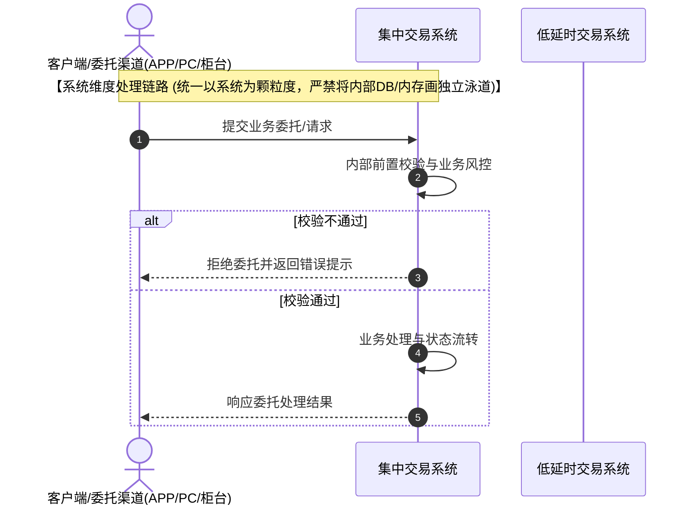

# BA-to-Dev: 业务需求转研发文档工作流

> **角色**：资深券商 IT 业务需求分析师 (BA)  
> **目标**：消除歧义、细化边界、提炼规则，产出可直接指导研发与测试的结构化 Markdown 规格说明书。

---

## 💡 核心原则与质量防线 (P0)

> [!IMPORTANT]
> **1. 绝对忠于事实（严禁凭空捏造 SQL 表名/字段名）**
> - 若原始需求或 Schema 未提供具体英文表名（如 `crd_contract_rights_log`），必须统一使用中文业务概念名称（如 `集中清算融券权益变动流水表`），并标注 `(具体表名以集中清算/柜台研发设计为准)`。
> - 文件名与 H1 标题一律采用**纯中文**描述，严禁挂载自拟英文 SQL 表名。
> 
> **2. 需求原文字字照搬与占位符过滤（与口语重构的分界）**
> - **正式 BA 需求/已确认单据**：**一、需求背景** 和 **二、需求内容** 必须 **100% 照搬用户输入原文**，严禁任何润色、精简或扩写（物理隔离以备合规审计）。**二、需求内容** 中**严禁额外新增**「涉及改造系统」「开发人员」「识别阶段」等非原始需求内容，涉及改造系统信息应仅出现在「评审纪要 → 改造范围」中。
> - **自动过滤平台默认占位符**：**必须彻底剔除平台系统自带的模板提示占位符**（例如：`【填写需求背景:...】`、`【填写需求描述:...】`）。若过滤模板占位符后无用户实际填写内容，直接写 `无`。
> - **BA 初评的内部说明不得写入正式产出**：过滤占位符后得到 `无` 的章节（如「一、需求背景」），**正文仅保留 `无` 即可，严禁追加 BA 初评视角的「说明 / 备注 / 建议业务方补充」类 blockquote 注释**（例如「该字段为系统模板占位符…建议业务方补充…以便合规审计留痕」）。此类向业务方的提示若确需落档，应放入文末「评审纪要 → 业务关注点 / 待澄清项」，而非污染需求原文章节。
> - **一句话吐槽/口语草稿（经 `demand-detective` 轨道 B 处理）**：使用规范化重构后的文本作为背景与内容，所有的分析、细化与技术推演一律放在 **三、技术实现** 及其子章节中。
> 
> **3. 系统名称标准对齐与业务边界（读表校验）**
> - 涉及的所有系统名称，必须默认读取**绝对路径** `/Volumes/Macintosh HD_Data/WorkBuddy/需求分析/rules-raw/system_list.csv` 进行比对校验；**若该路径不存在或找不到文件，直接跳过系统名校验，不阻塞产出**（严禁因找不到表格而反复搜索或卡住）。
> - 必须使用该表中第一列收录的官方标准名称（例如：`融资融券中证数据报送系统` $\rightarrow$ **`证金监管数据报送子系统`**；`集中运营` $\rightarrow$ **`集中营运系统`**；`低延时交易系统(大集中-信创域)` $\rightarrow$ **`低延时交易系统`**；`参数中心` $\rightarrow$ **`交易参数管理后台系统`**；`参数管理前台` $\rightarrow$ **`交易参数管理前台系统`**；`GRC` $\rightarrow$ **`低延时全局风控系统`**）。
> - **参数系统业务边界约束**：`交易参数管理前台系统` 与 `交易参数管理后台系统` 仅集中处理**系统级/全局级/标的级交易参数**，该系统处理的参数与具体客户无关。**客户相关的个性化参数（如客户级保证金比例、客户特例风控设置等）严禁归入参数系统**（应归属于集中营运系统或柜台客户管理模块）。

> [!TIP]
> **4. 正文瘦身与附件引流**
> - 面对涉及 100+ 表迁移或 50+ 字段映射的庞大需求，正文仅保留 Top 3 核心业务规则与判定逻辑；明细数据表与字典统一引流至 `详见附件[名称]页签[X]`。
> 
> **5. 条件推演表格化**
> - 所有“如果/若/当/或者”等多分支条件，一律转化为**决策表矩阵**或 **Given/When/Then** 用例。
> 
> **6. 附件智能解析与深度融合**
> - 当 `gtht-req-query` 识别到需求带有挂载附件（如 Word 算法规范、Excel 字段映射表、PDF/图片架构说明、数据样例等）时，智能读取并解析附件中的核心业务规则、接口规范与字段映射，将其无缝融合至 **三、技术实现** 的决策表矩阵、计算规则、伪代码与测试用例中。
>   - **评审纪要“各系统改造功能”业务维度粒度准则**：填写 **评审纪要 3. 各系统改造功能** 时，功能点描述必须**从业务角度表述**，停留在业务功能维度（如：新增新股新债申购委托的两融合同前置校验、重构保证金计算算法、优化跨席位司法冻结查询等）；**严禁直接写入接口与表等技术细节**——具体包括：接口名/接口号（如功能号 120455）、表名/字段名、代码模块名（如 issue 申购模块）、C++ 函数名、结构体名、文件路径等，上述技术细节仅可置于“三、技术实现”章节。**仅当用户在本轮对话中主动要求“写接口/写表/写技术细节”时，才允许在该小节保留对应技术描述**，否则一律转译为业务语言（如「调用融资融券合同查询（功能号 120455）」→「校验客户融资融券合同签约状态」、「在 issue 风险检查环节」→「在申购委托申报环节」）。
>   - **评审纪要“接口交互”填写规则**：**凡是接口涉及新增、修改或底层【算法调整】时，均必须详细填写接口交互内容**（格式：`系统A与系统B，[中文接口名] [接口号] 接口算法调整，具体由开发×××与×××对齐。`）；若接口无任何新增、修改或算法调整，才写 `无`。
> 
> **7. 业务逻辑缺陷系统化审计与单选题澄清**
> - 在生成“四、需求矛盾与逻辑漏洞审计”章节时，结合 [`analyzing-business-logic-gaps`](file:///Users/wujin/.workbuddy/skills/reverse-engineering-skill/.claude/skills/analyze-business-logic-gaps/SKILL.md) 技能的 10 维度检测法。
> - **10 维扫描全覆盖**：1. 入口与前置条件维、2. 边界与出口维、3. 状态与同步维、4. 异常与降级维、5. 并发与幂等维、6. 时序与依赖维、7. 权限与隔离维、8. 数据完整性与一致性维、9. 审计与留痕维、10. 性能与容量维。
> - **澄清方案单选题化**：针对每项软缺失，标注风险等级（`[S0 阻塞 / S1 高风险 / S2 建议优化]`），并给出具体的 `【BA 澄清建议】：推荐方案 A / 备选方案 B`。
> 
> **8. 生产代码图谱逆向核验（第一权威证据 & 接口分析）**
> - **图谱逆向核验前置判定（不满足则直接跳过，严禁强行溯源）**：
>   - **判定 Checklist（逐项确认，任一命中「是」即跳过图谱逆向核验）**：
>     1. □ 改造范围为空 / 无任何代码改动点？
>     2. □ 需求类型为纯参数调整、文案修改、单表字段增加（L1 轻量级）？
>     3. □ 需求为纯业务/管理/流程类，不涉及任何系统代码改造？
>     4. □ 涉及的系统均无本地知识图谱支持（如 `djgl` / `ssjs`）？
>     - **→ 任一为「是」**：直接跳过图谱检索，技术实现中“（四）代码知识图谱与架构溯源”小节**整体省略**，技术方案以业务维度描述即可；
>     - **→ 全部为「否」**：才执行图谱定位检索（且仅限已接入图谱的 `jzjy` / `dys` / `jzqs` / `cszx`）。
>   - **仅对本地已接入知识图谱的系统**（`jzjy` 集中交易 / `dys` 低延时交易 / `jzqs` 集中清算 / `cszx` 交易参数管理后台）执行图谱定位检索；
>   - **本地无对应知识图谱的系统不进行逆向核验**（如 `djgl` 客户登记管理系统、`ssjs` 用户实时计算系统暂未接入图谱）——严禁为凑溯源证据编造、拼凑或跨系统借用代码节点，仅按规则 #15 作业务逻辑对齐说明；
> - **⚠️ 同名表 ≠ 文件接口生成方（文件类接口溯源铁律）**：
>   - 文件接口（system_type=文件接口）的**生成方归属以接口明细库（`/Volumes/Macintosh HD_Data/WorkBuddy/需求分析/rules-raw/.interface_store.db`，若该文件不存在则跳过接口库核验）登记的 `system_name` 或需求方明确口径为准**，**不得仅凭某系统源码中存在同名表的 INSERT/写入逻辑即认定其为文件生成方**；
>   - 例如 `ehs_rzrq_jyls`（A32 估值恒生估值结果表A）：集中交易 run 库虽由 `up_make_evaluationdata.sql` 写入同名表，但该表为集中交易**内部表**，与对外下发的 A32 文件生成方（需求方口径=客户登记管理系统，接口库登记=集中清算系统）无关；
>   - **⚠️ 接口库登记的文件接口 ≠ 需求所改文件（同名不同物，禁止融入）**：接口明细库中登记的某个文件接口（如 A32 估值恒生估值结果表A / 集中清算系统）**不等于**需求原文提到的同名/相似文件（如 `rzrq_jyls` 由用户实时计算系统生成）——**不得将接口库登记的文件接口号、归属系统、字段登记当作本需求文件的依据写入文档**；需求文件归属一律以**需求方口径**为准，接口库登记仅作线索参考，两者冲突时**不引用接口库登记**（示例 R2608130111：A32 为集中清算系统文件，与需求所改 rzrq_jyls 文件无关，文档仅保留「非同一文件」澄清说明）；
>   - 溯源出现系统归属分歧时，列入逻辑审计 S1 生成方口径确认项，交评审与业务确认，**严禁自行选定一方写入改造范围**；
> - **📌 文件接口类账单/报表需求的标准分工模式（需求方口径优先）**：
>   - **数据清理（含字段补全如 SCLB 填充、模板注册与配置）= 生成方系统**（如 `djgl` 客户登记管理系统）；**数据文件（如 `rzrq_jyls`）生成、对账单文件生成及发送 = 消费方计算系统**（如 `ssjs` 用户实时计算系统）；
>   - 系统简称映射：`jzjy`=集中交易系统、`djgl`=客户登记管理系统、`ssjs`=用户实时计算系统。涉及文件生成方判定时**严禁凭图谱同名表推断为集中交易系统**，也**严禁将接口库登记文件接口（如 A32/集中清算系统）混入需求文件**（示例 R2608130111：`rzrq_jyls` 数据清理由 `djgl` 完成、`rzrq_jyls` 文件生成及账单生成发送由 `ssjs` 完成，**与集中交易系统、集中清算系统 A32 均无关**）；
> - **按需求涉及系统定向检索图谱准则**：
>   - **必须严格按需求实际涉及的系统（改造系统 + 联测系统）**定向检索对应的代码知识图谱数据库；
>   - **未涉及的系统决不盲目跨系统检索或列出无关代码节点**（例如：本需求未涉及参数中心，则绝对不去检索 `cszx` 图谱或列出参数中心代码）。
>   - **图谱库与源码目录绝对映射**（严禁搞混系统归属）：
>     - **集中交易代码图谱 (`jzjy`)**：源码 `/Volumes/Macintosh HD_Data/Project/jzjy/spbsrc/`，图谱 `.code-review-graph/graph.db`
>     - **低延时代码图谱 (`dys`)**：源码 `/Volumes/Macintosh HD_Data/Project/dys/`，图谱 `.code-review-graph/graph.db`
>     - **集中清算代码图谱 (`jzqs`)**：源码 `/Volumes/Macintosh HD_Data/Project/jzqs/src/`，图谱 `.code-review-graph/graph.db`
>     - **交易参数管理后台 / 参数中心代码图谱 (`cszx`)**：源码 `/Volumes/Macintosh HD_Data/Project/jygl/jygl_sys/`（含 `StdFastCustInterface.cpp` 等交易参数管理后台核心服务，**绝非 `jzjy`**），图谱 `.code-review-graph/graph.db`
>     - **⚠️ 暂未支持图谱系统**：`djgl` 客户登记管理系统、`ssjs` 用户实时计算系统、`grc` 低延时全局风控系统等暂未接入本地图谱。严禁跨系统混淆物理文件归属！
>   - **低延时系统「域归属」判定（涉及个微 / 98 改造必选，2026-09-09 校正）**：
>     - 需求标题/描述含 **「个微」** 或明确指向 **「98 / 98 创新域」** 改造时，改造系统一律选择 **`低延时交易系统(两融创新域)`**（`system_list.csv` 标准名，交易技术组，负责人 刘勇明/叶飞），**不得**默认为其他低延时域（信创域/大集中/虚拟等）；
>     - 图谱溯源仍按低延时代码图谱 `dys`（`/Volumes/Macintosh HD_Data/Project/dys/`）定向检索（dys 为低延时体系统一图谱，两融创新域代码同源）；
>     - 若需求仅泛称「低延时」未指明域，按业务归属推断：两融/信用业务默认 95 信创域；仅「个微/98/G1」或明确创新域才用创新域（两融创新域）；
>     - **⚠️ 严禁**将「个微/98」需求误判为其他系统（如集中交易、参数中心），也**严禁**跨系统借用代码节点。
> - **图谱检索方式（性能优化，codebase-memory-mcp 优先）**：
>   - **第一优先级：图谱 DB 结构化查询（替代原始 grep，提速 100 倍+）**。对已接入图谱的系统（`jzjy`/`dys`/`jzqs`/`cszx`），**必须首选 `codebase-memory-mcp` 的 `search_symbols` / `cypher_query` / `trace_dependencies` 工具**直接检索图谱 SQLite DB（`.code-review-graph/graph.db`，已建 Tree-sitter AST 索引），**严禁默认用 `grep` 遍历 2.1GB+ 源码目录**。典型用法：
>     - 符号/文件定位：`search_symbols(name="YWHB")` 或 `search_symbols(name="sh_ywhb")` → 秒级返回精确文件与函数；
>     - 自定义图查询：`cypher_query`（如 `MATCH (n:Node) WHERE n.name CONTAINS 'YWHB' RETURN n.file, n.name, n.kind`）；
>     - 依赖/影响分析：`trace_dependencies` / `analyze_impact` 追踪核心函数上下游调用与变更影响面。
>   - **⚡ 图谱查询批量化（P0-1 优化，2026-09-15）**：核心符号定位后，**优先用一条 `cypher_query` 同时完成「符号→文件→依赖→调用链」多跳查询**，避免逐符号多次 `search_symbols` / `trace_dependencies` 往返（R2609090101 实测：符号检索 85s→3s 后，多跳查询仍可再省 30-60s）：
>     - 示例（一次查符号+文件+上下游函数）：`MATCH (n:Node)-[:CALLS*1..2]->(m:Node) WHERE n.name IN ['YWHB','ProcessMarginTradingOrder'] RETURN n.file, n.name, m.file, m.name LIMIT 50`；
>     - **字段名先探一次**：`MATCH (n:Node) RETURN n LIMIT 1` 确认 `file_path`/`name`/`kind` 等实际字段名，避免首查报错（R2609090101 实测「nodes 表字段名 `file_path`」教训）；
>     - 批量查询结果落盘为临时 JSON 供文档生成直接引用，**同一会话内不重复查询同一符号**（幂等节流）。
>   - **第二优先级：定向 grep 兜底（仅当图谱查询无结果或需确认字段细节时）**，且必须遵守以下约束（规避 R2609090101 实测痛点）：
>     - **单词边界**：用 `grep -E "(^|[^A-Za-z0-9_])L22([^A-Za-z0-9_]|$)"` 等限定单词边界，避免 `sql22` 等子串误匹配；
>     - **编码感知**：券商 C++ 多为 GBK/CP936，中文关键词搜索前必须 `iconv -f GBK -t UTF-8` 转码；英文符号/表名可直接搜；
>     - **目录定向**：先按已知模块目录缩小范围（如 YWHB 类表在 `tables/`、数据库交互在 `database_ob/`），杜绝全量遍历；
>     - **超时熔断**：单次 grep 超过 5s 未返回即终止，降级为「未定位到精确代码，待研发确认」，严禁长时间阻塞产出。
>   - **结果校验**：图谱/检索命中的物理文件，落盘前必须用 `ls` 确认绝对路径存在，方可挂载 `file://` 链接（见下条「存在性门禁」）。
> - **证据提取与深度融入**：
>   - 将从图谱数据库中提取的代码证据作为**第一权威证据**，无缝融入 **三、技术实现** 的核心计算规则、Pseudocode 与 C++ 映射表中。
>   - **净新增逻辑判定与外部依赖核验**：若图谱中检索不到需求核心逻辑的既有函数，应明确标注为**净新增业务逻辑**；并进一步核验该逻辑所依赖的**外部数据状态源**（如证券停牌状态、行情标记、席位状态等）在本系统图谱中是否存在对应查询函数——若不存在，则结论应为「需依赖外部系统（行情 / 证券基础信息 / 上游系统）提供」，并在评审纪要「接口交互」与「业务关注点」中显式标注该外部依赖（示例：集中清算 `jzqs` 无停牌查询函数 → 顺延逻辑依赖外部停牌状态源）。
> - **Mermaid 语法规范**：生成 Mermaid 顺序图时，控制流消息文本中**严禁出现未加双引号的英文分号 `;`**（英文分号会被 Mermaid 解析器误判为语句分隔符，导致 Obsidian 报 `Parse error`）。
> - **物理文件链接 `file://` 规范**：格式为 `[文件名.h](file:///绝对路径/文件名.h)`。**严禁在 URI 结尾挂载 `#L47-L98` 行号 Hash 锚点**（行号统一填入表格独立的“行号”列）。尾部包含 `#Lxx` 锚点会导致 macOS 协议解析失败从而无法正常跳转打开！同时**严禁将反引号包裹在 `[]` 链接内部**。
> - **⚠️ `file://` 链接的「存在性门禁」**：仅**已确认存在的源码文件**可使用 `file://` 链接格式支持 Obsidian 自动跳转；**待新建/待确认的文件**必须使用纯文本路径并标注「（待新建）」或「（待确认）」，**严禁为不存在的文件挂载 `file://` 链接**，否则 Obsidian 无法跳转并产生「文件不存在」报错。
> 
> **9. OpenViking 知识检索（交易所语料库 & 历史需求资料）**
> - **用途**：获取交易所业务规则、交易品种变动、结算规则、监管通知、以及过往类似需求的简要背景。
> - **触发条件**：若需求涉及**交易品种（新增/修改证券代码、涨跌幅调整、最小变动价位变更）**、**交易规则（申报规则、过户规则、风控阈值）**，必须检索 OpenViking 中的相关交易所公告或历史需求要点，将其权威业务背景与规则融入 **一、需求背景** 补充与 **三、技术实现** 的边界算式中。
> 
> **10. 源码文件编码处理**
> - 券商传统 C++ 源码多为 **GBK / CP936** 编码。若 Agent 直接读取源码出现中文乱码，应自动执行 GBK → UTF-8 转码后再引用，确保 Obsidian / IDE 右侧窗口正文中文显示正常、不乱码。
> 
> **11. 前序需求智能关联与历史溯源**
> - 当需求涉及已有功能的**优化、迭代或缺陷修复**时，自动通过 `gtht-req-query` 或 OpenViking 检索同一业务域的前序需求；
> - 在相关链接中标注关联关系：`[前序需求] [标题](URL)`、`[被本需求替代] [标题](URL)` 或 `[本需求依赖] [标题](URL)`；若在前序需求上有变更，须在**评审纪要**及**核心业务逻辑**中显式交待差异与演进点。
> - **同一业务跨交易节点/域复刻落地（关联需求自动引用，2026-09-09 R2609090045 沉淀）**：
>   - **触发识别**：需求标题/描述中出现「此前已提需求给XX节点/系统，本次为提给YY节点/系统」「在XX域已实现，本次落地YY域」「复刻/镜像/同步到YY」等表述，或同一业务（标题核心词一致）在不同交易节点（如大集中-信创域 vs 两融创新域、集中交易 vs 低延时）分别提需求时，判定为**同业务跨节点复刻落地**；
>   - **自动检索前序需求**：通过 `gtht-req-query` 按**标题核心词**（如「担保物转出后不冻结对应持仓」）检索同业务域历史需求，定位已上线/已实现的「源节点需求」（示例 R2603270061：低延时两融QFII交易节点，已上线）；
>   - **文档落地**：
>     - 在「相关链接」小节补充 `[关联需求] [已上线源节点需求标题](URL)`，并标注其交易节点、域归属与状态（如「已上线，作为创新域复刻的参考基准」）；
>     - 在「三、技术实现 → 核心业务逻辑 → 业务边界（Non-Goals）」中显式声明本次改造节点与源节点的差异/复刻关系；
>     - 在「评审纪要 → 需求补充说明」中提示源节点需求已上线，风控口径、白名单配置、实现方案可直接对齐复用；
>   - **科技平台关联操作提醒**：在最终回复中提醒用户可在需求详情页「关联需求」标签页手动关联源节点需求（MCP 暂未提供创建关联需求的接口，需浏览器操作），关联类型建议选「关联」或「被参考」。
> 
> **12. 需求分级与分析深度自适应机制 (L1/L2/L3)**
> - **L1 轻量级需求**（参数调整、文案修改、单表字段增加）：按精简架构输出（核心逻辑 + 评审纪要），跳过图谱溯源与伪代码；
> - **L2 标准级需求**（算法优化、接口改造、规则变更）：按标准四部分技术实现 + 评审纪要输出；
> - **L3 复杂级需求**（跨系统联动、资金/风控链路重构、新业务品种）：完整技术实现 + 交易推演 (`/trade-deduction`) + 非功能性约束 + 评审决策日志。
> - **文档生成瘦身（P1-4 优化，2026-09-15）**：按分级控制正文篇幅，避免长文档拖慢生成（LLM 长文档生成是耗时瓶颈）：
>   - **伪代码按需触发**：仅 L2/L3 且核心逻辑需精确表达时生成「核心伪代码」小节；L1 或逻辑简单时省略（评审纪要已覆盖意图）；
>   - **交易推演按需触发**：仅当需求涉及资金/头寸/维保比/清算金额等**数值链路变化**且用户明确需要时，才联动 `/trade-deduction` 生成推演小节；纯规则/接口类需求不触发；
>   - **Mermaid 图按需**：仅跨系统交互或状态机复杂时绘制时序图，单系统内部逻辑用文字/表格表达；
>   - **长文档分节生成**：单次输出超长时，优先保证「评审纪要 + 核心业务逻辑」完整，技术实现明细（伪代码/映射表）可分批补充，避免单次生成超时。
> 
> **13. Front Matter 完整性强制校验（产出门禁）**
> - **新建文档**：在文件落盘前，必须强制校验 YAML Front Matter 包含完整的 9 项标准化属性：`req_id`, `submitter`, `ndw`, `created`, `updated`, `tags`, `domain`, `system`, `status`。**缺失任何一项均视为产出不完整，必须补齐后方可落盘**。若已通过 `gtht-req-query` 等渠道获取平台受理信息，必须同时写入 `receiver`（受理人）与 `co_receiver`（共同受理人），格式「姓名-工号」：`receiver` 取自平台需求详情「受理人」字段，`co_receiver` 取自平台「共同受理人」字段（`coReceiver`，多个时逗号分隔）；**平台存在共同受理人时必须写入 `co_receiver`（有则必填，不得省略）**；仅当平台两字段均无受理人信息时才省略该两行（不得留空或填 ×××）。
> - **更新已有文档**：若原文件缺失 Front Matter 或属性不完整，在更新时必须**补齐全部缺失属性**，严禁仅更新正文而遗漏属性；原有属性值（如 `created`）严格保持原值不变，仅更新 `updated` 为当前日期。
> - **字段命名严格统一**：严禁使用非标准字段名（如 `systems` 代替 `system`、`title` 代替文件名、`category` 等），严禁在 Front Matter 中混入非标准键值对。
>
> **14. 本地优先（Local-First）与科技平台 API 节流准则 (性能与响应速度优化)**
> - **本地优先命中原则（Zero-Latency Local Scan）**：
>   - 当用户输入需求编号（如 `R2608110032`）或调用 `/ba-to-dev R26xxxxxxx` 时，系统必须**第一步先检索本地工作目录** `/Volumes/Macintosh HD_Data/obsidian/100_Projects/需求分析/` 下的所有 Markdown 文档。**强制三路并行检索（缺一不可）**：
>     1. **文件名 Glob**：`**/*R26xxxxxxx*`；
>     2. **Front Matter Grep（关键）**：对目录下全部 `.md` 执行 `grep "req_id: R26xxxxxxx"`——**文件名以 `YYYYMMDD-R26xxxxxxx-` 规范命名时已含需求号，但仍须以 `req_id` 为唯一权威判据**（历史遗留 `20260821-需求-【低延时两融】无合同不可申购新股新债的优化需求.md` 等旧格式文件名不含需求号，靠文件名 Glob 必漏检）；
>     3. **标题核心词 Grep（兜底）**：`grep "需求标题核心词"`——区分**同名不同号**需求（如 R2608120012 与 R2608210051 标题完全相同，仅靠标题会误并，须以 `req_id` 区分）。
>   - **❗重复文件硬闸门（最高优先级）**：只要上述任一检索命中**同 `req_id`** 的已有 MD 文档，**严禁新建文件**，直接读取该文件做增量更新（补缺失 Front Matter 属性 / 改不合规格式 / 更新 `updated` 字段）；**仅当三路检索全未命中时才允许新建**。同名但 `req_id` 不同的文档属独立需求，各自保留，不得合并或删除。
>   - **命中本地文件时（默认极速模式）**：
>     - **严禁向科技平台发起重复 API 查询（`gtht-req-query`）**；
>     - **严禁发起无谓的网络往返或 MCP 接口调用**；
>     - **直接读取并复用本地已有 MD 文档**进行评审、增量修改、格式校验、状态推进或执行下游工具链（如 Story 拆分、价值量登记）；
>     - 响应耗时直接压缩为 **0 秒（本地内存毫秒级读取）**！
>   - **未命中本地文件时**：
>     - 仅在本地未检索到该需求编号的任何 Markdown 文档时，才首次调用 `gtht-req-query` 从科技平台拉取需求详情并新建文档落盘。
> - **强制远端拉取与覆盖条件（Force Remote Refresh）**：
>   - **只有当用户明确要求强制刷新时**（如命令中包含 `--force` / `--remote` / `--refresh` / `-f` 参数，或在对话中明确提示“强制去科技平台查询”、“重新从平台拉取覆盖本地”、“以科技平台为准重新生成”等），才穿透本地缓存重新调用 `gtht-req-query`，拉取科技平台最新数据并覆盖更新现有文档。
> - **日常交互与微调二次节流**：
>   - 在后续的迭代修改、格式微调、人员姓名更新等日常交互过程中，一律基于本地 MD 操作，**严禁再次自动发起 API 请求和知识图谱检索**。应直接读取本地缓存及现有 MD 文档内容进行编辑，从而大幅缩短响应时间、避免网络超时。
> - **科技平台 API 响应本地缓存（P0-2 优化，2026-09-15）**：
>   - 首次 `gtht-req-query` 拉取的需求详情 JSON 落盘到 `~/.chat/cache/req_{需求编号}.json`（带 `fetched_at` 时间戳），**24 小时内再次需要同一需求数据直接读缓存，不再发起 API 请求**（省 1-2s/次）；
>   - 仅 `--force`/`--remote` 强制刷新或缓存超 24h 时才重新拉取并覆盖缓存；
>   - 缓存文件为临时产物，可随时删除，不影响本地 MD 权威性（MD 仍为最终落盘产物）。
> - **需求分析目录检索索引缓存（P1-3 优化，2026-09-15）**：
>   - 首次扫描 `/Volumes/Macintosh HD_Data/obsidian/100_Projects/需求分析/` 时生成索引文件 `~/.chat/cache/req_index.json`（文件名 + Front Matter 的 `req_id`/`title`/`updated` 摘要），后续三路并行检索**优先命中索引**，避免每次全目录 grep（数百文件时省 1-3s）；
>   - 索引在「新建/更新 MD 落盘后」增量更新，或检测到目录 mtime 变化时重建。
> 
> **15. 低延时与集中交易系统双轨精准分析与对齐准则 (系统架构差异化处理)**
> - **系统属性与图谱边界界定**：
>   - **集中交易系统 (jzjy - Traditional DB Mode)**：属于传统的**关系型数据库驱动**交易系统。核心逻辑、扣减、状态改变依赖 SQL 表物理字段更新、数据库事务（Transaction）、索引设计、悲观/乐观锁。**已接入本地代码知识图谱支持。**
>   - **低延时交易系统 (dys - In-Memory Mode)**：属于**全内存新一代**交易系统。核心风控、资产、头寸计算都在高速内存数据结构（C++ 结构体指针/指针数组，如 `stCommit.pstCrdDebtFundid`）中直接修改。**已接入本地代码知识图谱支持（源码 `/Volumes/Macintosh HD_Data/Project/dys/`，图谱 `.code-review-graph/graph.db`）。**
   - **低延时全局风控系统 (grc - Global Risk Control)**：属于**全内存独立风控**系统，独立于集中交易系统和低延时交易系统运行。负责全局维度的风控指标计算（如融资回购使用率、负债率、单一发行人信用债集中度、融资额度控制等），通过内存高速计算实时输出风控判定结果。**暂未接入本地代码知识图谱，图谱逆向核验时需跳过**。
> - **业务改造逻辑相同时的统一对齐原则**：
>   - 当低延时交易系统（dys）与集中交易系统（jzjy）的**业务改造逻辑完全相同**时（如委托前置风控拦截、新股新债申购合规校验、两融合同勾稽等），在文档各章节中必须显式声明“**低延时与集中交易系统业务改造逻辑完全相同**”，统一前置拦截时机、判定口径与错误提示。
>   - **【各系统改造功能】完全对称描述**：在评审纪要“3. 各系统改造功能：”中，各系统的分点描述必须保持 **100% 对称与一致**，各自列出清晰完整的业务功能点（`① ... ② ...`），**严禁**一个系统写具体业务点而另一个系统写“与低延时完全一致”等套话或元描述；**同时严禁在该小节附加“两系统改造逻辑一致/镜像落地/仅入口表述不同”等注释说明**——对称分点描述本身就是对齐的体现，一致性声明仅保留在“三、技术实现”章节（见上条）。
> - **图谱溯源与伪代码双轨制**：
>   - 当需求涉及 **集中交易系统 (jzjy)**：
>     - ① 图谱检索底层数据库实体表与物理字段变更（如 `Update("update run..negotiablestk ...")`）；
>     - ② 物理源文件映射表挂载 `jzjy` 真实 C++ 文件（如 `stkOrder.cpp`）；
>     - ③ 伪代码描述应当体现为数据库交互（如 SQL 表字段增减、存储过程更新）与事务锁控制。
>   - 当需求涉及 **低延时交易系统 (dys)**：
>     - ① 图谱检索 `dys` 真实源码节点与文件（源码 `/Volumes/Macintosh HD_Data/Project/dys/`，严禁与 `jzjy` 文件混淆）；
>     - ② 物理源文件映射表挂载 `dys` 真实 C++ 文件与关键函数；
>     - ③ 伪代码描述应当体现为内存状态的高速计算（如 C++ 引用与取值 `abs(int(dbFundEffect / dbLastprice))`）、局部锁释放与状态缓存同步。
> - **数据流转图（Mermaid 时序图）统一以系统维度绘制**：
>   - 参与者（Participants）必须严格统一为**独立的业务系统维度**（如 `客户端/委托渠道`、`集中交易系统`、`低延时交易系统`、`集中清算系统` 等）；
>   - **严禁将系统内部的 DB 实体表、内存缓存、子模块画成独立的外部参与者**；系统内部的数据库查询、内存状态校验与处理一律作为系统自身的内部处理（`sys->>sys:`）体现，确保架构图具备宏观业务一致性与高内聚性。
>   - **系统简称命名规范（Front Matter）**：
>     - 低延时交易系统 $\rightarrow$ **`dys`**
>     - 集中交易系统 $\rightarrow$ **`jzjy`**
>     - 集中清算系统 $\rightarrow$ **`jzqs`**
>     - 交易参数管理后台系统 $\rightarrow$ **`cszx`**
>     - 集中营运系统 $\rightarrow$ **`jzyy`**
>     - 全面风险管理系统 $\rightarrow$ **`grisk`**
>     - 客户登记管理系统 $\rightarrow$ **`djgl`**
>     - 用户实时计算系统 $\rightarrow$ **`ssjs`**
     - 低延时全局风控系统 $\rightarrow$ **`grc`**
**16. 执行后性能自省与优化点输出（每次执行必做）**
- 每次实际执行 `/ba-to-dev` 生成或更新文档后，在最终回复的「📌 后续建议」部分**必须新增「🔧 本技能优化点」小节**，主动输出本次执行中暴露的优化点与改进建议，持续驱动技能迭代。
- **输出结构（统一模板，四段式）**：
  - **① 执行摘要**：本次执行总耗时（如 `~6.5s`），并标注耗时占比最高的环节（源码/图谱检索、MCP 往返、文档生成等）；
  - **② 优化点清单**：以 Markdown 表格输出，列固定为 `# | 类别 | 优化点 | 影响（耗时/质量） | 优先级 | 状态`：**仅输出「待落地」优化点**（已落地的不再重复提示）；
    | # | 类别 | 优化点 | 影响（耗时/质量） | 优先级 | 状态 |
    |:-:|:---|:---|:---|:---:|:---:|
    | 1 | 性能 | 图谱 DB 查询替代原始 grep | 源码检索 85s→3s | P0 | 已落地 |
    | 2 | 准确性 | 预知 nodes 表字段名 `file_path` | 避免首查报错 | P1 | 待落地 |
  - **③ 优先级定义**：`P0`=本次即可落地、收益显著；`P1`=需工程化/脚本改造；`P2`=体验/流程优化；
  - **④ 状态标注**：`已落地`=本次执行已采用该优化；`待落地`=已提出但未实施（供后续会话跟进）。**「已落地」的优化点不进入清单展示**（已生效，无需再提示），仅保留「待落地」项。
- **优化点分类**（覆盖三类，每类≥1条或如实说明无）：
  - **性能优化点**：耗时瓶颈环节（源码搜索、图谱查询、MCP 往返、文档生成）的耗时分布与可优化方案（图谱 DB 查询替代 grep、热缓存复用、目录定向检索、超时熔断、本地命中零延迟）；
  - **准确性优化点**：误匹配（`sql22` 误判 L22）、GBK 乱码、占位符残留、字段缺失、附件未解析、图谱字段名试错等；
  - **流程优化点**：接口号自动补全、Mermaid 模板复用、tags 自动推断、评审纪要接口交互自动推导等。
- 优化点须**基于本次实际执行情况**输出，避免空泛套话；若本次执行已足够高效（如本地命中 0 秒复用、图谱秒级返回），应如实标注「本次执行高效，无显著优化点」，不得为凑数编造优化点。


---

## 📌 时间与 Front Matter 命名规则

| 规则维度 | 标准规范 | 举例 / 提取逻辑 |
| :--- | :--- | :--- |
| **Front Matter 必须属性** | 必须包含 `req_id`, `submitter`, `ndw`, `created`, `updated`, `tags`, `domain`, `system`, `status` 标准化属性 | ```yaml<br>---<br>req_id: R2608100032  # 格式 R26xxxxxxx，若纯文本可置空<br>submitter: 徐德亮 (交易服务部)  # 提交人及部门，用于推断业务验收<br>receiver: 王飞-016931  # 受理人：格式「姓名-工号」，取自平台需求详情「受理人」字段；未受理/未知时省略本行<br>co_receiver: 吴进-125360  # 共同受理人：取自平台需求详情「共同受理人」(coReceiver) 字段，多个逗号分隔；平台有则必填，无才省略本行<br>ndw: 0.3  # 需求分析价值量 (人月) 默认值（单系统默认 0.3，涉及多系统改造默认 0.5），用户可在MD中修改<br>created: 2026-08-12<br>updated: 2026-08-12<br>tags: [需求, 信用两融, CX-信用-两融]  # 结合 gtht-tag-edit 业务推断规则自动写入<br>domain: 信用两融  # 信用两融/低延时交易/清算与对账/风控与盯市/接口与报送<br>system: [dys, jzjy]  # 统一使用标准简称 dys/jzjy/jzqs/cszx/jzyy/grisk/djgl/ssjs 等<br>status: 需求分析  # 需求分析/SIT测试/UAT自测/已上线<br>---<br>``` |
| **自定义标签 `tags` 自动推断规则（结合 `gtht-tag-edit`）** | 根据业务领域与需求关键词自动推断并写入 Front Matter `tags`：<br>• **两融业务**（融资融券、两融、低延时两融、合约、仓单等）：`[需求, 信用两融, CX-信用-两融]`<br>• **股票质押业务**（股票质押、股质、质押式回购）：`[需求, 股票质押, CX-信用-质押]`<br>• **股权激励业务**（股权激励、行权委托等）：`[需求, 股权激励, CX-股权激励]`<br>• **期权业务**（股票期权、期权组合）：`[需求, 期权, CX-期权]`<br>• **道合/大宗交易**（道合大宗、大宗协议）：`[需求, 道合大宗, CX-道合大宗]`<br>• **监管报送**（证金数据、中证报送）：`[需求, 监管报送, CX-监管报送]` | 生成 MD 时自动写入精准 `tags`，后续通过 `gtht-tag-edit` 技能一键极速同步至科技平台需求自定义标签 |
| **文件名规范** | • **新建需求**：**强制** `YYYYMMDD-R26xxxxxxx-[纯中文需求标题].md`（**日期 + 需求编号 + 纯中文标题**，三者缺一不可）<br>• **更新已有需求**：**若原文件名不符合 `YYYYMMDD-R26xxxxxxx-` 前缀格式**（如以 `R26` 开头、或旧式 `YYYYMMDD-需求-` 前缀），**必须自动纠正**为 `YYYYMMDD-R26xxxxxxx-纯中文标题.md`，**不得以「严禁改名」为由保留错误格式**<br>• **文件名格式产出门禁**：落盘前强制校验文件名匹配 `YYYYMMDD-R26xxxxxxx-` 前缀 + 纯中文标题，**不匹配则自动重命名后再落盘** | `20260826-R2608260007-关于交易参数系统北交所新股申购代码设置任务提前的需求.md` ✅<br>`R2608260007-关于....md` ❌ → 自动纠正为 `20260826-R2608260007-关于....md` |
| **文件前缀日期** | • **新建需求**：取生成该文件的今日日期；<br>• **更新已有需求**：**若原文件名符合规范**（`YYYYMMDD-R26xxxxxxx-` 前缀），严格保持原文件名与日期前缀不变；**若原文件名不符合规范**，以 `created` 日期或今日日期纠正为 `YYYYMMDD-R26xxxxxxx-` 前缀
| **评审时间** | `YYYY年MM月DD日经吴进与**[部门]**[姓名]和**[部门]**[姓名]沟通评审通过` | 保留历史沟通记录；新生成则取沟通当日日期。**占位符自动填充规则**：<br>• `YYYY年MM月DD日` → 默认填**需求分析当日**（生成文档的日期）；<br>• `吴进` → 默认填**需求受理人姓名**（来自 Front Matter `receiver`，如 `吴进-125360` 取 `吴进`）；<br>• `**[部门]**[姓名]` → 第一个 `[部门]` 默认填**需求提交人所在部门**（来自 Front Matter `submitter`），第一个 `[姓名]` 默认填**提交人姓名**（如 `**融资融券部**杜伟毅`），不得留 ×××；<br>• 第二个 `[部门]` 默认填 `技术研发部`，第二个 `[姓名]` 保留 ××× 待评审填写；<br>• 评审纪要首行**不得附加任何括号备注/占位说明**（如「本稿为 BA 初评占位」等），直接干净输出。<br>• **首行固定格式不分状态（P0）**：无论需求处于何种状态（暂存中/待受理/讨论中/待拆分/开发中等），首行**一律**输出 `YYYY年MM月DD日经吴进与**[部门]**[姓名]和**[部门]**[姓名]沟通评审通过` 固定格式，**严禁输出 `待评审` 等其他任何写法**；未评审时第二个 `[姓名]` 保留 ××× 待评审填写，其余占位符照常填充，格式本身永不变化。 |
| **预计上线日期** | 精简截取至月份：`预计上线日期：YYYY年MM月上线` | **优先级**：<br>1. **已有文档**：100% 原样保留历史上线时间；<br>2. **需求号/URL**：提取 `gtht-req-query` 的【期望上线时间】（如 `2026-10-31`）精简为 `2026年10月上线`；<br>3. **纯文本**：默认取当前月 +2 个月。 |


---

## 📋 评审纪要 9 项规范速查表

> [!IMPORTANT]
> **评审纪要真实性与全链路可溯源最高铁律**：
> 0. **系统名称书写规范（全称，不写缩写）**：评审纪要中**所有系统名称一律写中文全称**（如 `客户登记管理系统`、`用户实时计算系统`），**严禁附加括号缩写**（如 `客户登记管理系统（djgl）`、`用户实时计算系统（ssjs）`）；系统简称（djgl/ssjs/jzjy 等）仅允许出现在「三、技术实现」内部章节及 Front Matter `system` 字段中，评审纪要内不得出现任何系统缩写或简称映射说明。**「各系统改造功能」小标题固定格式 `(N) 系统全称：`**——只写系统名称，**严禁附加职责/阶段后缀**（如 `（数据清理）`、`——**数据清理**：`、`——文件生成及发送` 等一律不写），职责内容直接体现在 `①` `②` 功能点描述中。**改造范围小节严禁附加任何括号注释/注记**（如「某系统经平台核验为…」「不在标准清单内」「与某系统无关」等元描述一律删除），系统核验、标准清单匹配、与无关系统的关系说明等**分析过程信息**仅允许落在「三、技术实现」或逻辑审计中，评审纪要直接干净输出结论。
> 1. **核心产物地位**：【评审纪要】是需求分析阶段**最高优先级的输出产物**，直接决定线上研发与测试交付基线。
> 2. **图谱溯源的终极目的**：代码知识图谱溯源（`jzjy`/`dys`/`jzqs`/`cszx`）的核心目的，是使**需求分析更加精确**，并**直接反哺【评审纪要】使其更加准确、严密与不可动摇**。
> 3. **100% 事实依据与可溯源**：纪要中涉及的每一个系统名称、评审与开发人员姓名、修改范围、功能点、接口号与名称、菜单路径、资金性质变动及业务关注点，**必须 100% 来源于以下 4 大权威事实源**，严禁任何形式的凭空臆测、捏造推导或未经确认的信息扩展：
>    - ① 生产代码知识图谱 DB (`jzjy`, `dys`, `jzqs`, `cszx`) 的 Node / Symbol / 函数与表结构图谱事实（反哺改造功能、接口及关注点；**仅当需求涉及该等系统且本地存在对应图谱时适用，需求不涉及系统改造或无图谱支持的系统不进行图谱溯源**）；
>    - ② 金融科技平台需求/Story/任务单原始查询数据（通过 `gtht-req-query` 基于 kjptai MCP 直连获取；MCP 不可用时回退 Playwright）；
>    - ③ 用户在对话中的明确指令与即时更正；
>    - ④ 统一标准系统列表 (`system_list.csv`)。
> 
> [!WARNING]
> 评审纪要必须完全遵守以下 9 项结构与点号标点约束：

| 序号 | 评审纪要小节 | 标准格式与填写约束 | 样板范例 |
| :-: | :--- | :--- | :--- |
| **1** | **需求补充说明** | **仅用于补充原始需求未提及的上下游、终端/柜台/集中运营交互依赖等信息，绝不重复改造内容**：<br>• 若仅涉及终端依赖，提醒：`请业务老师后续另提终端需求对接，后台可先灰度升级。`<br>• 若仅涉及集中运营改造，提醒：`涉及集中运营改造，请业务老师另提集中运营需求并告知需求号，以便完成双向关联与同步测试。`<br>• 若同时涉及多项依赖，分点换行书写：<br>&nbsp;&nbsp;① 请业务老师后续另提终端需求对接，后台可先灰度升级；<br>&nbsp;&nbsp;② 涉及集中运营改造，请业务老师另提集中运营需求并告知需求号，以便完成双向关联与同步测试。<br>• 当需要列举改造点(1)(2)时，**必须分两行书写**，每项独立一行，格式：<br>&nbsp;&nbsp;(1) 第一项改造点描述；<br>&nbsp;&nbsp;(2) 第二项改造点描述。<br>• 无补充内容时：直接写纯文本 `无`（**严禁带句号**）<br>• **⚠️ 换行铁律**：标题冒号 `：` 后**必须换行**，`无` 或补充内容独立成行书写，**严禁**写成 `**需求补充说明**：无`（标题与内容同行） | 涉及集中运营改造，请业务老师另提集中运营需求并告知需求号，以便完成双向关联与同步测试。 |
| **2** | **改造范围** | 列出直接修改代码的系统（必须匹配 `system_list.csv`）；**严禁附加任何括号注释/注记**（如「系统核验说明」「标准清单说明」「与某系统无关」等元描述一律不写），直接干净输出系统名 | 集中交易系统, 集中清算系统 |
| **3** | **各系统改造功能** | 每个系统独立成块，按 `①` `②` `③` 换行分点，末尾以中文句号 `。` 结尾；**小标题固定格式 `(N) 系统全称：`**——只写系统名称，**严禁附加职责/阶段后缀**（如 `（数据清理）`、`——**数据清理**：`、`——文件生成及发送` 等一律不写），职责内容直接体现在 `①` `②` 功能点描述中；**功能点须从业务角度表述，严禁直接写接口（功能号/接口名）、表（表名/字段）、代码模块名/函数名等技术细节**（除非用户主动要求），技术细节仅置于“三、技术实现”章节；**严禁携带括号技术注记/待确认事项**（如 `（XX结构已具备xx字段，需确认链路完整性）`、`（待开发确认）` 等一律不写，此类信息仅置于“三、技术实现”，评审纪要直接干净输出结论）；**当多系统业务改造逻辑相同时，各系统分点描述必须保持 100% 对称与一致**，严禁使用“与XX系统完全一致”等元描述 | (1) 集中交易系统：<br>&nbsp;&nbsp;&nbsp;&nbsp;① 新增新股新债申购委托的两融合同前置校验，无合同的客户其申购委托不予申报。<br>(2) 低延时交易系统：<br>&nbsp;&nbsp;&nbsp;&nbsp;① 新增新股新债申购委托的两融合同前置校验，无合同的客户其申购委托不予申报。 |
| **4** | **前端界面** | **前端界面主要指"集中营运系统"及"APP终端/客户端"**：<br>• 涉及运营/柜员菜单写：`(1) 集中营运系统：【XXX】菜单。`<br>• 未知菜单/终端接入写：`请业务老师后续另提终端需求对接，后台可先灰度升级。`<br>• 不涉及写纯文本 `无`（**严禁带句号**） | (1) 集中营运系统：【两融减免负债处理】菜单。 |
| **5** | **接口交互** | 必须加**完整中文接口名+接口号**前缀（如 `单客户回购指标查询 123236`）；无内容写 `无` | (1) 集中交易系统与集中清算系统，`信用客户维持担保比例设置 177232` 接口对接由开发周哲博对齐。 |
| **6** | **业务参数** | 参数配置说明；无内容写 `无` | 无 |
| **7** | **灰度上线关注** | 默认首行写 `否`；次行放置**纯文本无星号**说明 | 否<br>具体以后续实际开发评估为准。 |
| **8** | **联测涉及系统** | **仅填写改造范围外的外围配合系统；改造范围内的系统一律不得出现**（涉及改造必然联测，无需重复突出）：<br>• **门禁（P0）**：与第 2 项【改造范围】绝对互斥，**改造范围内的系统严禁在本项重复出现**，凡已列入改造范围的系统（含其配合测试）一律不再体现；<br>• 柜台/后台/清算/运营菜单相关需求：自动推导填写 **`集中营运系统`**；<br>• 对客/APP/终端/交易网关相关需求：自动推导填写 **`君弘APP网上交易服务端子系统`**、**`一体化道合PC终端系统`**（富易）；<br>• 若联测仅涉及改造范围内系统、无其他外围配合系统，直接写 `无` | 集中营运系统 |
| **9** | **业务关注点** | 覆盖四大核心业务维度（**保持在高层业务/资金性质/风控/清算维度，严禁太细节到开发代码实现层面**），按 `(1)` `(2)` `(3)` 编号，末尾以中文分号/句号结尾：<br>① **资金与头寸变动**：可用/可取/冻结扣减、资金性质调整、交收平衡；<br>② **事中风控与拦截**：门禁规则、维保比、身份限制、报错提示；<br>③ **清算与切日对账**：时效约束、数据归档、A12/A23 勾稽、账目平衡；<br>④ **跨系统/终端协同**：多系统算法一致性、柜员菜单联动、终端展示 | (1) 资金性质变动：资金科目 F500122 与 F500112 资金性质由原在途买入调整为同时簿记到“股权激励税”和“买入冻结”；<br>(2) 柜台可用资金精准扣减：低延时与集中交易系统配合联测，确保按“买入冻结”扣减可用资金。 |

> [!CRITICAL]
> **评审纪要 9 项自动填写强制执行规则**：
> 1. **必须全部自动填写完毕**：生成评审纪要时，9 项内容必须逐项自动填写完成，**严禁留空、严禁使用占位符、严禁省略任何一项**。
> 2. **无内容时的填写规范**：对于确实不相关内容的小节，必须填写纯文本 `无`（**严禁带句号**），适用于：
>    - 需求补充说明：无补充时写 `无`
>    - 前端界面：不涉及时写 `无`
>    - 接口交互：无新增接口时写 `无`
>    - 业务参数：无参数配置时写 `无`
>    - **⚠️ 换行书写铁律**：所有小节内容（含 `无`）**必须换行独立成行**，严禁与标题同行合并书写。即必须写成：
>      ```
>      **需求补充说明**：
>      无
>      ```
>      而**严禁**写成 `**需求补充说明**：无`（标题与内容同行）。此规则适用于评审纪要所有 9 个小节：标题冒号 `：` 后一律换行，内容（`无`、系统名、功能点、关注点等）从下一行起书写。
> 3. **系统名称规范**：评审纪要中所有系统名称必须使用**中文全称**，严禁出现任何缩写（如 `dys`/`jzjy`/`cszx`/`jzqs`）或括号注释。
> 4. **互斥规则严守**：第 8 项【联测涉及系统】与第 2 项【改造范围】绝对互斥，**严禁同一系统在两项中重复出现**。
> 5. **保存前完整性校验**：在保存 Markdown 文件前，必须校验评审纪要 9 项是否全部完整，缺失任何一项则必须重新生成直至完整。
> 6. **业务语言表达**：功能点描述必须使用业务语言（如「新增两融合同前置校验」），**严禁直接暴露技术细节**（表名、字段名、函数名、接口号等），技术细节仅置于「三、技术实现」章节。

---

## 📐 研发 Markdown 标准输出模板

> **章节标题固定格式（P0，严禁漂移）**：
> - 一级章节标题统一 `## 序号、章节名`：`## 一、需求背景`、`## 二、需求内容`、`## 三、技术实现`、`## 四、需求矛盾与逻辑漏洞审计`；
> - **评审纪要章节标题固定为 `## 评审纪要`（无序号）**，**相关链接章节标题固定为 `## 相关链接`（无序号）**；
> - **严禁**将评审纪要写成 `## 五、评审纪要` 等任何带序号形式；带序号章节仅限 一、二、三、四。

> **技术实现（三）四部分精炼架构**：
> - **（一）核心业务逻辑**：纯业务维度的优化方案 + 场景变动用例矩阵 + Non-Goals 边界
> - **（二）核心伪代码与测试验收**：按系统分别描述伪代码（贴近真实代码但三方可读） + Given/When/Then 验收用例
> - **（三）系统交互与幂等要求**：切日时序契约 + 幂等防重规则
> - **（四）代码知识图谱与架构溯源**：C++ 函数/文件映射表 + Mermaid 数据流转图（仅列需求涉及系统；**仅当需求涉及已接入图谱的系统时保留本小节，否则整体省略**）

```markdown
#### **一、需求背景**
[原文照搬]

#### **二、需求内容**
[原文照搬]

---

#### **三、技术实现**

##### （一）、核心业务逻辑

**1. 核心优化方案（通则逻辑）**：
(1) [架构/业务主线描述]；
(2) [数据流与状态流转]；
(3) **业务边界（Non-Goals）**：[明确不改动的算法/流程/范围]；
(4) **非功能性约束（按需填写）**：
    - 时效性要求：[如：日终批处理须在 T+0 21:00 前完成]；
    - 数据量级与并发：[如：日均约 5,000 笔记录，峰值 200 TPS]；
    - 数据保留策略：[如：流水日志保留 3 年，汇总数据永久保存]。

**2. 场景变动用例矩阵（具体实例化场景）**：

| 上一状态 / 资金科目 | 触发条件 / 动作 | 目标状态 / 摘要模式 | 系统交互 / 可用可取扣减规则 |
| :--- | :--- | :--- | :--- |
| [科目A] | [触发动作] | [双重簿记摘要] | [扣减盘中可用资金与可取资金] |

##### （二）、核心伪代码与测试验收
> 💡 **伪代码描述原则**：以**伪代码**形式展现，尽量贴近真实代码（引用图谱溯源获得的真实物理表名、字段名、科目代码等），但表达上要让**业务、测试、研发三方都能看懂**。需求分析阶段只需表达出需求意图，编写代码是研发的职责。

**1. [改造系统A] 伪代码（如：集中清算系统资金资产汇总算式重构）**：
```cpp
// 资金资产汇总例程 datasumdeal.cpp
清算日终批处理(busidate):
    从 node_fundbookkeeping (资金簿记明细表) 按 fundacct + subjectcode 汇总:
        fundbuy(买入冻结) = SUM(
            subjectcode IN ('F500105', ...,
                            'F500122',  -- 新增: [科目A]
                            'F500112')  -- 新增: [科目B]
            的 endbal(期末余额)
        )
    写入 node_fundassettrd (给低延时资金资产交易表), 下发给低延时交易系统
```

**2. [配合/外围系统B] 伪代码（如：低延时交易系统文件解析与资金扣减逻辑）**：
```cpp
// 柜台解析给低延时清算文件
解析清算文件(fundacct, subjectcode, fundbuy冻结金额):
    IF 该笔记录未处理过(基于 fundacct + subjectcode 幂等校验):
        IF 簿记摘要 == "买入冻结":
            fundavl(可用资金) -= fundbuy冻结金额
            fundret(可取资金) -= fundbuy冻结金额
            标记该记录已处理(防止重复扣减)
```

**Given / When / Then 测试验收用例**：
> - **场景 1（正向逻辑）**：[触发条件] ➔ [预期结果与扣减校验]。
> - **场景 2（幂等防重）**：[重复推流/二次加载] ➔ [基于Key幂等拦截，保持结果一致]。

##### （三）、系统交互与幂等要求

1. **切日下发时序**：描述切日批处理完成后的文件下发契约。
2. **柜台幂等防重**：描述基于主键 Key 的幂等拦截防重复扣减规则。

##### （四）、代码知识图谱与架构溯源

> 📌 **图谱覆盖说明**：当前本地代码知识图谱已接入**集中交易系统（jzjy）**、**低延时交易系统（dys）**、**集中清算系统（jzqs）**及**交易参数管理后台（cszx）**生产源码库。（注：**若需求不涉及系统改造或涉及系统均无本地图谱支持，本小节整体省略，不进行图谱逆向核验**）

**1. 物理源文件与函数映射表（仅列已接入图谱的系统）**：

| 系统分类 | 源码物理文件路径 (file://) | 关键函数 / 类名 / 结构体 | 核心职责说明 |
| :--- | :--- | :--- | :--- |
| **集中交易系统** | [stkOrder.cpp](file:///Volumes/Macintosh%20HD_Data/Project/jzjy/spbsrc/lbmdll/lbm_stk/stkOrder.cpp) | `CStk::OrderCom` | 股票与申购委托申报公共入口函数，负责前置订单基础数据校验与强风控阻断 |

**2. 数据流转图（统一以纯系统维度绘制）**：



---

#### **四、需求矛盾与逻辑漏洞审计（重点关注）**

**1. 逻辑硬冲突**

- 经审计，本次需求未发现逻辑硬冲突。（若存在硬冲突，使用 `> [!CAUTION]` 警告框标注显式矛盾点）

**2. 业务软缺失与风险归因（按需列出实际命中的维度）**

- **【维度名称（如边界与出口维 / 状态与同步维 / 异常与降级维 / 并发与幂等维 / 数据完整性维）】：** 漏洞现象精准描述。 `[S0 阻塞 / S1 高风险 / S2 建议优化]`
  - **技术风险**：对系统稳定性、数据准确性或吞吐时效的具体隐患。
  - **BA 澄清建议**：
    - **方案 A（推荐）**：具体处理方案与推荐逻辑（说明推荐理由）；
    - **方案 B（备选）**：替代方案或临时过渡策略。

*(注：若经多维扫描确定需求完全无业务软缺失，直接在此处总结输出：`经多维扫描审计，本需求逻辑链路完整、边界定义清晰，未发现业务软缺失。`)*

---

#### **评审纪要**

**首行固定格式（P0，不分状态，严禁格式漂移）**：
- 无论需求处于何种状态（暂存中/待受理/讨论中/待拆分/开发中等），首行**一律**输出：`[YYYY年MM月DD日]经与**[业务部门]**[业务人员]和**技术研发部**[研发人员/×××]沟通评审通过`
- 未评审时：第二个 `[研发人员/×××]` 保留 ××× 待评审填写，其余占位符照常填充；**严禁**输出 `待评审`、`> 待评审（需求状态：xxx）` 等任何其他写法
- 9 项小节、预计上线日期按同一规范完整填写，不受需求状态影响；**评审纪要末尾仅输出「预计上线日期：YYYY年MM月上线」一行，严禁输出「涉及系统：…」行**（改造范围已体现系统，无需重复）。

<!-- 占位符填充规则（仅供 Agent 参照，严禁输出到文档正文）：
     [YYYY年MM月DD日] = 需求分析当日；
     [业务部门][业务人员] = 需求提交人部门+姓名（如 **营运管理部**刘伟，取自 Front Matter `submitter`，严禁留 ×××）；
     [研发人员/×××] = 技术研发人员未知时保留 ××× 待评审填写。
     首行固定格式不分状态：未评审时第二个 [研发人员/×××] 保留 ××× 待评审填写，其余占位符照常填充；严禁输出「待评审」等其他写法。9 项内容仍须按规范完整填写（未知项写 无），预计上线日期照常输出；末尾严禁输出「涉及系统：…」行。
     生成文档时，仅输出填充后的首行，不得将本注释/规则说明写入文档。 -->

1. **需求补充说明**：
   无
2. **改造范围：**
   [改造系统A（匹配 system_list.csv 全称，严禁带缩写或注释）]
3. **各系统改造功能：**
   (1) [系统A]：
       ① [改造功能点1]；
       ② [改造功能点2]。
   (2) [系统B]：
       ① [改造功能点1]；
       ② [改造功能点2]。（注：多系统改造逻辑相同时，各系统分点描述保持 100% 对称与一致，严禁使用套话）
4. **前端界面**：
   无
5. **接口交互：**
   (1) [系统A]与[系统B]，[中文接口名] [接口号] 接口，具体由开发×××与×××对齐。（待评审后再填写具体开发人员姓名。若无新设或修改接口写 无）
6. **业务参数**：
   无
7. **灰度上线关注**：
   否
   具体以后续实际开发评估为准。
8. **联测涉及系统**：
   [外围配合系统B（门禁：与改造范围绝对互斥，严禁重复出现；无外围配合写 无）]
9. **业务关注点：**
   (1) [资金与头寸变动：可用/可取/冻结扣减、资金性质调整、交收平衡]；
   (2) [事中风控与拦截：门禁规则、维保比、身份限制、报错提示]；
   (3) [清算与切日对账：时效约束、数据归档、A12/A23 勾稽、账目平衡]；
   (4) [跨系统协同与口径一致：多系统算法一致性、柜员菜单联动、终端展示]。

预计上线日期：[YYYY年MM月上线]

##### **评审决策日志（可选）**
> - **决策 1（[主题]）**：[核心方案选项] ➔ [最终选择方案及推荐理由，记录弃选方案及原因，便于后续复盘与知识沉淀]。
> - **决策 2（[主题]）**：[风控/幂等机制] ➔ [最终选择方案及推荐理由]。

> ⚠️ **附件清单规则**：若需求无附件（无内嵌图片、无挂载文件、无数据样例），**严禁输出「附件清单」章节**，文档直接从「预计上线日期」进入「相关链接」；仅当需求确实有附件时，才在「预计上线日期」后输出「附件清单」章节，引用附件名称及内容概要。
>
> ⚠️ **结尾红线（P0）**：**评审决策日志之后严禁再输出「预计完成时间：计划×月份」等任何额外行**。文档正文至此结束，直接以 `---` 分隔后进入「相关链接」小节。预计上线信息已由「预计上线日期：YYYY年MM月上线」承载，无需（也不得）重复落盘完成时间行。

> **💡 填充示例（参考已完成的实际需求）**：
> ```
> 2026年08月24日经与**融资融券部**杜伟毅和**技术研发部**宁秀芳、厉凌杰、程菲沟通评审通过
> 
> 1. **需求补充说明**：
>    参数前台部分暂不做改造，待该需求上线后再提需求改造，该参数按默认关闭上线。
> 2. **改造范围：**
>    低延时交易系统, 集中交易系统, 交易参数管理后台系统
> 3. **各系统改造功能：**
>    (1) 交易参数管理后台系统：
>        ① 在混合参数表中新增「新股新债申购是否判断担保品」参数配置项，支持参数的设置与查询。
>    (2) 集中交易系统：
>        ① 在新股新债申购委托处理流程中，新增读取混合参数「新股新债申购是否判断担保品」的逻辑；
>        ② 参数为开通时保持现有担保品标的校验逻辑不变，参数为关闭时跳过担保品标的校验直接放行申购委托。
>    (3) 低延时交易系统：
>        ① 在新股新债申购委托前置处理流程中，新增读取信用混合参数「新股新债申购是否判断担保品」的逻辑；
>        ② 参数为开通时保持现有担保品标的校验逻辑不变，参数为关闭时跳过担保品标的校验直接放行申购委托。
> 4. **前端界面**：
>    参数前台部分本次暂不做改造，待该需求上线后再提需求改造，该参数按默认关闭（0=关闭）上线，后续前台改造时再提供可视化配置界面。
> 5. **接口交互：**
>    (1) 交易参数管理后台系统与低延时交易系统，信用混合参数 KCXP 接口算法调整，新增参数项的下发与编解码，具体由开发×××与×××对齐。
>    (2) 交易参数管理后台系统与集中交易系统，混合参数同步接口算法调整，新增参数项的同步，具体由开发×××与×××对齐。
> 6. **业务参数**：
>    新增混合参数：新股新债申购是否判断担保品（参数编码 ISSUE_CHK_GUARANTEE，类型 int，默认值 0=关闭，1=开通）。本次按默认关闭上线，前台暂不做改造。
> 7. **灰度上线关注**：
>    否
>    具体以后续实际开发评估为准。
> 8. **联测涉及系统**：
>    无
> 9. **业务关注点：**
>    (1) 资金与头寸变动：参数关闭后非担保品标的申购中签缴款将正常扣减客户可用资金，需确认非担保品标的股份到账后的卖出流程是否受担保品属性限制，避免客户中签后无法卖出形成业务断点；
>    (2) 事中风控与拦截：参数为全局级开关，关闭后所有两融客户新股新债申购均跳过担保品校验，需确认是否与现有风控规则存在冲突；
>    (3) 清算与切日对账：参数切换不影响切日批处理与清算对账流程，已受理委托按提交时刻参数状态执行，不受后续切换影响；
>    (4) 跨系统协同与口径一致：低延时与集中交易系统须保持参数值同步加载，避免同一客户在两系统中担保品校验行为不一致。
> 
> 预计上线日期：2026年10月上线
> 
> ##### **评审决策日志（可选）**
> > - **决策 1**：参数层级选择 ➔ 采用全局级混合参数开关（而非客户级参数），推荐理由：需求明确针对北交所隔夜委托场景的迫切性，全局开关可快速上线满足业务需求，客户级差异化控制可后续扩展。
> > - **决策 2**：参数切换溯及力 ➔ 委托按提交时刻参数状态执行（不溯及已受理委托），推荐理由：保障委托稳定性与客户体验，避免参数切换导致已排队委托被拒。
> ```

---

**相关链接**
* [[本需求标题]](URL)
* [前序需求] [[历史关联需求标题]](URL)
```

---

## 💾 文件保存与工作流联动

1. **本地命中优先与落盘路径**：
   - **输入需求号时本地优先**：优先在 `/Volumes/Macintosh HD_Data/obsidian/100_Projects/需求分析/` 目录下检索匹配已有 MD 文档（**必须同时按文件名 Glob 与 Front Matter `req_id:` Grep 双校验**）。**只要本地存在同 `req_id` 文档，一律直接读取并复用已有文件，绝不发起科技平台重复查询、绝不新建文件**；仅当本地不存在或用户显式指定 `--force` / `--remote` 时才请求科技平台。
   - **新建文档**：`/Volumes/Macintosh HD_Data/obsidian/100_Projects/需求分析/YYYYMMDD-R26xxxxxxx-[纯中文需求标题].md`
   - **更新已有文档**：**若原文件名符合 `YYYYMMDD-R26xxxxxxx-` 前缀规范**，100% 保持原文件路径与原文件名不变；**若原文件名不符合规范**（如以 `R26` 开头、或旧式 `YYYYMMDD-需求-` 前缀），**必须自动纠正**为 `YYYYMMDD-R26xxxxxxx-纯中文标题.md` 格式后再保存
   - **文件名格式产出门禁（P0）**：文件落盘前强制校验文件名是否匹配 `YYYYMMDD-R26xxxxxxx-` 前缀 + 纯中文标题。**不匹配则自动重命名后再落盘，严禁以错误文件名保存**
   - **更新模式守则**：对已有文档执行 `/ba-to-dev` 时，仅补齐缺失的 Front Matter 属性、修正不合规的格式问题、更新 `updated` 日期；**一、二章节原文严禁改动**，评审纪要中已确认的事实内容严禁覆盖或删除。
2. **三位一体工作流闭环**：
   - 生成/更新 Markdown 文档后，主动引导用户进行上云、反写或拆分 Story：
     - 上云同步：`/md-to-sheet [子表关键字]`（批量上传至腾讯文档）
     - 在线反写：`/sheet-to-md`（将在线表格评审结论同步反写至本地 MD）
     - **受理需求与完成评审**：用户或 Agent 触发「`受理需求`」、「`完成评审`」、「`提交评审纪要`」、「`提交需求评审`」或使用 `/gtht-accept-review` 技能（纯 MCP 版，**替代原 `gtht-review-submit` 直连技能，直连方式不再使用**），系统自动抽取本文档中的需求编号、【评审纪要】小节全量正文与版本要素，一键完成需求受理（待受理→讨论中）与需求评审（讨论中→待拆分），推进需求进入待拆分状态。
     - **Story 拆分**：用户或 Agent 触发「`拆分Story`」或使用 `/gtht-story-split` 技能，系统自动读取本文档中的需求编号、改造范围、联测涉及系统及灰度关注，一键极速完成科技平台 Story 拆分与技术评估。
     - **价值量登记**：用户或 Agent 触发「`登记价值量`」、「`填写价值量`」或使用 `/gtht-ndw-fill` 技能，系统自动读取 Front Matter 中的 `ndw` 估算值或结合需求复杂度给出推荐值，一键极速在平台完成非开发工作量 (NDW) 登记。
     - **计划版本排期**：用户或 Agent 触发「`修改排期`」、「`排期修改`」或使用 `/adjust-plandate` 技能（v3 极速版，替代原 `/req-schedule-edit`），按需求编号写入或修改计划生产排期。
     - **修改需求标签**：用户或 Agent 触发「`修改需求标签`」、「`设置需求标签`」或使用 `/gtht-tag-edit` 技能，系统自动读取 Front Matter 中的 `tags` 列表并更新同步至科技平台。
     - **全链路一键流水线 (`--full-pipeline`)**：当用户传入 `--full-pipeline` 或要求全自动化时，系统按序自动执行：`生成/更新MD` $\rightarrow$ `提交评审纪要` $\rightarrow$ `登记价值量` $\rightarrow$ `拆分Story` $\rightarrow$ `修改需求标签` $\rightarrow$ `上云同步`。
   - **技能存储路径说明**：上述下游技能统一以 `/技能名` 风格引用；各技能独立维护、存储路径不尽一致，参考如下：
     - `/gtht-accept-review` → `/Users/wujin/.workbuddy/skills/gtht-accept-review/SKILL.md`
     - `/gtht-story-split` → `/Users/wujin/.chat/skills/gtht-story-split/SKILL.md`
     - `/gtht-ndw-fill`、`/gtht-tag-edit`、`/md-to-sheet`、`/sheet-to-md` → `/Users/wujin/.workbuddy/skills/` 对应子目录
