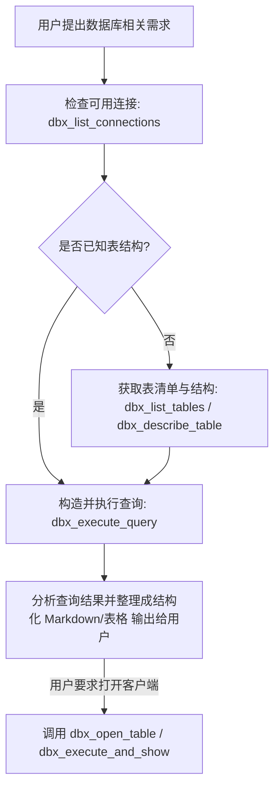

# DBX 数据库智能管理与查询技能

[DBX](https://github.com/t8y2/dbx) 是一款轻量（20MB）、高性能的现代跨平台数据库管理工具，内置 MCP Server、CLI 与桌面端，支持 90+ 种主流与国产数据库。

本技能通过 **DBX MCP Server** 与 **DBX CLI** 为 Agent 提供全方位的数据库探索、Schema 提取、SQL/NoSQL 查询与会话控制能力。

---

## 核心调用途径

### 途径 1：MCP 工具调用（原生 Agent 优先）

当通过 MCP 连接时，可直接调用以下 14 个标准工具：

| 工具名称 | 参数 | 说明 |
| :--- | :--- | :--- |
| `dbx_list_connections` | `{}` | 列出 DBX 中已保存的所有有效数据库连接（包含名称、类型、主机等） |
| `dbx_list_tables` | `{"connection": "<连接名>", "database": "<可选库名>"}` | 列出指定连接下的所有表、视图或集合 |
| `dbx_describe_table` | `{"connection": "<连接名>", "table": "<表名>", "database": "<可选库名>"}` | 获取表的字段名称、类型、是否为空、主键等完整元数据 |
| `dbx_get_schema_context` | `{"connection": "<连接名>", "tables": ["t1", "t2"], "database": "<可选库名>"}` | 提取适合 AI 编写 SQL 用的紧凑 Schema 上下文 |
| `dbx_execute_query` | `{"connection": "<连接名>", "query": "SELECT ...", "sessionId": "<可选>"}` | 执行 SQL 查询（单次最多返回 100 行），支持只读/读写安全策略 |
| `dbx_open_session` | `{"connection": "<连接名>", "database": "<可选库名>"}` | 开启有状态查询会话（固定连接），返回 `sessionId` 用于事务或 `USE` |
| `dbx_close_session` | `{"sessionId": "<sessionId>"}` | 关闭有状态会话并释放底层数据库连接资源 |
| `dbx_execute_redis_command` | `{"connection": "<连接名>", "command": "GET key"}` | 执行 Redis 命令（如 GET、SET、HGETALL、KEYS 等） |
| `dbx_open_table` | `{"connection": "<连接名>", "table": "<表名>"}` | 桌面联动：在运行中的 DBX 桌面客户端直接打开并查看该表 |
| `dbx_execute_and_show` | `{"connection": "<连接名>", "query": "SELECT ..."}` | 桌面联动：在 DBX 桌面客户端中执行并展示查询表格 |
| `dbx_add_connection` | `{"name": "...", "type": "...", ...}` | 向 DBX 存储新增数据库连接配置 |
| `dbx_remove_connection` | `{"name": "<连接名>"}` | 从 DBX 存储移除数据库连接 |
| `dbx_duplicate_connection` | `{"sourceName": "...", "targetName": "..."}` | 复制已有连接的完整配置 |
| `dbx_send_message` | `{"connection": "...", "topic": "...", "message": "..."}` | 向消息队列（Kafka/RocketMQ/Pulsar）发送消息 |

---

### 途径 2：CLI 命令行直接调用（Shell / 脚本模式）

可在终端或脚本中直接运行 `dbx` 命令行：

```bash
# 1. 诊断与健康检查
dbx doctor

# 2. 列出所有数据库连接
dbx connections list --json

# 3. 查看连接下的表清单
dbx schema list <连接名称> --json

# 4. 查看指定表结构
dbx schema describe <连接名称> <表名> --json

# 5. 执行 SQL 查询
dbx query <连接名称> "SELECT * FROM <表名> LIMIT 10" --json

# 6. 生成多表上下文供编写复杂查询
dbx context <连接名称> --tables table1,table2

# 7. 在桌面端联动打开指定表
dbx open <连接名称> <表名>
```

---

## 工作流指引



### 最佳实践与安全规范
1. **优先提取 Schema**：在编写复杂查询或联表 SQL 前，先使用 `dbx_get_schema_context` 或 `dbx_describe_table` 核对字段名与类型，避免猜测字段名。
2. **只读保护**：默认优先执行 `SELECT` 只读查询，对于 `UPDATE` / `DELETE` / `DROP` 等写操作需提示用户二次确认。
3. **分页与性能**：单次查询默认最多返回 100 行，针对大表查询建议显式添加 `LIMIT` 条件。
4. **会话控制**：若需要切换库（如 `USE db_name`）或涉及显式事务（`BEGIN ... COMMIT`），必须先通过 `dbx_open_session` 建立 session 并传入 `sessionId`。
