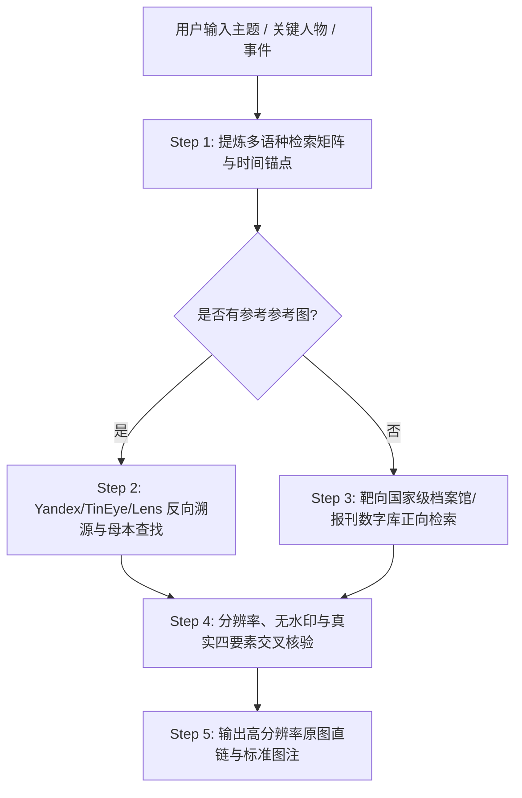

# 珍贵图片与历史档案检索规程 (Rare Image Finder SOP)

## 📖 技能定位与核心目标

本技能专为**高标准非虚构写作、学术研究、重大历史事件考证、纪实报道与高保真配图**设计。
核心目标是：**彻底告别自媒体翻拍、低画质压缩、虚假上色与狗皮膏药水印，一键直达国家级权威档案馆、数字博物馆与高分辨率原始母本。**

---

## 🏛️ 一、 珍贵图片严选四红线（Quality & Accuracy Redlines）

```
┌────────────────────────────────────────────────────────────────────────────────────────┐
│ 1. 拒绝对抗伪劣（Zero Junk）: 坚决剔除自媒体LOGO、斜拍展板、压缩泛白、AI伪造图        │
│ 2. 真实四要素（Four Pillars）: 每张图必具【年份】、【地点】、【人物/事件】、【权威出处】 │
│ 3. 母本超清优先（Master Quality）: 优先选用原生未压缩 TIFF / 超清大图（宽 ≥ 1920px）    │
│ 4. 靶向专业语法（Precision Syntax）: 强制指定权威档案库域名与高画质检索参数           │
└────────────────────────────────────────────────────────────────────────────────────────┘
```

1. **绝对禁选清单**：
   - ❌ 严禁手机斜拍展览展板图、发布会电视翻拍照；
   - ❌ 严禁带有微博、小红书、今日头条等自媒体平台二次水印的图片；
   - ❌ 严禁现代 Midjourney/Stable Diffusion 伪造的历史场景图（除非明确标注为 AI 概念图）；
   - ❌ 严禁现代大厦、现代电脑 K 线截图冒充 80/90 年代历史图；
   - ❌ 严禁未经验证批量复制同图占位、严禁同一篇幅出现 MD5/尺寸相同的重复文件；
   - ❌ 严禁未经 OCR 校验凭空虚构图注（如严禁将实物股票凭证虚构标注为“判决书”或“签约仪式现场”）；
   - ❌ 严禁公文原件中残留数字化抓取导致的破损图片图标（`[x]` 框）、失效 Logo 栏或旧网页底部版权冗余，入库前必须执行像素级有效区域裁切与纯白留白重构；
   - ❌ 严禁公文/文献扫描件保留单侧超过 20% 的大面积无意义死白，必须按文字有效包围盒进行对称紧凑裁切（四周保留 40-60px 均匀留白）。

2. **必须满足的真实性验证与四要素图注**：
   - **OCR 实体字段强制核验**：票据、股票、国库券、牌匾、监管公文等物证，必须经 OCR 确认年份、标题与图章，严禁张冠李戴；图注所称法定属性必须与 OCR 读出的文字严格对齐；
   - 所有交付的珍贵图片必须严格配齐：**《拍摄年份 + 拍摄地点 + 核心人物/具体事件 + 权威馆藏/摄影师出处》**。

---

## 🔍 二、 核心检索工作流与技术路线 (5-Step SOP)



### Step 1：多维关键词矩阵与时间锚点拆解
将口语需求拆解为**中英双语、当时专有名词、核心物证与时间区间**：
- **中文专有名词**：如检索“中国第一张股票” $\to$ `飞乐音响` + `小飞乐` + `周芝石` + `邓小平 范尔霖` + `1984/1986` + `静安业务部`；
- **英文对应词**：如 `Shanghai Stock Exchange opening 1990` / `Library of Congress China vintage photo`；
- **标志性物证**：铜锣、认购证、红色马甲、黑板行情、大飞乐。

---

### Step 2：反向以图搜图与母本抓取（Reverse Image Discovery）
当手头已有参考图，需寻找**超清无水印母本或考证真伪**时：

| 引擎 | 核心优势 | 推荐使用姿势 |
| :--- | :--- | :--- |
| **Yandex Images** | 全球最强面部与老照片特征匹配引擎 | 传入图片 URL 或特征，寻找未经裁剪的广角全景原图与冷门原档 |
| **TinEye** | 时间与尺寸排序 | 选用 `Sort by: Oldest` 查最早来源，选用 `Sort by: Biggest Image` 提取最高清版本 |
| **Google Lens** | OCR 与背景细节点对点对齐 | 识别背景里的老式牌匾、路牌、服装肩章、建筑特征推断年代 |
| **Baidu 识图** | 国内中文网页与地方文史库覆盖 | 补充检索国内地方志、高校特藏网与中文垂直论坛 |

---

### Step 3：靶向权威图库与开放档案库直接检索

#### 1. 中国及华语权威历史档案
* **新华社中国照片档案馆 / 新华网图片库**：新中国各历史阶段官方正规通稿原照。
* **人民日报历史图文数据库**：头版原版影印与新闻纪实照片。
* **中国国家图书馆·数字典籍与地方志**：古籍善本、老地图、民国画报。
* **专业数字博物馆**：如中国证券博物馆、中国铁道博物馆、故宫博物院数字文物库。

#### 2. 全球顶级公共领域（Public Domain）与开源超清图库
* **[Library of Congress Prints & Photographs (美国国会图书馆)](https://www.loc.gov/pictures/)**：
  * 支持获取数百万张 4K/8K 级未压缩 TIFF/高清 JPG 原片，完全 Public Domain。
* **[Wikimedia Commons (维基共享资源)](https://commons.wikimedia.org/)**：
  * 极其规范的历史图片元数据、创作共用许可、原始摄影师与扫描出处。
* **[Internet Archive Visual Archive (互联网档案馆)](https://archive.org/details/image)**：
  * 跨越数个世纪的历史书籍原版插画、绝版刊物与新闻纪录片截帧。
* **[Newspaper Navigator (历史报纸照片 AI 检索库)](https://news-navigator.labs.loc.gov/)**：
  * 覆盖数百年历史报纸中精准切片提取的 150 万张高精新闻照片。
* **[Europeana (欧洲数字文化遗产库)](https://www.europeana.eu/)**：
  * 欧洲数千家国家图书馆与博物馆馆藏艺术品与历史纪实。

---

### Step 4：高级检索指令速查表 (Search Operators)

针对普通搜索引擎，强制搭配高级指令过滤低质营销内容：

```bash
# 1. 国会图书馆 / 官方档案专项检索
"Shanghai" AND "1990" site:loc.gov

# 2. 维基共享资源超清历史原档检索
"Feile Acoustics" OR "Shanghai Stock Exchange" site:commons.wikimedia.org

# 3. 官方新闻档案高画质检索（剔除自媒体营销号）
"飞乐音响" "营业部" (site:xinhuanet.com OR site:people.com.cn OR site:gov.cn)

# 4. 指定大尺寸与扫描件
"上海证券交易所开业" "1990" filetype:jpg (高清 OR 原照 OR 扫描件) -水印 -自媒体
```

---

### Step 5：标准交付与图注格式规范

每次为文章或用户推荐/交付珍贵图片时，必须采用**标准卡片与斜体图注**：

```markdown

*【图注】：1990年12月19日，上海浦江饭店，上海证券交易所开业典礼现场。朱镕基等领导出席并敲响开市铜锣。（出处：新华社中国照片档案馆 / 中国证券博物馆馆藏）*
```

---

## 🛠️ 三、 内置辅助脚本工具

本技能自带 `scripts/archive_search_helper.py` 辅助脚本，可一键生成各大专业档案库与以图搜图的精准检索直达链接，或直接调用公共 API：

```bash
# 示例：快速生成多源检索矩阵链接
python3 ~/.workbuddy/skills/rare-image-finder/scripts/archive_search_helper.py "1990 上海证券交易所 开业 尉文渊"
```
