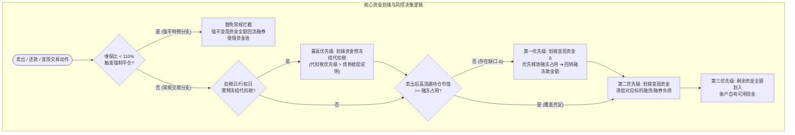
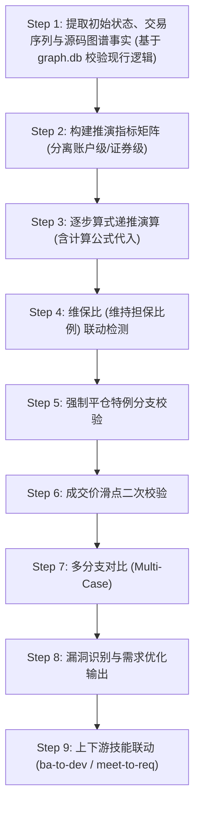
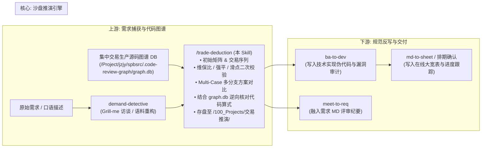

# 交易推演 Skill (Trading Scenario Simulation & Vulnerability Deduction)

**目标**：
1. **数据动态直观化**：让开发、测试与产品人员一目了然地看到在连续交易序列与清算批次下，资金余额、可用资金、融冻占用、融冻款金额、融资负债、维保比、持仓市值及各类风控/扣税指标的递推算式与数值演变。
2. **需求漏洞挖掘与规范化修正**：通过推演极端场景、滑点波动与多算法分支（Multi-Case），暴露公式冲突、负数倒挂、逻辑死锁等需求漏项，输出可直接反写或融入 `ba-to-dev` 研发文档的技术规则。

---

## 核心推演原则 (12 大刚性法则)

1. **核心判断法则：先判断覆盖，覆盖不了释放占用**：
   - 卖出/还款变现时，优先判定 `卖出后刨除融资买入的高流通持仓市值` 是否大于等于 `融冻占用`；
   - 若覆盖不了（缺口 $\Delta = \text{融冻占用} - \text{卖出后持仓市值} > 0$），**优先划拨变现资金释放融冻占用**，释放资金回转至 `融冻款金额`，确保风控与清算合规。
2. **算式 + 数值双展现**：
   - 单元格必须显式展示递推算式与代入数值（例如：`7000 - 1000 = 6000`、`min(500 + 1000 - 2000, 0) = 0`），直观呈现增量演化。
3. **账户级与单证券级粒度严格分离**：
   - 证券粒度：总持仓、融资买入数量、刨除融资买入数量、高流通持仓市值；
   - 账户粒度：融冻占用、融冻款金额、融资负债、资金余额、维持担保比例。表头醒目标注 `(账户级/元)`，单证券行填 `-`。
4. **“占用”与“可用”资金池解耦**：
   - 严格区分 `融冻占用`（当前受限冻结金额）与 `融冻款金额`（已释放/未被占用的可用现金）；占用释放时资金全额回转进入 `融冻款金额`。
5. **变现资金“三段式”清算划拨优先级**：
   - 第一优先级（平复缺口）：变现资金优先释放 `融冻占用` 并回转至 `融冻款金额`；
   - 第二优先级（清偿债务）：划拨资金偿还对应标的的融资/融券负债；
   - 第三优先级（自有资金）：剩余资金划入账户自有可用现金。
6. **Multi-Case 多分支对比**：
   - 当需求规则模糊或存在多种实现方案时，构建 2~3 种分支算法对比表（如 方案 A: 缺乏联动导致负数倒挂 vs 方案 B: 优先释放占用恢复合规）。
7. **严禁凭空臆测与模糊术语**（遵循 `LRN-20260728-006`）：
   - 严格使用统一规范术语（用 `刨除融资买入数量` 替代 `剩余数量`；用 `实际成交后` 替代 `预估`）；使用通用业务表名，严禁捏造英文 SQL 数据库或接口字段名。
8. **维持担保比例 (维保比) 动态联动预警**：
   - 每步交易后按公式计算 `维保比 = (总资产 - 融冻占用) / 总负债`；
   - 按四档状态高亮标注：$\ge 150\%$（安全）、$< 150\%$（关注）、$< 130\%$（追保）、$< 110\%$（平仓）。
9. **预冻结代扣税最高优先级法则**（源自 R2607160075 实际需求）：
   - 在扣税日/行权日场景，`预冻结代扣税` 的资金扣减/冻结优先级高于 `融资行权债务抵偿`，确保代扣税不因债务清偿而失败。
10. **T+1 清算时间轴维度**：
    - 明确区分「盘中实时递推」与「T+1 日终批处理清算」时点；标注各项指标是在盘中即时解冻/更新，还是在 T+1 清算批次更新。
11. **强平特例不拦截法则**：
    - 当账户维保比 $< 110\%$ 触发系统强制平仓时，豁免常规「持仓市值 $\le$ 融冻占用则拦截卖出」的管控；强平所得资金全额回流融券受限资金池扣减占用，不得挪用于清偿其他负债，避免逻辑死锁。
12. **成交回报二次校验 (滑点风险防范)**：
    - 在行情剧烈波动场景中，包含「委托价预推演」与「成交价实际推演」二次校验对比，防止出现“委托时合规放行、成交后跌价导致资金漏项”的漏洞。
13. **生产系统代码图谱 (graph.db) 事实优先法则**：
    - 当推演公式存在争议或需校验现行系统实际表现时，以集中交易系统生产源码图谱数据库（`/Volumes/Macintosh HD_Data/Project/jzjy/spbsrc/.code-review-graph/graph.db`）及 C++/C/SQL 实际实现作为**第一权威事实依据**。
14. **代码图谱 DB 自动比对与核验法则 (Auto Graph Code Verification)**：
    - 任何交易推演在构建推演矩阵与 Multi-Case 对比前，必须优先调用本技能内置的图谱核验工具：
      `python3 /Users/wujin/.workbuddy/skills/trade-deduction/scripts/verify_graph_deduction.py --query "<关键词>" [--snippet]`
    - 自动提取集中交易(`jzjy`) / 集中清算(`jzqs`) 图谱库中的 C++ 函数签名、物理源码路径 (`file://`)、行号及算式片段；
    - 在推演报告中必须标准输出 **【代码事实自动比对与图谱核验】** 表，自动标记“推演算式”与“生产代码”之间的硬冲突（`⚠️ 硬冲突`）或一致性（`✅ 一致`）。

---

## 核心交易清算与三段式资金划拨决策流程图



---

## 交易推演九步工作流 (9-Step Workflow)



---

## 上下游技能协同与数据流向图 (Skill Integration Pipeline)



---

## 领域规范术语表 (Terminology Reference)

| 禁用/模糊术语 | 规范业务术语 | 说明/定义 |
| :--- | :--- | :--- |
| 剩余数量 | **刨除融资买入数量** | $\max(\text{总持仓数量} - \text{融资买入数量}, 0)$ |
| 预估 / 预算 | **实际成交后** | 避免委托时点与成交/清算时点混淆 |
| 冻结金额 | **融冻占用 (账户级/元)** | 账户买入货基/债基占用的融券受限资金 |
| 解冻金额 | **融冻款金额 (账户级/元)** | 账户已被释放/未被占用的融冻可用现金池 |
| balance / 余额 | **资金余额 (元)** | 禁用英文变量名，使用标准业务术语 |
| margin_debt | **融资负债 (元)** | 禁用英文变量名 |
| 高流通市值 | **刨除融资买入后的高流通持仓市值** | 风控评估的真实资产基准 |

---

## 常见推演场景速查

1. **融冻覆盖推演**：卖出变现 $\rightarrow$ 高流通持仓市值覆盖判定 $\rightarrow$ 三段式划拨。
2. **代扣税预冻结推演**：行权日/扣税日 $\rightarrow$ 预冻结代扣税优先划拨 $\rightarrow$ 债务抵偿。
3. **货基混用与解冻推演**：货基混用额度变动 $\rightarrow$ 市值联动 $\rightarrow$ 占用抵充。
4. **维保比临界推演**：交易后维保比递推 $\rightarrow$ 追保线 (130%) / 平仓线 (110%) 触发。
5. **一户两地与跨系统推演**：同标的两地持仓 $\rightarrow$ 日终归集 $\rightarrow$ 负债分摊。
6. **融券卖出 + 买券还券推演**：融券卖出 $\rightarrow$ 保证金占用 $\rightarrow$ 买券还券释放。

---

## 标准输出 Markdown 与 HTML 规范

推演完成后，生成结构化报告。若用户要求生成 HTML，可同步输出高颜值单文件 HTML 报告：

### 报告输出结构

````markdown
# 需求交易推演与漏洞分析报告：[需求编号 - 需求名称]

> **推演目的**：展示 [业务场景] 动态数据变化过程，对比不同算法方案，挖掘极端场景漏洞并给出规范修正建议。

---

## 一、 核心法则与计算公式

1. **覆盖判断法则**：先判断 `卖出后高流通持仓市值 >= 融冻占用`，覆盖不了则按缺口优先释放占用。
2. **资金划拨优先级**：1. 释放融冻占用回融冻款 $\rightarrow$ 2. 清偿负债 $\rightarrow$ 3. 自有资金。
3. **维保比公式**：$\text{维保比} = \frac{\text{总资产} - \text{融冻占用}}{\text{总负债}} \times 100\%$。

---

## 二、 初始状态与交易动作序列

### 1. 初始状态 (T-1日)
| 证券代码 | 总持仓数量 | 价格(元) | 总市值(元) | 融资买入数量 | 刨除融资买入数量 | 高流通持仓市值(元) | 融冻占用 (账户级) | 融冻款金额 (账户级) | 融资负债 (账户级) | 维保比 (账户级) |
| :---: | :---: | :---: | :---: | :---: | :---: | :---: | :---: | :---: | :---: | :---: |
| **股票 A** | 1,000 | 100 | 100,000 | 500 | 500 | 50,000 | - | - | - | - |
| **账户汇总**| - | - | **100,000** | **500** | **500** | **50,000** | **220,000** | **0** | **10,000** | **300%** |

### 2. 交易动作序列
1. **T-1日基准**：初始指标如上。
2. **【动作 1】卖出股票 C**：变现 300,000 元，卖出后剩余高流通市值 215,000 元。

---

## 三、 代码事实自动比对与图谱核验

> 💡 运行 `python3 /Users/wujin/.workbuddy/skills/trade-deduction/scripts/verify_graph_deduction.py --query "<关键词>"` 自动生成本比对表：

| 推算 / 逻辑点 | 需求/推演期望算式 | 生产代码 `graph.db` 现有逻辑 | 映射 C++ 函数/物理文件 (file://) | 比对结论 |
| :--- | :--- | :--- | :--- | :---: |
| **资金划拨优先级** | 1.解冻融冻占用 ➔ 2.清偿负债 ➔ 3.自有资金 | `STEPPOP.CPP`: 资金清算汇总处理例程 | [STEPPOP.CPP](file:///Volumes/Macintosh%20HD_Data/Project/jzjy/spbsrc/lbmdll/GeneralBus/STEPPOP.CPP#L1401) | ✅ 一致 |
| **代扣税优先** | 预冻结代扣税 > 债务抵偿 | `taxdeal.cpp`: 预冻结代扣税优先扣除 | [taxdeal.cpp](file:///Volumes/Macintosh%20HD_Data/Project/jzjy/spbsrc/lbmdll/GeneralBus/taxdeal.cpp) | ✅ 一致 |

---

## 四、 动态数据推演表 (Multi-Case 对比)

### 方案 A：[旧默认逻辑 - 无联动释放导致负数倒挂]
| 序号 | 交易动作 | 高流通持仓市值 | 融冻占用 | 融冻款金额 | 融资负债 | 维保比 | 条件判定与算式说明 |
| :---: | :--- | :--- | :--- | :--- | :--- | :--- | :--- |
| 1 | T-1日初始 | 515,000 | 220,000 | 0 | 10,000 | 300% | 初始基准 |
| 2 | 卖出股票C成交 | 215,000 | 220,000 | 0 | 10,000 | 215% | **【漏洞告警】215,000 - 220,000 = -5,000 元倒挂** |

### 方案 B：[推荐逻辑 - 先判断覆盖，覆盖不了释放占用]
| 序号 | 交易动作 | 高流通持仓市值 | 融冻占用 | 融冻款金额 | 融资负债 | 维保比 | 划拨顺序与算式递推 |
| :---: | :--- | :--- | :--- | :--- | :--- | :--- | :--- |
| 1 | T-1日初始 | 515,000 | 220,000 | 0 | 10,000 | 300% | 校验通过 |
| 2 | 卖出股票C成交 | 215,000 | **215,000** | **5,000** | **0** | **220%** | **1. 优先 5,000 元解冻回融冻款<br/>2. 10,000 元偿还负债<br/>3. 285,000 元转自有资金** |

---

## 四、 需求漏洞定位 (Vulnerability Identification)

> [!WARNING]
> **发现的需求漏洞 1：未联动释放占用导致负数倒挂 (Negative Balance Overflow)**
> - **现象**：卖出后持仓市值 < 融冻占用。
> - **后果**：清算抛出资金溢出异常，抛单失败。
> - **归因**：缺乏“卖出后高流通市值能否覆盖融冻占用”的前置/联动校验机制。

---

## 五、 需求修正与规范反写 (Spec Refinement)

#### 修正后技术规则
1. **先判断覆盖，覆盖不了释放占用**：卖出变现优先平复缺口 $\Delta$ 释放占用回融冻款。
2. **三段式划拨顺序**：1. 释放占用 $\rightarrow$ 2. 清偿负债 $\rightarrow$ 3. 自有资金。
````

---

## 上下游技能联动指南

- **下游联动 $\rightarrow$ `ba-to-dev`**：
  推演完成后，可提示用户："是否将推演表与漏洞结论自动写入 `ba-to-dev` 研发文档的「三、（三）伪代码与边界推演」及「四、逻辑漏洞审计」？"
- **自动存盘与规范目录**：
  生成的推演报告默认自动存盘至 `/Volumes/Macintosh HD_Data/obsidian/100_Projects/交易推演/<YYYYMMDD-交易推演-纯中文需求名>.md`，顶部包含 YAML `created` 与 `updated` 元数据。
- **下游联动 $\rightarrow$ `meet-to-req`**：
  若推演结论源于评审会议，可调用 `meet-to-req` 融合进需求 MD 的评审纪要中。
- **上游联动 $\leftarrow$ `demand-detective` & 生产代码图谱**：
  当 `demand-detective` 发现规则包含复杂资金/市值计算，或需校验生产现行逻辑时，自动调用 `/Volumes/Macintosh HD_Data/Project/jzjy/spbsrc/.code-review-graph/graph.db` 逆向核对源码算式后再执行数据演绎。

---

## 推演质量自检清单 (Post-Deduction Checklist)

- [ ] 推演 MD 报告已默认保存至 `/Volumes/Macintosh HD_Data/obsidian/100_Projects/交易推演/`
- [ ] 涉及生产算法的争议规则，已基于 `/Volumes/Macintosh HD_Data/Project/jzjy/spbsrc/.code-review-graph/graph.db` 源码图谱逆向核对
- [ ] 每个单元格包含算式 + 数值双展现，无裸数字
- [ ] 账户级指标与证券级指标严格分行显示
- [ ] 融冻占用与融冻款金额变动方向相反且金额闭环
- [ ] 变现资金划拨遵循三段式优先级
- [ ] 维保比在每步交易后已重新计算并高亮
- [ ] 所有负值或倒挂结果已标记为【漏洞告警】
- [ ] 使用规范术语表中的中文术语，无英文表名/字段名捏造
- [ ] Multi-Case 至少对比 2 种方案
- [ ] 漏洞分析包含「现象 $\rightarrow$ 后果 $\rightarrow$ 归因 $\rightarrow$ 修正建议」
- [ ] 已标注关键指标是盘中即时生效还是 T+1 清算批次生效

---

## 参考文件

- [sample_deduction.md](file:///Users/wujin/.workbuddy/skills/trade-deduction/references/sample_deduction.md) - 标杆推演完整范例（包含 Multi-Case、维保比、代扣税优先与强平分支）
- [scenario_templates.md](file:///Users/wujin/.workbuddy/skills/trade-deduction/references/scenario_templates.md) - 6 类常见推演场景半填模板
- [terminology_glossary.md](file:///Users/wujin/.workbuddy/skills/trade-deduction/references/terminology_glossary.md) - 交易清算与两融规范术语词典
