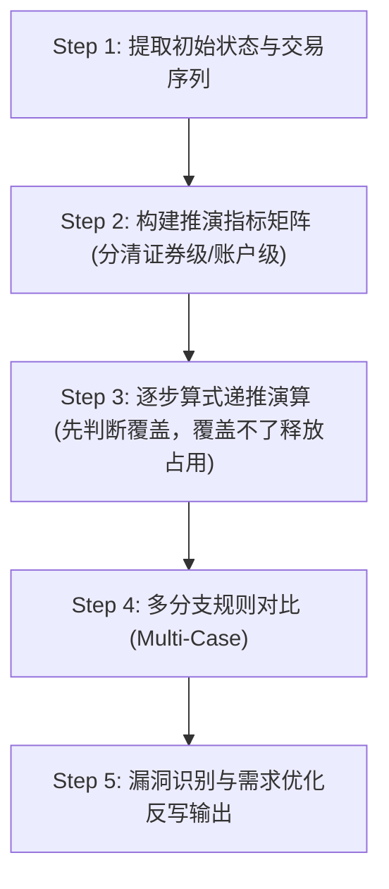

# 交易推演 Skill (Trading Scenario Simulation & Vulnerability Deduction)

**目标**：
1. **数据动态直观化**：让开发、测试人员一目了然地看到在连续交易序列下，资金余额、可用资金、融冻占用、融冻款金额、融资负债、市值及各类风控指标的每一步算式演算过程与数值变化。
2. **需求漏洞挖掘与修正**：通过推演极端场景与多算法分支（Case Analysis），主动暴露公式冲突、边界溢出、状态倒挂等需求漏项，修正推演步骤，倒逼并优化需求文档。

---

## 核心推演原则

1. **核心判断法则：先判断覆盖，覆盖不了释放占用**：
   - 客户卖出/还款变现时，第一步先判定：`卖出后高流通持仓市值` 是否大于等于 `融冻占用`；
   - 若覆盖不了（缺口 $\Delta = \text{融冻占用} - \text{卖出后持仓市值} > 0$），**自动优先划拨变现资金释放融冻占用**，并将释放资金回转增加至 `融冻款金额`，确保风控闭环。
2. **算式+数值双展现**：每个单元格不仅列出最终数值，还必须显式展示递推算式（例如：`7000 - 1000`、`3000 - 1000 + 1500`、`min(500 + 1000 - 2000, 0) = 0`），直观呈现增量变化。
3. **账户级与单证券级粒度明确分离**：
   - 区分**证券粒度指标**（总持仓、融资买入数量、刨除融资买入数量、证券市值）与**账户级指标**（融冻占用、融冻款金额、总负债、资金余额）。
   - 明示指标计算作用域（如：在表头列名醒目标注 `(账户级/元)`），单证券行填写 `-`，仅在 `账户汇总` 行展示总额。
4. **“占用”与“可用”资金池解耦**：
   - 严格区分 `融冻占用`（当前冻结受限金额）与 `融冻款金额`（已释放/未被占用的融冻可用现金）。
   - 初始状态推演设定：`融冻占用 = X`（如 220,000元），`融冻款金额 = 0`元；当占用释放时，释放资金**回转进入融冻款金额**。
5. **变现资金“三段式”清算划拨优先级**：
   - 当平仓/还款变现资金产生时，资金划拨必须严格遵循业务优先级：
     - **第一优先级（优先平复占用缺口）**：若卖出后市值无法覆盖占用，优先划拨资金释放 `融冻占用` 并回转至 `融冻款金额`；
     - **第二优先级（清偿负债）**：划拨资金清偿对应标的的融资/融券负债；
     - **第三优先级（划入自有资金）**：剩余资金全额划入 `账户自有可用现金`。
6. **多分支对比 (Multi-Case)**：当规则描述存在歧义、边界模糊或可能有多种实现方案时，构建 2~3 种分支算法对比表（如方案 A: 缺乏解冻产生负数倒挂，方案 B: 卖出后覆盖不了自动释放占用），对比优劣。
7. **严禁凭空臆测与模糊术语**：使用精准术语（如用 `刨除融资买入数量` 替代模糊的 `剩余数量`；用 `实际成交后` 替代不严谨的 `预算/预估`）。对模糊点明确标记为【需求漏洞/规则未定义】，并提出闭环建议。

---

## 交易推演五步工作流 (Workflow)



### Step 1: 提取初始状态与交易序列
- 梳理账户初始状态（T-1日资金余额、可用、融冻占用、融冻款金额、融资负债、已混用额度、持仓市值等）。
- 按时间顺序排列 T 日及后续连续交易动作（如：普通买入、融资买入、竞价卖出、卖出融资买入标的、还款变现清算等）。

### Step 2: 构建推演指标矩阵
根据业务诉求确定列维度，必须清晰分隔证券级别与账户级别：
- **交易动作**（序号 + 时间/动作描述）
- **证券级资产**：总持仓数量、融资买入数量、刨除融资买入数量 (`=总持仓数量-融资买入数量`)、刨除融资买入后的高流通证券市值 (`=MAX(总数量-融资买入, 0)*价格`)
- **账户级资金与占用**：融冻占用 (账户级/元)、融冻款金额 (账户级/元)、自有可用现金
- **负债与信用**：融资负债、融券负债、授信额度、已用额度
- **判断条件与算式说明**：逻辑判定条件、触发规则、实际成交后差异说明

### Step 3: 逐步算式递推演算
- 从第 1 行初始状态开始，针对每个交易动作计算各个指标列的变化。
- 格子中写明计算过程：`原值 ± 变动量` 或 `公式代入(实参)`。
- 涉及变现资金时，先判断卖出后高流通市值是否可覆盖融冻占用，覆盖不了按 **1. 释放占用回融冻款 -> 2. 偿还负债 -> 3. 转自有资金** 三段式清算。

### Step 4: 多分支规则对比 (Multi-Case Analysis)
若需求逻辑存在模糊或多种设计可能，并行列出：
- **方案 A（规则/算法 1）**：例如默认 Excel 计算，无法覆盖时不释放占用，导致负数倒挂溢出。
- **方案 B（规则/算法 2）**：卖出后无法覆盖时自动优先释放融冻占用并回转至融冻款金额，恢复风控合规。

### Step 5: 漏洞识别与需求优化输出
- 分析各方案推演结果，识别边界漏洞（如：负值倒挂、资金解冻断层、风控计算误拒成交单）。
- 整理成【需求漏洞清单】与【需求优化修改建议】，直接反写或粘贴到需求 MD 文档中。

---

## 标准输出 Markdown 模板

当用户要求进行交易推演时，按照以下结构输出：

````markdown
# 需求交易推演与漏洞分析报告：[需求名称/编号]

> **推演目的**：展示 [业务场景] 的数据动态演变过程，对比不同规则逻辑下的指标差异，挖掘需求潜在漏洞并给出修正建议。

---

## 一、 核心判断与处理逻辑

> [!IMPORTANT]
> **核心法则**：**先判断卖出后高流通市值是否可以覆盖融冻占用，若覆盖不了，则释放占用。**

---

## 二、 初始状态与推演动作序列

### 1. 初始状态 (T-1日)

| 证券代码 | 总持仓数量 | 价格 (元) | 总市值 (元) | 融资买入数量 | 刨除融资买入数量 | 刨除融资买入后的高流通证券市值 (元) | 融冻占用 (账户级/元) | 融冻款金额 (账户级/元) | 融资负债 (元) |
| :---: | :---: | :---: | :---: | :---: | :---: | :---: | :---: | :---: | :---: |
| **股票 A** | 1,000 | 100 | 100,000 | 500 | `500` | 50,000 | - | - | 0 |
| **账户汇总**| - | - | **100,000** | **500** | **500** | **50,000** | **220,000** | **0** | **10,000** |

* **概念区分**：
  * **融冻占用**：账户级买入货基/债基占用的融券受限资金（初始值 220,000 元）。
  * **融冻款金额**：账户级未被占用的融冻可用现金（初始值 0 元）。
* **核心公式**：
  * `刨除融资买入数量` = `总持仓数量 - 融资买入数量`
  * `刨除融资买入后的高流通证券市值` = `MAX(总持仓数量 - 融资买入数量, 0) * 价格`

### 2. 交易动作序列
1. **T-1日初始基准**：融冻占用 220,000 元，融冻款金额 0 元。
2. **【关键动作】卖出/还款股票 C**：变现 300,000 元，卖出后剩余高流通持仓市值 215,000 元（判断 $215,000 < 220,000$ 无法覆盖 $\rightarrow$ 释放占用 $5,000$ 元）。

---

## 三、 动态数据推演表 (Multi-Case 对比)

### 方案 A：[原默认逻辑 - 无法覆盖时不释放占用导致倒挂]

| 序号 | 交易动作 | 卖出后剩余持仓市值 | 融冻占用 (账户级) | 融冻款金额 (账户级) | 覆盖缺口 | 条件判定与算式说明 |
| :---: | :--- | :--- | :--- | :--- | :--- | :--- |
| 1 | T-1日初始基准 | 515,000 | 220,000 | 0 | +295,000 | 覆盖充足 |
| 2 | 卖出股票C实际成交 | 215,000 | 220,000 | 0 | **-5,000** | **【漏洞告警】215,000 - 220,000 = -5,000 元倒挂** |

---

### 方案 B：[推荐逻辑 - 先判断覆盖，覆盖不了释放占用]

| 序号 | 交易动作 | 卖出后剩余持仓市值 | 融冻占用最新值 | 融冻款金额最新值 | 变现资金划拨分配 | 算式推演与逻辑判定 |
| :---: | :--- | :--- | :--- | :--- | :--- | :--- |
| 1 | T-1日初始基准 | 515,000 | 220,000 | 0 | 正常维持 | 校验通过 |
| 2 | 卖出股票C实际成交 | 215,000 | **`215,000`** | **`5,000`** | **1. 优先 5,000 元释放占用回融冻款**<br/>**2. 10,000 元还负债**<br/>**3. 285,000 元转自有资金** | **判断无法覆盖，优先划拨 5,000 元平复缺口回转至融冻款金额，指标全部合规** |

---

## 四、 需求漏洞挖掘与问题定位 (Vulnerability Identification)

> [!WARNING]
> **发现的需求漏洞 1：未做覆盖判断与联动释放占用导致倒挂 (Negative Balance Overflow)**
> - **现场现象**：卖出后持仓市值小于融冻占用。
> - **后果影响**：若清算环节未做占用优先释放，抛出负数倒挂异常。
> - **归因分析**：原算法缺乏“卖出后高流通市值能否覆盖融冻占用”的前置/联动校验机制。

---

## 五、 需求修正与优化建议 (Spec Refinement)

```markdown
#### **修正后清算与划拨规范**
1. **核心原则：先判断覆盖，覆盖不了释放占用**：
   - 计算卖出后高流通持仓市值是否可覆盖融冻占用；
   - 若无法覆盖（缺口 $\Delta$），变现资金优先划拨 $\Delta$ 解冻 `融冻占用` 并回转入 `融冻款金额`。
2. **变现资金三段式清算划拨顺序**：
   - 第一优先级：释放融冻占用，回转至融冻款金额；
   - 第二优先级：清偿对应标的融资负债；
   - Third优先级：划入账户自有可用现金。
```
````

---

## 标杆参考范例

完整高保真的 3 阶方案推演范例请参阅本地参考文件：
[sample_deduction.md](file:///Users/wujin/.workbuddy/skills/trade-deduction/references/sample_deduction.md)
