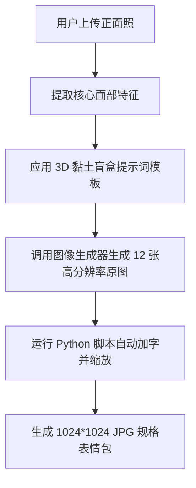

# 3D 黏土盲盒表情包生成引擎 - 通用技能指南 (Universal Skill Guide)

本文件定义了一套将“任意个人正面照”转化为“12张 3D 黏土风格微信表情包”的通用技能流程。未来的 AI 助手或自动化脚本只需读取此指南，即可为新用户复刻全套表情包生成与排版流程。

---

## 🚀 核心工作流 (Workflow)



---

## 1. 面部特征提取指南 (Feature Extraction)
当收到用户的新照片时，AI 助手需提取以下 5 个核心维度特征并填入提示词模板中：
1. **发型** (例如：短直发、中分卷发、大背头)
2. **脸型与眼睛** (例如：圆脸、国字脸、单眼皮、大眼睛)
3. **眼镜** (例如：长方形黑框眼镜、圆形金属框眼镜、无眼镜)
4. **面部细节** (例如：小胡茬、酒窝、连鬓胡)
5. **衣着款式** (例如：深灰色圆领T恤、连帽衫)

---

## 2. 3D 黏土风格提示词模板 (Prompt Template)
使用以下提示词模板生成 12 张图片。生成时需传入提取到的特征：

> **主提示词模板：**
> `A 3D clay blind box style emoji of the [性别] character in the reference photo. He/She has [发型特征], [脸型特征], wears [眼镜特征], has [面部细节特征], and is wearing a [衣着特征]. Action/Scene: [具体动作场景]. Cute, high quality, 3D render, claymation style, soft studio lighting, solid [背景颜色] background, cute chibi style.`

### 12 个场景的具体参数配置表：

| 场景编号 | 场景中文名 | 动作场景提示词 (Action/Scene) | 建议背景色 (Background) | 底部文案 (Caption) |
| :--- | :--- | :--- | :--- | :--- |
| **1** | 加个小需求 | `He/She has a smirk or cheeky smile, pointing one index finger up as if saying 'just add a small requirement'.` | `pastel yellow` | **加个小需求** |
| **2** | 求排期 | `He/She has a pleading, puppy-dog eyes look, holding hands together in a prayer or pleading gesture, asking for a timeline.` | `pastel blue` | **求排期** |
| **3** | 问题不大 | `He/She is smiling happily, making a thumbs-up gesture next to a computer screen showing a giant green checkmark.` | `pastel green` | **问题不大** |
| **4** | 疯狂输出 | `He/She is typing furiously on a keyboard, hands moving in a blur, looking highly focused and determined.` | `pastel orange` | **疯狂输出中** |
| **5** | 甩锅 | `He/She is shrugging shoulders, palms facing up, wearing a puzzled and innocent expression as if saying 'it works on my machine'.` | `pastel pink` | **这不科学啊** |
| **6** | 收到/完成 | `He/She is doing a salute gesture, smiling brightly and cheerfully.` | `pastel cyan` | **收到，马上办** |
| **7** | 无语/崩溃 | `He/She has a crying, distressed expression with comic tear streams, holding both hands on head in frustration.` | `pastel gray` | **我太难了** |
| **8** | 点赞/膜拜 | `He/She is giving two thumbs up, smiling widely with stars or sparkle effects around him/her.` | `pastel yellow` | **大佬牛逼** |
| **9** | 摸鱼 | `He/She has a relaxed, sneaky smile, holding a large clay mug/teacup and sipping from it.` | `pastel mint green`| **偷偷摸鱼** |
| **10** | 顺利上线 | `He/She is raising both hands in the air in celebration, smiling joyfully, with colorful clay confetti and paper strips falling around.` | `pastel purple` | **顺利上线！** |
| **11** | 熬夜/修仙 | `He/She has deep black eye circles from staying up all night, looking very tired but determinedly staring at a glowing computer screen.`| `pastel dark blue` | **还能再写两行**|
| **12** | 下班/开溜 | `He/She is carrying a backpack, waving goodbye with a big cheerful smile, walking away happily.` | `pastel blue` | **下班，溜了！** |

---

## 3. 自动化后处理脚本 (Post-Processing Automation)
生成高分辨率（如 1024x1024）的 3D 原图后，运行以下自动化 Python 脚本，以批量添加底部 20% 纯色背景、绘制黑体描边文字，并输出为 **1024*1024 像素的 JPG 格式表情包**。

脚本可在工作目录下通过以下命令调用（默认输出格式为 1024*1024 JPG）：
```bash
python generate_emoji_set.py --input_dir /path/to/generated_images --output_dir /path/to/output
```
如果需要修改输出尺寸（例如 240x240），可以传入 `--size` 参数：
```bash
python generate_emoji_set.py --input_dir /path/to/generated_images --output_dir /path/to/output --size 240
```

*(具体的 Python 自动化实现代码保存在当前目录下的 `generate_emoji_set.py` 中。)*

---

## 4. AI 水印处理 (Watermark Removal)

由 AI 图像生成器（如混元 ImageGen）输出的图像默认在底部带有「图片由AI生成」水印。

**水印特征：**
- 位置：图像底部，通常位于 y=88%~98%（1024 图上 y≈901-1002）
- 尺寸：约 245×101 px
- 颜色：半透明深色文字

**处理方案 — crop 而非 resize：**

原脚本将完整图像 `resize` 到顶部 80% 高度，导致水印被压缩进角色区域。现已改为 `crop`：

```python
# 旧（有水印残留）：
char_img = img_large.resize((target_size, char_height), Image.Resampling.LANCZOS)

# 新（干净切除）：
char_img = img_large.crop((0, 0, target_size, char_height))
```

**原理：** 水印在 y>88%，crop 线在 y=80%（819px），水印落在被丢弃的底部 20%，自然消失。角色图像 100% 不受涂抹。

**注意：** 如果后续切换到其他图像生成模型，需重新确认水印位置。若水印高于 80% 裁剪线，则需额外精确覆盖。
